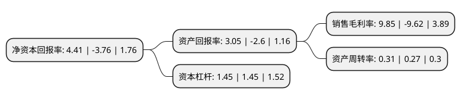

> 本页面由自动化程序生成于 2022年5月20日 01:28
> 内容可能存在错误，如有bug请提交issue至：https://github.com/Eroleice/doc-pi/issues
{.is-warning}

# 上市公司基本情况

## 基本资料

中源协和细胞基因工程股份有限公司（以下简称“中源协和”）成立于1995年06月14日，天津市。于1993年05月04日在上交所主板上市。

中源协和注册资本46,794.889万元，主营业务:工业，商业，房地产业，服务业，生命科技。以下是详细信息：

- 公司名称: 中源协和细胞基因工程股份有限公司
- 股票代码: 600645.SH
- 所在地: 天津 - 天津市
- 成立日期: 1995年06月14日
- 注册资本: 46,794.889万元
- 法定代表人: 王勇
- 主营业务: 主营业务:工业，商业，房地产业，服务业，生命科技
- 公司官网: www.vcanbio.com
- 公司介绍: 公司是一家主营生命科学技术开发、干细胞基因工程产业化、生物医疗和基因制药的生物高科技企业。公司主要面向科研市场及体外诊断市场提供产品及服务，其中科研市场包括细胞检测制备及存储、基因检测等。公司以精准医疗为中心，不断开拓创新，逐步形成了细胞存储、基因检测及临床试剂、肿瘤免疫治疗等多个业务板块。后公司收购上海傲源。傲锐东源是一家立足于基因合成、蛋白质表达纯化、抗体制备等生物技术，为生命科学领域提供产品和服务的生物制品公司。傲锐东源主要面向科研市场及体外诊断市场，提供包括人类全长基因、蛋白质、抗体、体外检测产品在内的多种产品，服务的客户包括科研机构、生物医药公司、临床医院等。

## 股东及高管情况

上市公司第一大股东为天津开发区德源投资发展有限公司，持股56,787,503股，占比12.14%，**疑似为**上市公司实际控制人。

截至2022年03月31日，上市公司的前十大股东中，共有5名自然人股东，4名机构股东，1个海外主体，其中5%以上大股东共有2名。上市公司前十大股东明细如下：

> 未能通过持股比例判定出上市公司实际控制人（持股30%以上）
> 可能存在通过间接持股、联合持股、协议控制等方式拥有实际控制权的主体，具体请参考上市公司定期公告！
{.is-warning}

> 截至2022年03月31日，上市公司前十大股东信息如下：

| 股东名称 | 持股数量（股） | 持股比例 |
| --- | --- | --- |
| 天津开发区德源投资发展有限公司 | 56,787,503 | 12.14% |
| 深圳嘉道成功投资企业(有限合伙) | 44,943,820 | 9.6% |
| 中国信达资产管理股份有限公司 | 23,397,374 | 4.99% |
| UBS   AG | 11,721,636 | 2.5% |
| 王辉 | 6,361,800 | 1.36% |
| 北京银宏春晖投资管理有限公司 | 5,761,349 | 1.23% |
| 王晓鸽 | 3,569,885 | 0.76% |
| 黄庆仰 | 3,500,000 | 0.75% |
| 徐志霖 | 3,390,863 | 0.72% |
| 周瑞珍 | 3,334,600 | 0.71% |

## 利润表分析

上市公司2021年总收入为15.35亿元，净利润为1.51亿元，实现盈利。

## 杜邦分析

> 数据列示周期：2021年 | 2020年 | 2019年
{.is-info}

上市公司的净资产收益率在近一年有所下降，下降幅度为-217.29%，其变化情况分解如下：
- 上市公司的销售毛利率在近一年下降了-202.39%，可能是生产效率的下降、商品原材料价格上涨或商品价格的下跌所致。
- 上市公司的资产周转率在近一年上升了14.81%，可能是源自于更快的销售回款或库存管理效果提升。
- 上市公司的财务杠杆比率在近一年下降了0%，可能是减少负债降低财务费用。

