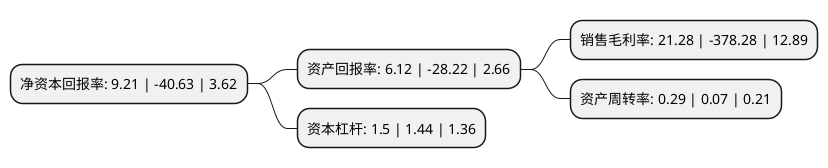

> 本页面由自动化程序生成于 2022年5月20日 01:28
> 内容可能存在错误，如有bug请提交issue至：https://github.com/Eroleice/doc-pi/issues
{.is-warning}

# 上市公司基本情况

## 基本资料

新疆百花村医药集团股份有限公司（以下简称“百花村”）成立于1996年06月21日，五家渠市。于1996年06月26日在上交所主板上市。

百花村注册资本37,513.436万元，能源及煤化工投资。房地产投资。自营和代理各类商品和技术的进出口。开展边境小额贸易业务。机电产品，五金交电化工，金属材料，农副产品，皮棉，棉短绒，长绒棉的销售。计算机软件开发;计算机技术培训咨询;计算机软件及硬件销售，计算机系统集成及相关技术服务，市场开发建设。仓储业务。房屋及柜台租赁。广告业务。以下是详细信息：

- 公司名称: 新疆百花村医药集团股份有限公司
- 股票代码: 600721.SH
- 所在地: 新疆 - 五家渠市
- 成立日期: 1996年06月21日
- 注册资本: 37,513.436万元
- 法定代表人: 郑彩红
- 主营业务: 能源及煤化工投资房地产投资自营和代理各类商品和技术的进出口开展边境小额贸易业务机电产品，五金交电化工，金属材料，农副产品，皮棉，棉短绒，长绒棉的销售计算机软件开发;计算机技术培训咨询;计算机软件及硬件销售，计算机系统集成及相关技术服务，市场开发建设仓储业务房屋及柜台租赁广告业务
- 公司官网: www.xjbhc.net
- 公司介绍: 公司由享誉全国的名店“百花村饭店”发生而来。原是集能源开发、餐饮、信息产品展示、数码影像技术等为一体的著名企业。公司通过重大资产重组，整体置出发展前景不明朗的业务，同时置入盈利能力较强、发展前景良好的生物医药研发业务，主营业务由煤炭采选和煤化工转变为生物医药研发。标的公司华威医药是中国领先的高端药物研发企业，面向医药行业提供药物发现、研究、注册等专业技术服务。作为专业从事药物发现、研究、技术服务的高科技企业，公司组建了多名博士为核心的研发团队，致力于手性合成、缓控释技术、靶向给药系统、新分子药物筛选等多项前沿技术的研究。通过本次交易，公司盈利能力大幅提升，同时华威医药将实现同A股资本市场的对接，进一步推动华威医药的战略布局及业务发展，实现CRO行业的良好快速发展。

## 股东及高管情况

上市公司第一大股东为新疆华凌工贸(集团)有限公司，持股79,525,087股，占比21.2%，**疑似为**上市公司实际控制人。

截至2022年03月31日，上市公司的前十大股东中，共有4名自然人股东，6名机构股东，其中5%以上大股东共有2名。上市公司前十大股东明细如下：

> 未能通过持股比例判定出上市公司实际控制人（持股30%以上）
> 可能存在通过间接持股、联合持股、协议控制等方式拥有实际控制权的主体，具体请参考上市公司定期公告！
{.is-warning}

> 截至2022年03月31日，上市公司前十大股东信息如下：

| 股东名称 | 持股数量（股） | 持股比例 |
| --- | --- | --- |
| 新疆华凌工贸(集团)有限公司 | 79,525,087 | 21.2% |
| 张孝清 | 24,435,632 | 6.51% |
| 新疆新农现代投资发展有限公司 | 16,873,556 | 4.5% |
| 新疆生产建设兵团国有资产经营有限责任公司 | 8,721,815 | 2.32% |
| 张德胜 | 8,149,601 | 2.17% |
| 张德胜 | 8,149,601 | 2.17% |
| 上海嘉企资产管理中心(有限合伙) | 8,143,322 | 2.17% |
| 新疆生产建设兵团投资有限责任公司 | 7,372,752 | 1.97% |
| 宁波梅山保税港区道康祥云投资合伙企业(有限合伙) | 7,130,622 | 1.9% |
| 黄彪 | 3,596,794 | 0.96% |

## 利润表分析

上市公司2021年总收入为2.81亿元，净利润为0.59亿元，实现盈利。

## 杜邦分析

> 数据列示周期：2021年 | 2020年 | 2019年
{.is-info}

上市公司的净资产收益率在近一年有所下降，下降幅度为-122.67%，其变化情况分解如下：
- 上市公司的销售毛利率在近一年下降了-105.63%，可能是生产效率的下降、商品原材料价格上涨或商品价格的下跌所致。
- 上市公司的资产周转率在近一年上升了314.29%，可能是源自于更快的销售回款或库存管理效果提升。
- 上市公司的财务杠杆比率在近一年上升了4.17%，可能是增加负债扩大生产规模。

