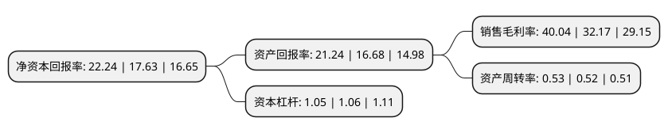

> 本页面由自动化程序生成于 2022年5月20日 01:29
> 内容可能存在错误，如有bug请提交issue至：https://github.com/Eroleice/doc-pi/issues
{.is-warning}

# 上市公司基本情况

## 基本资料

通化东宝药业股份有限公司（以下简称“通化东宝”）成立于1992年12月28日，通化市。于1994年08月24日在上交所主板上市。

通化东宝注册资本200,958.857万元，主要产品为重组人胰岛素冻干粉及注射液，大输液制品，镇脑宁胶囊，东宝甘泰片，塑钢窗等。以下是详细信息：

- 公司名称: 通化东宝药业股份有限公司
- 股票代码: 600867.SH
- 所在地: 吉林 - 通化市
- 成立日期: 1992年12月28日
- 注册资本: 200,958.857万元
- 法定代表人: 冷春生
- 主营业务: 主要产品为重组人胰岛素冻干粉及注射液，大输液制品，镇脑宁胶囊，东宝甘泰片，塑钢窗等
- 公司官网: www.thdb.com
- 公司介绍: 公司主要从事医药研发和制造,主要业务涵盖生物制品、中成药，化学药，治疗领域以糖尿病、心脑血管为主，公司拥有国家级企业技术中心、国家GMP和欧盟GMP认证的生产车间。被国家认定为高新技术企业、国家技术创新示范企业、ISO14001环境体系认证企业。主要产品包括重组人胰岛素原料药、重组人胰岛素注射剂(商品名：甘舒霖)、镇脑宁胶囊等。公司“东宝”商标被国家工商总局认定为中国驰名商标。公司拥有以重组人胰岛素(商品名：甘舒霖)为代表的系列产品。公司产品已完成了世界上40多个国家的现场检查，已完成注册并出口波兰、白俄罗斯等18个国家，广泛应用于临床治疗。重组人胰岛素原料药生产基地已通过欧盟认证，产品的国际市场大大拓宽。同时公司积极开发胰岛素类似物产，长效、短效、速效胰岛素产品，化学口服降糖药品、满足市场上不同糖尿病患者的用药需求，为国内糖尿病患者提供了更多的用药选择。

## 股东及高管情况

上市公司第一大股东为东宝实业集团有限公司，持股591,699,387股，占比29.44%，**疑似为**上市公司实际控制人。

截至2022年03月31日，上市公司的前十大股东中，共有3名自然人股东，2名机构股东，3个产品账户，1个海外主体，1名其他股东，其中5%以上大股东共有2名。上市公司前十大股东明细如下：

> 未能通过持股比例判定出上市公司实际控制人（持股30%以上）
> 可能存在通过间接持股、联合持股、协议控制等方式拥有实际控制权的主体，具体请参考上市公司定期公告！
{.is-warning}

> 截至2022年03月31日，上市公司前十大股东信息如下：

| 股东名称 | 持股数量（股） | 持股比例 |
| --- | --- | --- |
| 东宝实业集团有限公司 | 591,699,387 | 29.44% |
| 天津桢逸股权投资合伙企业(有限合伙) | 183,058,967 | 9.11% |
| 香港中央结算有限公司(陆股通) | 37,687,744 | 1.88% |
| 阿布达比投资局 | 33,796,698 | 1.68% |
| 张炜 | 28,000,000 | 1.39% |
| 陈庆玥 | 22,000,000 | 1.09% |
| 中国银行股份有限公司-招商国证生物医药指数分级证券投资基金 | 20,670,142 | 1.03% |
| 中国银行股份有限公司-嘉实价值精选股票型证券投资基金 | 15,112,555 | 0.75% |
| 招商银行股份有限公司-嘉实价值长青混合型证券投资基金 | 13,902,182 | 0.69% |
| 李一奎 | 11,328,579 | 0.56% |

## 利润表分析

上市公司2021年总收入为32.67亿元，净利润为13.08亿元，实现盈利。

## 杜邦分析

> 数据列示周期：2021年 | 2020年 | 2019年
{.is-info}

上市公司的净资产收益率在近一年有所上升，上升幅度为26.15%，其变化情况分解如下：
- 上市公司的销售毛利率在近一年上升了24.46%，可能是生产效率的提升、商品原材料价格下跌或商品价格的上涨所致。
- 上市公司的资产周转率在近一年上升了1.92%，可能是源自于更快的销售回款或库存管理效果提升。
- 上市公司的财务杠杆比率在近一年下降了-0.94%，可能是减少负债降低财务费用。

