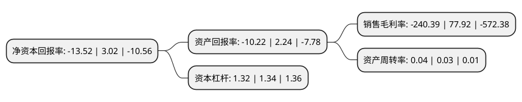

> 本页面由自动化程序生成于 2022年5月20日 01:29
> 内容可能存在错误，如有bug请提交issue至：https://github.com/Eroleice/doc-pi/issues
{.is-warning}

# 上市公司基本情况

## 基本资料

览海医疗产业投资股份有限公司（以下简称“*ST海医”）成立于1993年04月02日，三亚市。于1996年05月03日在上交所主板上市。

*ST海医注册资本102,480.542万元，主营业务:综合性医院，专科医院，门诊部等在内的高端医疗项目的投资建设及运营管理业务。以下是详细信息：

- 公司名称: 览海医疗产业投资股份有限公司
- 股票代码: 600896.SH
- 所在地: 海南 - 三亚市
- 成立日期: 1993年04月02日
- 注册资本: 102,480.542万元
- 法定代表人: 倪小伟
- 主营业务: 主营业务:综合性医院，专科医院，门诊部等在内的高端医疗项目的投资建设及运营管理业务
- 公司官网: www.lanhaimedical.com
- 公司介绍: 公司主要从事包括综合性医院、专科医院、门诊部等在内的高端医疗项目的投资建设及运营管理业务。以医疗健康产业为主线，公司精心打造包括高端门诊、专科医院及康复医院等在内的高端医疗项目以及在线健康管理，致力于为客户提供高品质、全方位的专业诊疗及健康服务。同时还在医疗健康、智能制造和公用事业领域开展融资租赁服务。依托览海集团的平台，公司还将与金融、保险资源联动，实现医疗服务与高端健康保险产品的有机结合，打造平台整合、资源共享、产业协同、优势互补的综合医疗服务体系，促进医疗服务良性循环发展，充分保障患者利益。

## 股东及高管情况

上市公司第一大股东为上海览海投资有限公司，持股384,007,992股，占比37.47%，为上市公司实际控制人。

截至2022年03月31日，上市公司的前十大股东中，共有6名自然人股东，3名机构股东，1个产品账户，其中5%以上大股东共有3名。上市公司前十大股东明细如下：

> 截至2022年03月31日，上市公司前十大股东信息如下：

| 股东名称 | 持股数量（股） | 持股比例 |
| --- | --- | --- |
| 上海览海投资有限公司 | 384,007,992 | 37.47% |
| 上海览海上寿医疗产业有限公司 | 82,000,000 | 8% |
| 中国海运集团有限公司 | 77,802,500 | 7.59% |
| 上海人寿保险股份有限公司-万能产品1 | 20,170,319 | 1.97% |
| 高雄 | 16,635,972 | 1.62% |
| 王平 | 9,729,000 | 0.95% |
| 赵周生 | 8,270,241 | 0.81% |
| 黄荣 | 7,461,041 | 0.73% |
| 李自华 | 6,296,521 | 0.61% |
| 陈惜如 | 3,680,000 | 0.36% |

## 利润表分析

上市公司2021年总收入为1.18亿元，净利润为-2.85亿元，**未实现盈利**。

## 杜邦分析

> 数据列示周期：2021年 | 2020年 | 2019年
{.is-info}

上市公司的净资产收益率在近一年有所下降，下降幅度为-547.68%，其变化情况分解如下：
- 上市公司的销售毛利率在近一年下降了-408.51%，可能是生产效率的下降、商品原材料价格上涨或商品价格的下跌所致。
- 上市公司的资产周转率在近一年上升了33.33%，可能是源自于更快的销售回款或库存管理效果提升。
- 上市公司的财务杠杆比率在近一年下降了-1.49%，可能是减少负债降低财务费用。

