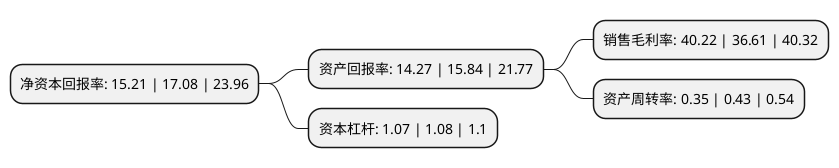

> 本页面由自动化程序生成于 2022年5月20日 01:32
> 内容可能存在错误，如有bug请提交issue至：https://github.com/Eroleice/doc-pi/issues
{.is-warning}

# 上市公司基本情况

## 基本资料

甘李药业股份有限公司（以下简称“甘李药业”）成立于1998年06月17日，北京市。于2020年06月29日在上交所主板上市。

甘李药业注册资本56,154万元，主要从事重组胰岛素类似物原料药及注射剂的研发，生产和销售。主要产品包括重组甘精胰岛素注射液(商品名“长秀霖”)，重组赖脯胰岛素注射液(商品名“速秀霖”)，精蛋白锌重组赖脯胰岛素混合注射液(25R)。以下是详细信息：

- 公司名称: 甘李药业股份有限公司
- 股票代码: 603087.SH
- 所在地: 北京 - 北京市
- 成立日期: 1998年06月17日
- 注册资本: 56,154万元
- 法定代表人: 甘忠如
- 主营业务: 主要从事重组胰岛素类似物原料药及注射剂的研发，生产和销售主要产品包括重组甘精胰岛素注射液(商品名“长秀霖”)，重组赖脯胰岛素注射液(商品名“速秀霖”)，精蛋白锌重组赖脯胰岛素混合注射液(25R)
- 公司官网: www.ganlee.com
- 公司介绍: 公司为首家掌握产业化生产重组胰岛素类似物技术的中国企业，使得我国成为世界上少数能进行重组胰岛素类似物产业化生产的国家之一，公司主要从事重组胰岛素类似物原料药及注射剂的研发、生产和销售。公司主要产品包括重组甘精胰岛素注射液(商品名“长秀霖”)、重组赖脯胰岛素注射液(商品名“速秀霖”)、精蛋白锌重组赖脯胰岛素混合注射液(25R)，公司的研发及生产能力处在行业领先水平，具备了持续开发新药品的创新能力，有多个新产品已进入临床研究阶段。公司及其研究成果曾先后获得“北京市高新技术成果转化项目”、“北京市自主创新产品”、“中关村科技园区瞪羚企业”、“北京生物医药产业跨越发展工程(G20)规模企业”等奖项。

## 股东及高管情况

上市公司第一大股东为甘忠如，持股177,135,207股，占比31.54%，为上市公司实际控制人。

截至2022年03月31日，上市公司的前十大股东中，共有2名自然人股东，3名机构股东，5个海外主体，其中5%以上大股东共有4名。上市公司前十大股东明细如下：

> 截至2022年03月31日，上市公司前十大股东信息如下：

| 股东名称 | 持股数量（股） | 持股比例 |
| --- | --- | --- |
| 甘忠如 | 177,135,207 | 31.54% |
| 明华创新技术投资(香港)有限公司 | 77,013,100 | 13.71% |
| 北京旭特宏达科技有限公司 | 47,494,437 | 8.46% |
| Vast Wintersweet Limited | 34,056,996 | 6.06% |
| STRONG LINK INTERNATIONAL LIMITED | 25,168,737 | 4.48% |
| GS Direct,L.L.C. | 17,670,544 | 3.15% |
| 北京宽街博华投资中心(有限合伙) | 8,397,341 | 1.5% |
| 甘喜茹 | 6,223,276 | 1.11% |
| 香港中央结算有限公司(陆股通) | 5,381,503 | 0.96% |
| Hillhouse G&L Holdings(HK)Limited | 4,357,832 | 0.78% |

## 利润表分析

上市公司2021年总收入为36.12亿元，净利润为14.52亿元，实现盈利。

## 杜邦分析

> 数据列示周期：2021年 | 2020年 | 2019年
{.is-info}

上市公司的净资产收益率在近一年有所下降，下降幅度为-10.95%，其变化情况分解如下：
- 上市公司的销售毛利率在近一年上升了9.86%，可能是生产效率的提升、商品原材料价格下跌或商品价格的上涨所致。
- 上市公司的资产周转率在近一年下降了-18.6%，可能是源自于更慢的销售回款或库存管理效果下降。
- 上市公司的财务杠杆比率在近一年下降了-0.93%，可能是减少负债降低财务费用。

