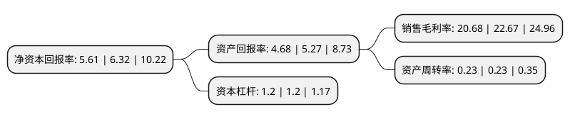

> 本页面由自动化程序生成于 2022年5月20日 01:34
> 内容可能存在错误，如有bug请提交issue至：https://github.com/Eroleice/doc-pi/issues
{.is-warning}

# 上市公司基本情况

## 基本资料

北京康辰药业股份有限公司（以下简称“康辰药业”）成立于2003年09月03日，北京市。于2018年08月27日在上交所主板上市。

康辰药业注册资本16,000万元，以创新药研发为核心，以临床需求为导向，集研发，生产和销售于一体的创新型制药企业。目前公司在产产品和在研产品主要专注于血液，肿瘤等市场空间较大的领域。以下是详细信息：

- 公司名称: 北京康辰药业股份有限公司
- 股票代码: 603590.SH
- 所在地: 北京 - 北京市
- 成立日期: 2003年09月03日
- 注册资本: 16,000万元
- 法定代表人: 刘建华
- 主营业务: 以创新药研发为核心，以临床需求为导向，集研发，生产和销售于一体的创新型制药企业目前公司在产产品和在研产品主要专注于血液，肿瘤等市场空间较大的领域
- 公司官网: www.konruns.cn
- 公司介绍: 公司是中国研发驱动型制药企业。公司现已成为集高新医药研发、生产、销售于一体的全国性医药公司，展现出强劲的企业发展势头。公司目前拥有国家一类新药苏灵和在研一类新药迪奥、CX1003、CX1026等，并已获得多项国内、国际PCT发明专利，填补了多项国际国内空白。苏灵是全球唯一单组份蛇毒血凝酶产品，已成为业内领军品牌；公司的精细化营销模式，首创的企业文化体系，也成为广受关注和追踪的标杆性案例。目前，公司已进入高速成长期。在独特的企业文化体系引领下，在“以研发创新为先导，以精细化营销为驱动，以质量信誉为保障”的运动体系推动下，公司已逐步成为一家科技型、现代化、品牌化的高新医药企业。

## 股东及高管情况

上市公司第一大股东为刘建华，持股50,786,760股，占比31.74%，为上市公司实际控制人。

截至2022年03月31日，上市公司的前十大股东中，共有5名自然人股东，3名机构股东，2个产品账户，其中5%以上大股东共有3名。上市公司前十大股东明细如下：

> 截至2022年03月31日，上市公司前十大股东信息如下：

| 股东名称 | 持股数量（股） | 持股比例 |
| --- | --- | --- |
| 刘建华 | 50,786,760 | 31.74% |
| 北京沐仁投资管理有限公司 | 16,245,600 | 10.15% |
| 北京普华基业投资顾问中心(有限合伙) | 9,600,000 | 6% |
| 北京康辰药业股份有限公司回购专用证券账户 | 3,508,623 | 2.19% |
| 北京康辰药业股份有限公司-第一期员工持股计划 | 1,994,900 | 1.25% |
| 华夏人寿保险股份有限公司-自有资金 | 1,908,477 | 1.19% |
| 杨永康 | 1,601,701 | 1% |
| 薛肖红 | 1,466,280 | 0.92% |
| 张铭杰 | 1,264,500 | 0.79% |
| 谭金清 | 1,240,500 | 0.78% |

## 利润表分析

上市公司2021年总收入为8.09亿元，净利润为1.67亿元，实现盈利。

## 杜邦分析

> 数据列示周期：2021年 | 2020年 | 2019年
{.is-info}

上市公司的净资产收益率在近一年有所下降，下降幅度为-11.23%，其变化情况分解如下：
- 上市公司的销售毛利率在近一年下降了-8.78%，可能是生产效率的下降、商品原材料价格上涨或商品价格的下跌所致。
- 上市公司的资产周转率在近一年下降了0%，可能是源自于更慢的销售回款或库存管理效果下降。
- 上市公司的财务杠杆比率在近一年下降了0%，可能是减少负债降低财务费用。

