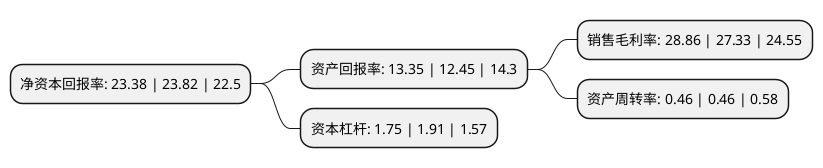

> 本页面由自动化程序生成于 2022年5月20日 01:35
> 内容可能存在错误，如有bug请提交issue至：https://github.com/Eroleice/doc-pi/issues
{.is-warning}

# 上市公司基本情况

## 基本资料

南京健友生化制药股份有限公司（以下简称“健友股份”）成立于2000年10月16日，南京市。于2017年07月19日在上交所主板上市。

健友股份注册资本124,360.022万元，主营业务:药品原料，制剂的研发，生产和销售;主要产品:标准肝素原料，低分子肝素原料及其制剂等。以下是详细信息：

- 公司名称: 南京健友生化制药股份有限公司
- 股票代码: 603707.SH
- 所在地: 江苏 - 南京市
- 成立日期: 2000年10月16日
- 注册资本: 124,360.022万元
- 法定代表人: 唐咏群
- 主营业务: 主营业务:药品原料，制剂的研发，生产和销售;主要产品:标准肝素原料，低分子肝素原料及其制剂等
- 公司官网: www.nkf-pharma.com
- 公司介绍: 公司位于南京高新技术产业开发区内，为江苏省、南京市高新技术企业，中国医药保健品进出口商会肝素钠分会理事长单位。公司业务涵盖医药领域研发、生产、营销全产业链，是国家认定的高新技术企业。公司始终秉承“建设一流的国际化生物制药企业”的企业愿景，以“阳光文化、品质产品、卓越运营、共享发展”为企业文化纲领，致力于打造国际化、高品质的医药生产企业。公司是中国肝素原料药生产的龙头企业，是国内少数同时通过美国FDA和欧盟EDQM认证的肝素原料药生产企业之一。公司近年分别被认定为江苏省粘多糖类生化药物工程技术研究中心、江苏省企业技术中心、省级工程中心。

## 股东及高管情况

上市公司第一大股东为谢菊华，持股338,217,655股，占比27.2%，**疑似为**上市公司实际控制人。

截至2022年03月31日，上市公司的前十大股东中，共有2名自然人股东，1名机构股东，5个产品账户，2个海外主体，其中5%以上大股东共有3名。上市公司前十大股东明细如下：

> 未能通过持股比例判定出上市公司实际控制人（持股30%以上）
> 可能存在通过间接持股、联合持股、协议控制等方式拥有实际控制权的主体，具体请参考上市公司定期公告！
{.is-warning}

> 截至2022年03月31日，上市公司前十大股东信息如下：

| 股东名称 | 持股数量（股） | 持股比例 |
| --- | --- | --- |
| 谢菊华 | 338,217,655 | 27.2% |
| 江苏省沿海开发集团有限公司 | 264,742,299 | 21.29% |
| TANG YONGQUN | 246,065,576 | 19.79% |
| 黄锡伟 | 54,349,398 | 4.37% |
| 招商银行股份有限公司-兴全合润混合型证券投资基金 | 33,018,032 | 2.66% |
| 招商银行股份有限公司-兴全合宜灵活配置混合型证券投资基金(LOF) | 25,261,383 | 2.03% |
| 香港中央结算有限公司(陆股通) | 15,157,323 | 1.22% |
| 中国光大银行股份有限公司-兴全商业模式优选混合型证券投资基金(LOF) | 9,722,462 | 0.78% |
| 中国农业银行股份有限公司-交银施罗德成长混合型证券投资基金 | 6,392,440 | 0.51% |
| 中国建设银行股份有限公司-南方匠心优选股票型证券投资基金 | 6,117,470 | 0.49% |

## 利润表分析

上市公司2021年总收入为36.86亿元，净利润为10.63亿元，实现盈利。

## 杜邦分析

> 数据列示周期：2021年 | 2020年 | 2019年
{.is-info}

上市公司的净资产收益率在近一年有所下降，下降幅度为-1.85%，其变化情况分解如下：
- 上市公司的销售毛利率在近一年上升了5.6%，可能是生产效率的提升、商品原材料价格下跌或商品价格的上涨所致。
- 上市公司的资产周转率在近一年下降了0%，可能是源自于更慢的销售回款或库存管理效果下降。
- 上市公司的财务杠杆比率在近一年下降了-8.38%，可能是减少负债降低财务费用。

