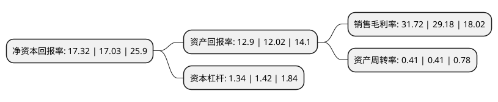

> 本页面由自动化程序生成于 2022年5月20日 01:37
> 内容可能存在错误，如有bug请提交issue至：https://github.com/Eroleice/doc-pi/issues
{.is-warning}

## 股东及高管情况

上市公司第一大股东为南京老岩企业管理中心(有限合伙)，持股201,817,185股，占比49.2237%，为上市公司实际控制人。

截至2022年04月25日，上市公司的前十大股东中，共有10名机构股东，其中5%以上大股东共有3名。上市公司前十大股东明细如下：

> 截至2022年04月25日，上市公司前十大股东信息如下：

| 股东名称 | 持股数量（股） | 持股比例 |
| --- | --- | --- |
| 南京老岩企业管理中心(有限合伙) | 201,817,185 | 49.2237% |
| 青岛国药大创投资合伙企业(有限合伙) | 34,745,078 | 8.4744% |
| 杭州鼎晖新趋势股权投资合伙企业(有限合伙) | 22,570,533 | 5.505% |
| 江苏省产业技术研究院有限公司 | 16,038,621 | 3.9119% |
| 南京生物医药谷建设发展有限公司 | 16,038,621 | 3.9119% |
| 珠海荀恒股权投资合伙企业(有限合伙) | 12,547,185 | 3.0603% |
| 南京江北新区国有资产管理有限公司 | 12,174,545 | 2.9694% |
| 南京砾岩企业管理中心(有限合伙) | 9,818,182 | 2.3947% |
| 上海曜萃投资中心(有限合伙) | 8,364,809 | 2.0402% |
| 杭州长潘股权投资合伙企业(有限合伙) | 5,228,013 | 1.2751% |

## 利润表分析

上市公司2021年总收入为3.93亿元，净利润为1.24亿元，实现盈利。

## 杜邦分析

> 数据列示周期：2021年 | 2020年 | 2019年
{.is-info}

上市公司的净资产收益率在近一年有所上升，上升幅度为1.7%，其变化情况分解如下：
- 上市公司的销售毛利率在近一年上升了8.7%，可能是生产效率的提升、商品原材料价格下跌或商品价格的上涨所致。
- 上市公司的资产周转率在近一年下降了0%，可能是源自于更慢的销售回款或库存管理效果下降。
- 上市公司的财务杠杆比率在近一年下降了-5.63%，可能是减少负债降低财务费用。

