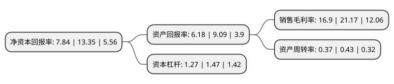

> 本页面由自动化程序生成于 2022年5月20日 01:37
> 内容可能存在错误，如有bug请提交issue至：https://github.com/Eroleice/doc-pi/issues
{.is-warning}

# 上市公司基本情况

## 基本资料

江苏诺泰澳赛诺生物制药股份有限公司（以下简称“诺泰生物”）成立于2009年04月03日，连云港市。于2021年05月20日在上交所科创板上市。

诺泰生物注册资本21,318.38万元，公司主要产品包括医药中间体，依替巴肽，醋酸奥曲肽，醋酸兰瑞肽等原料药，胸腺法新制剂。以下是详细信息：

- 公司名称: 江苏诺泰澳赛诺生物制药股份有限公司
- 股票代码: 688076.SH
- 所在地: 江苏 - 连云港市
- 成立日期: 2009年04月03日
- 注册资本: 21,318.38万元
- 法定代表人: 赵德毅
- 主营业务: 公司主要产品包括医药中间体，依替巴肽，醋酸奥曲肽，醋酸兰瑞肽等原料药，胸腺法新制剂
- 公司官网: www.sinopep.com.cn
- 公司介绍: 公司依托技术创新，构建了从高级医药中间体、原料药到制剂的全产业链，积极在高端定制、仿制药和创新药领域进行研发布局，致力于成为一家以多肽创新药为主体、以重磅仿制药和医药定制服务为两翼、具备国际竞争力的综合型生物医药企业。公司利用较强的研发与合成能力在艾滋病、肿瘤、关节炎等多个重大疾病领域，采用定制研发+定制生产的方式，每年为全球创新药企的30多个创新药研发项目提供高级医药中间体和原料药定制研发生产服务，解决其创新药品研发过程中的技术瓶颈、生产工艺路径优化及放大生产等难题，有效提高下游客户新药研发效率，降低其新药研发生产成本。公司这类业务客户包括美国因赛特(Incyte)、美国吉利德(Gilead)、德国勃林格殷格翰(BoehringerIngelheim)、美国福泰制药(Vertex)、前沿生物等数十家国内外知名创新药企。公司自主开发的原料药已销往韩国大熊制药(Daewoong)、印度西普拉(Cipla)、印度卡迪拉(Cadila)、克罗地亚普利瓦(PLIVA)、硕腾(Zoetis)普利制药、齐鲁制药等数十家国内外知名制药公司。

## 股东及高管情况

上市公司第一大股东为连云港诺泰投资管理合伙企业(有限合伙)，持股20,000,000股，占比9.38%，**疑似为**上市公司实际控制人。

截至2022年03月31日，上市公司的前十大股东中，共有3名自然人股东，6名机构股东，1个产品账户，其中5%以上大股东共有3名。上市公司前十大股东明细如下：

> 未能通过持股比例判定出上市公司实际控制人（持股30%以上）
> 可能存在通过间接持股、联合持股、协议控制等方式拥有实际控制权的主体，具体请参考上市公司定期公告！
{.is-warning}

> 上市公司第一大股东持股不超过10%，请检查是否存在公司控制权风险！
{.is-danger}

> 截至2022年03月31日，上市公司前十大股东信息如下：

| 股东名称 | 持股数量（股） | 持股比例 |
| --- | --- | --- |
| 连云港诺泰投资管理合伙企业(有限合伙) | 20,000,000 | 9.38% |
| 赵德毅 | 13,414,000 | 6.29% |
| 赵德中 | 13,414,000 | 6.29% |
| 建德市五星生物科技有限公司 | 10,314,700 | 4.84% |
| 杭州伏隆贸易有限公司 | 9,506,919 | 4.46% |
| 杭州鹏亭贸易有限公司 | 9,506,919 | 4.46% |
| 建德市宇信企业管理有限公司 | 8,903,022 | 4.18% |
| 建德市上将企业管理有限公司 | 8,809,794 | 4.13% |
| 方东晖 | 7,500,000 | 3.52% |
| 中信证券-招商银行-中信证券诺泰生物员工参与科创板战略配售集合资产管理计划 | 5,329,595 | 2.5% |

## 利润表分析

上市公司2021年总收入为6.43亿元，净利润为1.08亿元，实现盈利。

## 杜邦分析

> 数据列示周期：2021年 | 2020年 | 2019年
{.is-info}

上市公司的净资产收益率在近一年有所下降，下降幅度为-41.27%，其变化情况分解如下：
- 上市公司的销售毛利率在近一年下降了-20.17%，可能是生产效率的下降、商品原材料价格上涨或商品价格的下跌所致。
- 上市公司的资产周转率在近一年下降了-13.95%，可能是源自于更慢的销售回款或库存管理效果下降。
- 上市公司的财务杠杆比率在近一年下降了-13.61%，可能是减少负债降低财务费用。

