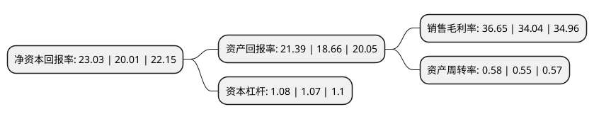

> 本页面由自动化程序生成于 2022年5月20日 01:38
> 内容可能存在错误，如有bug请提交issue至：https://github.com/Eroleice/doc-pi/issues
{.is-warning}

# 上市公司基本情况

## 基本资料

上海赛伦生物技术股份有限公司（以下简称“赛伦生物”）成立于1999年11月09日，上海市。于2022年03月11日在上交所科创板上市。

赛伦生物注册资本10,822万元，现有产品聚焦于抗血清抗毒素治疗领域，包括抗蛇毒血清系列，马破免疫球蛋白，抗狂犬病血清，致力于研究，开发，生产及销售针对生物毒素及生物安全领域的预防和治疗药物。以下是详细信息：

- 公司名称: 上海赛伦生物技术股份有限公司
- 股票代码: 688163.SH
- 所在地: 上海 - 上海市
- 成立日期: 1999年11月09日
- 注册资本: 10,822万元
- 法定代表人: 范志和
- 主营业务: 现有产品聚焦于抗血清抗毒素治疗领域，包括抗蛇毒血清系列，马破免疫球蛋白，抗狂犬病血清，致力于研究，开发，生产及销售针对生物毒素及生物安全领域的预防和治疗药物
- 公司官网: www.serum-china.com.cn
- 公司介绍: 公司经过多年的研究积累，在抗血清相关急救药品的研发上具备较强的领先优势。公司的产品抗蛇毒血清、抗狂犬病血清已纳入《国家基本药物目录》；抗蛇毒血清、马破免疫球蛋白、抗狂犬病血清已全部纳入了国家人社部颁发的《国家基本医疗保险、工伤保险和生育保险药品目录》；抗蛇毒血清和马破免疫球蛋白已纳入国家卫计委《急(抢)救药品直接挂网采购示范药品目录》。公司坚持以履行社会责任、保障人民群众的生命安全为出发点，在现有研发领域及其相关产品具有专科、急救、涉及公共安全等特殊性的基础上，以抗血清领域为核心的研发方向，通过深耕专业领域，依托抗血清技术平台，不断拓展不同类型生物毒素抗血清研发，致力于成为生物毒素及生物安全预防与治疗领域药物开发的领军企业。

## 股东及高管情况

上市公司第一大股东为赵爱仙，持股36,848,000股，占比34.05%，为上市公司实际控制人。

截至2022年03月31日，上市公司的前十大股东中，共有3名自然人股东，5名机构股东，2个产品账户，其中5%以上大股东共有2名。上市公司前十大股东明细如下：

> 截至2022年03月31日，上市公司前十大股东信息如下：

| 股东名称 | 持股数量（股） | 持股比例 |
| --- | --- | --- |
| 赵爱仙 | 36,848,000 | 34.05% |
| 上海置源投资有限公司 | 24,000,000 | 22.18% |
| 上海瑞力投资基金管理有限公司-上海瑞力嘉成股权投资基金合伙企业(有限合伙) | 3,530,000 | 3.26% |
| 方正证券投资有限公司 | 2,200,020 | 2.03% |
| 上海辕祐企业管理咨询中心(有限合伙) | 2,000,000 | 1.85% |
| 谢丽 | 1,950,000 | 1.8% |
| 王跃进 | 1,269,000 | 1.17% |
| 苏州友财汇赢投资中心(有限合伙) | 1,000,000 | 0.92% |
| 北京友财投资管理有限公司-苏州友财汇赢投资中心(有限合伙) | 1,000,000 | 0.92% |
| 武汉光谷生物产业创业投资基金有限公司 | 680,000 | 0.63% |

## 利润表分析

上市公司2021年总收入为2.08亿元，净利润为0.76亿元，实现盈利。

## 杜邦分析

> 数据列示周期：2021年 | 2020年 | 2019年
{.is-info}

上市公司的净资产收益率在近一年有所上升，上升幅度为15.09%，其变化情况分解如下：
- 上市公司的销售毛利率在近一年上升了7.67%，可能是生产效率的提升、商品原材料价格下跌或商品价格的上涨所致。
- 上市公司的资产周转率在近一年上升了5.45%，可能是源自于更快的销售回款或库存管理效果提升。
- 上市公司的财务杠杆比率在近一年上升了0.93%，可能是增加负债扩大生产规模。

