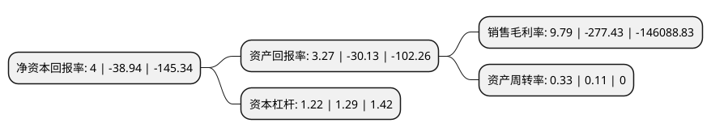

> 本页面由自动化程序生成于 2022年5月20日 01:38
> 内容可能存在错误，如有bug请提交issue至：https://github.com/Eroleice/doc-pi/issues
{.is-warning}

# 上市公司基本情况

## 基本资料

百奥泰生物制药股份有限公司（以下简称“百奥泰”）成立于2003年07月28日，广州市。于2020年02月21日在上交所科创板上市。

百奥泰注册资本41,408万元，主要从事创新药和生物类似药的研发，生产业务。以下是详细信息：

- 公司名称: 百奥泰生物制药股份有限公司
- 股票代码: 688177.SH
- 所在地: 广东 - 广州市
- 成立日期: 2003年07月28日
- 注册资本: 41,408万元
- 法定代表人: 易贤忠
- 主营业务: 主要从事创新药和生物类似药的研发，生产业务
- 公司官网: www.bio-thera.com
- 公司介绍: 公司成立于2003年，是一家以创新药和生物类似药研发为核心的创新型生物制药企业。公司秉承“创新只为生命”的理念，坚持创新驱动发展战略，致力于开发新一代创新药和生物类似药，用于治疗肿瘤、自身免疫性疾病、心血管疾病以及其它危及人类生命或健康的重大疾病。公司始终以患者的福祉作为首要核心价值，通过创新研发为患者提供安全、有效、可负担的优质药物，以满足亟待解决的治疗需求。公司“百奥泰人源抗体创新药物孵化基地”课题于2013年获得“十二五”国家重大新药创制科技重大专项立项支持；公司“肿瘤治疗性抗体药物研发及全球临床Ⅲ期试验”课题于2018年获得重大新药创制科技重大专项立项支持；百奥泰生物科技研究院(承担单位为百奥泰有限)2016年度被广东省科学技术厅认定为广东省新型研发机构，广东省抗体偶联药物工程技术研究中心(依托单位为百奥泰有限)2016年度被广东省科学技术厅认定为广东省工程技术研究中心；2018年7月被广东省发展和改革委员会认定为广东省抗体药物偶联生物医药工程实验室(广东省工程实验室)。

## 股东及高管情况

上市公司第一大股东为广州七喜集团有限公司，持股159,990,270股，占比38.64%，为上市公司实际控制人。

截至2022年03月31日，上市公司的前十大股东中，共有8名机构股东，2个海外主体，其中5%以上大股东共有6名。上市公司前十大股东明细如下：

> 截至2022年03月31日，上市公司前十大股东信息如下：

| 股东名称 | 持股数量（股） | 持股比例 |
| --- | --- | --- |
| 广州七喜集团有限公司 | 159,990,270 | 38.64% |
| Therabio   International Limited | 47,177,729 | 11.39% |
| 广州启奥兴投资合伙企业(有限合伙) | 23,173,326 | 5.6% |
| 珠海吉富启恒医药投资合伙企业(有限合伙) | 21,499,471 | 5.19% |
| 广州中科粤创孵化器投资管理有限公司-广州中科粤创三号创业投资合伙企业(有限合伙) | 21,333,332 | 5.15% |
| 广州兴昱投资合伙企业(有限合伙) | 21,320,002 | 5.15% |
| 广州晟昱投资合伙企业(有限合伙) | 16,000,000 | 3.86% |
| 吉安市青原区浥尘企业管理合伙企业(有限合伙) | 10,744,802 | 2.59% |
| 广州返湾湖投资合伙企业(有限合伙) | 7,424,586 | 1.79% |
| LI SHENGFENG(李胜峰) | 6,517,332 | 1.57% |

## 利润表分析

上市公司2021年总收入为8.36亿元，净利润为0.81亿元，实现盈利。

## 杜邦分析

> 数据列示周期：2021年 | 2020年 | 2019年
{.is-info}

上市公司的净资产收益率在近一年有所下降，下降幅度为-110.27%，其变化情况分解如下：
- 上市公司的销售毛利率在近一年下降了-103.53%，可能是生产效率的下降、商品原材料价格上涨或商品价格的下跌所致。
- 上市公司的资产周转率在近一年上升了200%，可能是源自于更快的销售回款或库存管理效果提升。
- 上市公司的财务杠杆比率在近一年下降了-5.43%，可能是减少负债降低财务费用。

