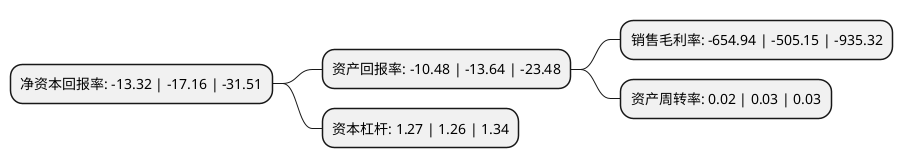

> 本页面由自动化程序生成于 2022年5月20日 01:38
> 内容可能存在错误，如有bug请提交issue至：https://github.com/Eroleice/doc-pi/issues
{.is-warning}

# 上市公司基本情况

## 基本资料

前沿生物药业(南京)股份有限公司（以下简称“前沿生物-U”）成立于2013年01月15日，南京市。于2020年10月28日在上交所科创板上市。

前沿生物-U注册资本35,976万元，致力于研究，开发，生产及销售针对未满足的重大临床需求的创新药。主要产品包括自主研发并获批上市的抗艾滋病新药和两个处于临床开发阶段的创新药物。以下是详细信息：

- 公司名称: 前沿生物药业(南京)股份有限公司
- 股票代码: 688221.SH
- 所在地: 江苏 - 南京市
- 成立日期: 2013年01月15日
- 注册资本: 35,976万元
- 法定代表人: 谢东
- 主营业务: 致力于研究，开发，生产及销售针对未满足的重大临床需求的创新药主要产品包括自主研发并获批上市的抗艾滋病新药和两个处于临床开发阶段的创新药物
- 公司官网: www.frontierbiotech.com
- 公司介绍: 公司是一家立足中国、面向全球，具有国际竞争力的创新型生物医药企业，致力于研究、开发、生产及销售针对未满足的重大临床需求的创新药。公司拥有一个已上市且在全球主要市场获得专利的原创抗艾滋病新药，两个处于美国II期临床阶段、已获专利(或专利许可)、且具有明确临床疗效的在研新药。同时，公司拥有行业先进的长效多肽药物研发实力、经验丰富的研发团队、GMP认证的生产设施、中国市场的医学推广团队和海外市场开拓团队，覆盖从创新药物发现、临床前研发和全球临床开发、生产与销售的全产业链，在HIV长效治疗及免疫治疗细分领域具有全球竞争力。公司由三名国家特聘专家DONG XIE(谢东)、CHANGJIN WANG(王昌进)、RONGJIAN LU(陆荣健)共同创立，是中国艾滋病新药的领军企业、国家“十三五”新药创制科技重大专项“艾滋病药物专项”的牵头单位、南京市的“培育独角兽企业”。

## 股东及高管情况

上市公司第一大股东为建木药业有限公司，持股70,638,750股，占比19.63%，**疑似为**上市公司实际控制人。

截至2022年03月31日，上市公司的前十大股东中，共有8名机构股东，2个海外主体，其中5%以上大股东共有4名。上市公司前十大股东明细如下：

> 未能通过持股比例判定出上市公司实际控制人（持股30%以上）
> 可能存在通过间接持股、联合持股、协议控制等方式拥有实际控制权的主体，具体请参考上市公司定期公告！
{.is-warning}

> 截至2022年03月31日，上市公司前十大股东信息如下：

| 股东名称 | 持股数量（股） | 持股比例 |
| --- | --- | --- |
| 建木药业有限公司 | 70,638,750 | 19.63% |
| 建木藥業有限公司 | 70,638,750 | 19.63% |
| LU RONGJIAN | 21,743,750 | 6.04% |
| WANG CHANGJIN | 21,059,500 | 5.85% |
| 南京建木商务咨询合伙企业(有限合伙) | 17,200,000 | 4.78% |
| 南京建木生物技术有限公司 | 13,922,500 | 3.87% |
| 南京玉航春华企业管理中心(有限合伙) | 9,290,000 | 2.58% |
| 北京瑞丰投资管理有限公司 | 8,902,400 | 2.47% |
| 上海众诚鸿运商务信息咨询服务事务所(有限合伙) | 8,615,227 | 2.39% |
| 南京晟功创业投资中心(有限合伙) | 7,041,974 | 1.96% |

## 利润表分析

上市公司2021年总收入为0.4亿元，净利润为-2.66亿元，**未实现盈利**。

## 杜邦分析

> 数据列示周期：2021年 | 2020年 | 2019年
{.is-info}

上市公司的净资产收益率在近一年有所下降，下降幅度为-22.38%，其变化情况分解如下：
- 上市公司的销售毛利率在近一年上升了29.65%，可能是生产效率的提升、商品原材料价格下跌或商品价格的上涨所致。
- 上市公司的资产周转率在近一年下降了-33.33%，可能是源自于更慢的销售回款或库存管理效果下降。
- 上市公司的财务杠杆比率在近一年上升了0.79%，可能是增加负债扩大生产规模。

