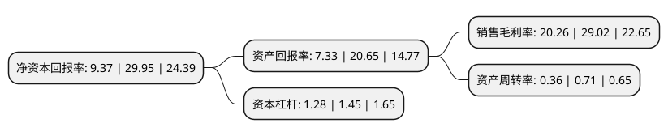

> 本页面由自动化程序生成于 2022年5月20日 01:39
> 内容可能存在错误，如有bug请提交issue至：https://github.com/Eroleice/doc-pi/issues
{.is-warning}

# 上市公司基本情况

## 基本资料

长春百克生物科技股份公司（以下简称“百克生物”）成立于2004年03月04日，长春市。于2021年06月25日在上交所科创板上市。

百克生物注册资本41,284.07万元，致力于传染病防治，主要从事人用疫苗产品的研发，生产与销售业务以下是详细信息：

- 公司名称: 长春百克生物科技股份公司
- 股票代码: 688276.SH
- 所在地: 吉林 - 长春市
- 成立日期: 2004年03月04日
- 注册资本: 41,284.07万元
- 法定代表人: 马骥
- 主营业务: 致力于传染病防治，主要从事人用疫苗产品的研发，生产与销售业务
- 公司官网: www.bchtpharm.com
- 公司介绍: 公司是一家主要致力于传染病防治的创新生物医药企业,是国家级高新技术企业。公司目前已有水痘疫苗、狂犬疫苗以及冻干鼻喷流感疫苗三种已获批的疫苗产品，主要包括带状疱疹减毒活疫苗、吸附无细胞百白破(三组分)联合疫苗、b型流感嗜血杆菌结合疫苗、全人源抗狂犬病单克隆抗体、全人源抗破伤风毒素单克隆抗体等。公司具有完备的创新研发体系，重视创新环境的建设和新产品的开发，与国内外研发机构长期保持着紧密的科研协作关系。公司承接了多项国家级研发项目，其中包括牵头国家科技重大专项：长春百克多肽药物和创新疫苗孵化基地建设(课题编号2011ZX09401-025)、重组疫苗通用载体构建与应用技术平台(课题编号2014ZX09304314)，参加了国家科技重大专项1项：创新药物孵化(吉林)基地(课题编号2011ZX09401-305-06)；亦有多项在研项目获得国家科技资金支持。

## 股东及高管情况

上市公司第一大股东为长春高新技术产业(集团)股份有限公司，持股171,488,182股，占比41.54%，为上市公司实际控制人。

截至2022年03月31日，上市公司的前十大股东中，共有4名自然人股东，5名机构股东，1个产品账户，其中5%以上大股东共有3名。上市公司前十大股东明细如下：

> 截至2022年03月31日，上市公司前十大股东信息如下：

| 股东名称 | 持股数量（股） | 持股比例 |
| --- | --- | --- |
| 长春高新技术产业(集团)股份有限公司 | 171,488,182 | 41.54% |
| 孔维 | 104,260,584 | 25.25% |
| 魏学宁 | 36,010,000 | 8.72% |
| 余盛 | 18,005,000 | 4.36% |
| 长春道和生物技术合伙企业(有限合伙) | 17,451,000 | 4.23% |
| 上海盈兆置业有限公司 | 11,080,000 | 2.68% |
| 吉林省乾亨投资合伙企业(有限合伙) | 3,273,322 | 0.79% |
| 永春嘉睿聚创创业投资合伙企业(有限合伙) | 3,273,322 | 0.79% |
| 林殿海 | 3,266,094 | 0.79% |
| 长春新区产业基金投资有限公司 | 2,895,124 | 0.7% |

## 利润表分析

上市公司2021年总收入为12.02亿元，净利润为2.43亿元，实现盈利。

## 杜邦分析

> 数据列示周期：2021年 | 2020年 | 2019年
{.is-info}

上市公司的净资产收益率在近一年有所下降，下降幅度为-68.71%，其变化情况分解如下：
- 上市公司的销售毛利率在近一年下降了-30.19%，可能是生产效率的下降、商品原材料价格上涨或商品价格的下跌所致。
- 上市公司的资产周转率在近一年下降了-49.3%，可能是源自于更慢的销售回款或库存管理效果下降。
- 上市公司的财务杠杆比率在近一年下降了-11.72%，可能是减少负债降低财务费用。

