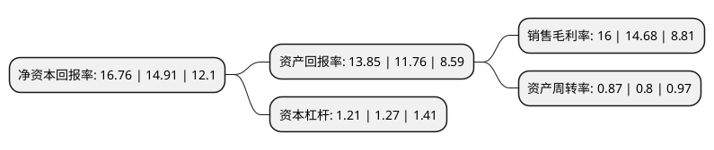

> 本页面由自动化程序生成于 2022年5月20日 01:39
> 内容可能存在错误，如有bug请提交issue至：https://github.com/Eroleice/doc-pi/issues
{.is-warning}

# 上市公司基本情况

## 基本资料

厦门特宝生物工程股份有限公司（以下简称“特宝生物”）成立于1996年08月07日，厦门市。于2020年01月17日在上交所科创板上市。

特宝生物注册资本40,680万元，上市产品包括生物制品国家1类新药——聚乙二醇干扰素α-2b注射液(商品名称:“派格宾”)，注射用重组人粒细胞巨噬细胞刺激因子(商品名称:“特尔立”)，重组人粒细胞刺激因子注射液(商品名称:“特尔津”)和注射用重组人白介素-11(商品名称:“特尔康”)。是一家主要从事重组蛋白质及其长效修饰药物研发，生产及销售的创新型生物医药企业。以下是详细信息：

- 公司名称: 厦门特宝生物工程股份有限公司
- 股票代码: 688278.SH
- 所在地: 福建 - 厦门市
- 成立日期: 1996年08月07日
- 注册资本: 40,680万元
- 法定代表人: 孙黎
- 主营业务: 上市产品包括生物制品国家1类新药——聚乙二醇干扰素α-2b注射液(商品名称:“派格宾”)，注射用重组人粒细胞巨噬细胞刺激因子(商品名称:“特尔立”)，重组人粒细胞刺激因子注射液(商品名称:“特尔津”)和注射用重组人白介素-11(商品名称:“特尔康”)是一家主要从事重组蛋白质及其长效修饰药物研发，生产及销售的创新型生物医药企业
- 公司官网: www.amoytop.com
- 公司介绍: 公司是专业从事重组蛋白质及其长效修饰药物研发、生产及销售的创新型生物医药企业。围绕病毒性肝炎、恶性肿瘤等重大疾病和免疫治疗领域，布局涵盖多种蛋白质药物的创新平台，拥有从基础研究到产业化的生物医药体系化创新能力。主打四大重组蛋白商业化产品——派格宾、特尔立、特尔津、特尔康，用于慢性肝炎、中性粒细胞减少、白细胞减少和血小板减少。旗下创新药物研发团队，入选国家科技部“重点领域创新团队”，共计承担了9项“重大新药创制”国家科技重大专项，已有5个聚乙二醇蛋白质长效药物获准开展临床研究，其中1个药物获准上市。作为国产长效干扰素龙头，有望受益于进口替代，2018年公司产品已占据接近30%市场份额。

## 股东及高管情况

上市公司第一大股东为杨英，持股138,077,266股，占比33.94%，为上市公司实际控制人。

截至2022年03月31日，上市公司的前十大股东中，共有7名自然人股东，1名机构股东，2个产品账户，其中5%以上大股东共有3名。上市公司前十大股东明细如下：

> 截至2022年03月31日，上市公司前十大股东信息如下：

| 股东名称 | 持股数量（股） | 持股比例 |
| --- | --- | --- |
| 杨英 | 138,077,266 | 33.94% |
| 通化东宝药业股份有限公司 | 85,700,114 | 21.07% |
| 孙黎 | 32,539,237 | 8% |
| 青岛鼎兴启光医疗产业投资基金合伙企业(有限合伙) | 20,350,000 | 5% |
| 郑善贤 | 11,820,230 | 2.91% |
| 蔡智华 | 11,428,121 | 2.81% |
| 左仲鸿 | 6,658,201 | 1.64% |
| 李一奎 | 4,400,000 | 1.08% |
| 国金证券-招商银行-国金证券特宝生物高管参与科创板战略配售1号集合资产管理计划 | 4,000,000 | 0.98% |
| 赖伏英 | 3,879,232 | 0.95% |

## 利润表分析

上市公司2021年总收入为11.32亿元，净利润为1.81亿元，实现盈利。

## 杜邦分析

> 数据列示周期：2021年 | 2020年 | 2019年
{.is-info}

上市公司的净资产收益率在近一年有所上升，上升幅度为12.41%，其变化情况分解如下：
- 上市公司的销售毛利率在近一年上升了8.99%，可能是生产效率的提升、商品原材料价格下跌或商品价格的上涨所致。
- 上市公司的资产周转率在近一年上升了8.75%，可能是源自于更快的销售回款或库存管理效果提升。
- 上市公司的财务杠杆比率在近一年下降了-4.72%，可能是减少负债降低财务费用。

