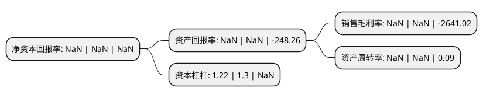

> 本页面由自动化程序生成于 2022年5月20日 01:39
> 内容可能存在错误，如有bug请提交issue至：https://github.com/Eroleice/doc-pi/issues
{.is-warning}

# 上市公司基本情况

## 基本资料

海创药业股份有限公司（以下简称“海创药业-U”）成立于2013年02月05日，成都市。于2022年04月12日在上交所科创板上市。

海创药业-U注册资本7,425.56万元，专注于肿瘤，代谢性疾病等重大治疗领域的创新药物研发，基于氘代技术和PROTAC靶向蛋白降解等技术平台，以开发具有重大临床需求的Best-in-class(同类最佳)，First-in-class(国际首创)药物为目标。以下是详细信息：

- 公司名称: 海创药业股份有限公司
- 股票代码: 688302.SH
- 所在地: 四川 - 成都市
- 成立日期: 2013年02月05日
- 注册资本: 7,425.56万元
- 法定代表人: 陈元伟
- 主营业务: 专注于肿瘤，代谢性疾病等重大治疗领域的创新药物研发，基于氘代技术和PROTAC靶向蛋白降解等技术平台，以开发具有重大临床需求的Best-in-class(同类最佳)，First-in-class(国际首创)药物为目标
- 公司官网: www.hinovapharma.com
- 公司介绍: 公司专注于肿瘤、代谢性疾病等重大治疗领域的创新药物研发，秉承“创良药，济天下”的战略理念，以为患者提供安全、有效且可负担的药物为重点，致力于研发与生产具有全球权益的创新药物。公司在肿瘤和代谢性疾病领域重点布局，重点搭建了氘代药物研发平台、PROTAC靶向蛋白降解技术平台、靶向药物发现与验证平台与先导化合物优化筛选平台，形成了较强的研发优势和丰富的技术储备。公司具有出色的靶向药物发现能力，能够独立进行靶点评估、机制研究及验证、靶点选择、成药性分析、临床候选化合物筛选以及化合物验证等发现靶向药的关键步骤。公司长期跟踪全球前沿的药物研究情况，建立了高效的药物研究立项体系，通过市场需求调研、靶点机制研究及验证、搭建计算机辅助筛选模型、初步试验等一系列步骤，推算临床候选药物的质量及成为安全有效药物的可能性。公司形成了成熟可操作性强的药物发现机制，提高了药物发现过程的效率。

## 股东及高管情况

上市公司第一大股东为Affinitis Group LLC，持股13,125,294股，占比13.2558%，**疑似为**上市公司实际控制人。

截至2022年04月12日，上市公司的前十大股东中，共有2名自然人股东，4名机构股东，4个海外主体，其中5%以上大股东共有2名。上市公司前十大股东明细如下：

> 未能通过持股比例判定出上市公司实际控制人（持股30%以上）
> 可能存在通过间接持股、联合持股、协议控制等方式拥有实际控制权的主体，具体请参考上市公司定期公告！
{.is-warning}

> 截至2022年04月12日，上市公司前十大股东信息如下：

| 股东名称 | 持股数量（股） | 持股比例 |
| --- | --- | --- |
| Affinitis Group LLC | 13,125,294 | 13.2558% |
| 成都盈创动力创业投资有限公司 | 10,568,449 | 10.6735% |
| 陈元伦 | 3,828,297 | 3.8664% |
| Hinova United LLC | 3,628,370 | 3.6644% |
| 成都海创同力企业管理中心(有限合伙) | 3,597,944 | 3.6337% |
| 海思科医药集团股份有限公司 | 3,250,676 | 3.283% |
| 刘西荣 | 2,143,006 | 2.1643% |
| Hermed Alpha Industrial Co., Limited | 1,903,289 | 1.9222% |
| Amhiron LLC | 1,564,347 | 1.5799% |
| 上海复星平耀投资管理有限公司 | 1,439,019 | 1.4533% |

## 利润表分析

上市公司2021年总收入为NaN亿元，净利润为-3.07亿元，**未实现盈利**。

## 杜邦分析

> 数据列示周期：2021年 | 2020年 | 2019年
{.is-info}

上市公司的净资产收益率在近一年有所下降，下降幅度为NaN%，其变化情况分解如下：
- 上市公司的销售毛利率在近一年下降了NaN%，可能是生产效率的下降、商品原材料价格上涨或商品价格的下跌所致。
- 上市公司的资产周转率在近一年下降了NaN%，可能是源自于更慢的销售回款或库存管理效果下降。
- 上市公司的财务杠杆比率在近一年下降了-6.15%，可能是减少负债降低财务费用。

