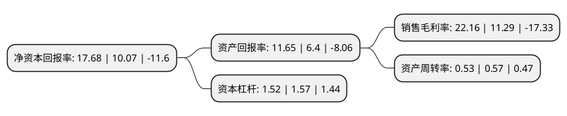

> 本页面由自动化程序生成于 2022年5月20日 01:39
> 内容可能存在错误，如有bug请提交issue至：https://github.com/Eroleice/doc-pi/issues
{.is-warning}

# 上市公司基本情况

## 基本资料

成都欧林生物科技股份有限公司（以下简称“欧林生物”）成立于2009年12月11日，成都市。于2021年06月08日在上交所科创板上市。

欧林生物注册资本40,526.5万元，专注于人用疫苗的研发，生产及销售以下是详细信息：

- 公司名称: 成都欧林生物科技股份有限公司
- 股票代码: 688319.SH
- 所在地: 四川 - 成都市
- 成立日期: 2009年12月11日
- 注册资本: 40,526.5万元
- 法定代表人: 樊绍文
- 主营业务: 专注于人用疫苗的研发，生产及销售
- 公司官网: www.olymvax.com
- 公司介绍: 公司是一家专注于人用疫苗研发、生产及销售的生物制药企业,自成立之日起，公司就制定了“传统疫苗升级换代+创新疫苗开发”双轮驱动的产品研发策略，自主研发与合作研发相结合的开发模式。在十多年的研究开发过程中，公司已经形成“阶梯有序、重点突破、多产品储备”的产品研发格局,公司以自主研发的方式对国内市场需求广阔的传统疫苗进行改良和技术创新，并与国内外高校及科研院所合作研发创新疫苗。经过多年技术积累，公司已能够熟练掌握多糖蛋白结合技术、基因工程技术、多肽疫苗技术、分离纯化技术、细菌高密度培养技术和脱毒控制技术,公司已实现吸附破伤风疫苗和Hib结合疫苗两个产品上市销售，AC结合疫苗完成了药品注册生产现场检查。通过上述疫苗的研发及产业化，公司收获了人才团队，积累了丰富的经验，取得了多项发明专利，为未来在研项目的成功及产业化奠定了坚实的基础。

## 股东及高管情况

上市公司第一大股东为重庆武山生物技术有限公司，持股72,394,330股，占比17.86%，**疑似为**上市公司实际控制人。

截至2022年03月31日，上市公司的前十大股东中，共有6名自然人股东，4名机构股东，其中5%以上大股东共有4名。上市公司前十大股东明细如下：

> 未能通过持股比例判定出上市公司实际控制人（持股30%以上）
> 可能存在通过间接持股、联合持股、协议控制等方式拥有实际控制权的主体，具体请参考上市公司定期公告！
{.is-warning}

> 截至2022年03月31日，上市公司前十大股东信息如下：

| 股东名称 | 持股数量（股） | 持股比例 |
| --- | --- | --- |
| 重庆武山生物技术有限公司 | 72,394,330 | 17.86% |
| 樊钒 | 29,489,220 | 7.28% |
| 泰昌集团有限公司 | 25,893,040 | 6.39% |
| 张渝 | 23,146,860 | 5.71% |
| 王保林 | 15,922,077 | 3.93% |
| 樊绍文 | 15,592,795 | 3.85% |
| 邹龙 | 14,994,000 | 3.7% |
| 上海联寰生实业有限公司 | 11,900,000 | 2.94% |
| 珠海广发信德敖东医药产业股权投资中心(有限合伙) | 11,106,610 | 2.74% |
| 辛懿 | 8,780,840 | 2.17% |

## 利润表分析

上市公司2021年总收入为4.87亿元，净利润为1.07亿元，实现盈利。

## 杜邦分析

> 数据列示周期：2021年 | 2020年 | 2019年
{.is-info}

上市公司的净资产收益率在近一年有所上升，上升幅度为75.57%，其变化情况分解如下：
- 上市公司的销售毛利率在近一年上升了96.28%，可能是生产效率的提升、商品原材料价格下跌或商品价格的上涨所致。
- 上市公司的资产周转率在近一年下降了-7.02%，可能是源自于更慢的销售回款或库存管理效果下降。
- 上市公司的财务杠杆比率在近一年下降了-3.18%，可能是减少负债降低财务费用。

