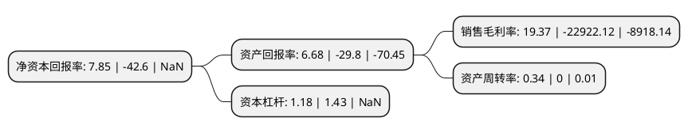

> 本页面由自动化程序生成于 2022年5月20日 01:39
> 内容可能存在错误，如有bug请提交issue至：https://github.com/Eroleice/doc-pi/issues
{.is-warning}

# 上市公司基本情况

## 基本资料

荣昌生物制药(烟台)股份有限公司（以下简称“荣昌生物”）成立于2008年07月04日，烟台市。于2022年03月31日在上交所科创板上市。

荣昌生物注册资本54,426.3万元，专注于抗体药物偶联物(ADC)，抗体融合蛋白，单抗及双抗等治疗性抗体药物领域。公司致力于发现，开发与商业化创新，有特色的同类首创(first-in-class)与同类最佳(best-in-class)生物药物，以创造药物临床价值为导向，为自身免疫疾病，肿瘤疾病，眼科疾病等重大疾病领域提供安全，有效，可及的临床解决方案，以满足大量尚未被满足的临床需求。以下是详细信息：

- 公司名称: 荣昌生物制药(烟台)股份有限公司
- 股票代码: 688331.SH
- 所在地: 山东 - 烟台市
- 成立日期: 2008年07月04日
- 注册资本: 54,426.3万元
- 法定代表人: 王威东
- 主营业务: 专注于抗体药物偶联物(ADC)，抗体融合蛋白，单抗及双抗等治疗性抗体药物领域公司致力于发现，开发与商业化创新，有特色的同类首创(first-in-class)与同类最佳(best-in-class)生物药物，以创造药物临床价值为导向，为自身免疫疾病，肿瘤疾病，眼科疾病等重大疾病领域提供安全，有效，可及的临床解决方案，以满足大量尚未被满足的临床需求
- 公司官网: www.remegen.cn
- 公司介绍: 公司是一家具有全球化视野的创新型生物制药企业，自成立以来一直专注于抗体药物偶联物(ADC)、抗体融合蛋白、单抗及双抗等治疗性抗体药物领域。公司致力于发现、开发与商业化创新、有特色的同类首创(first-in-class)与同类最佳(best-in-class)生物药物，以创造药物临床价值为导向，为自身免疫疾病、肿瘤疾病、眼科疾病等重大疾病领域提供安全、有效、可及的临床解决方案，以满足大量尚未被满足的临床需求。秉承与坚持自主创新、差异化与全球化的发展战略，公司全力推动多个药物在国内外的研发与商业化进程，以实现“成为中国领先、全球一流的生物制药公司”的企业愿景。并获评“国家(山东)创新药物孵化基地”、“科技创新优秀团队”、“重点华侨华人创业团队”、“烟台市科学技术奖”、“2020年度山东十大科技成果奖”等奖项或荣誉。

## 股东及高管情况

上市公司第一大股东为香港中央结算(代理人)有限公司，持股156,992,705股，占比28.85%，**疑似为**上市公司实际控制人。

截至2022年03月31日，上市公司的前十大股东中，共有4名机构股东，1个产品账户，5个海外主体，其中5%以上大股东共有3名。上市公司前十大股东明细如下：

> 未能通过持股比例判定出上市公司实际控制人（持股30%以上）
> 可能存在通过间接持股、联合持股、协议控制等方式拥有实际控制权的主体，具体请参考上市公司定期公告！
{.is-warning}

> 截至2022年03月31日，上市公司前十大股东信息如下：

| 股东名称 | 持股数量（股） | 持股比例 |
| --- | --- | --- |
| 香港中央结算(代理人)有限公司 | 156,992,705 | 28.85% |
| 烟台荣达创业投资中心(有限合伙) | 102,381,891 | 18.81% |
| I-Nova Limited | 39,600,000 | 7.28% |
| FANG  JIANMIN | 26,218,320 | 4.82% |
| 国投(上海)创业投资管理有限公司-国投(上海)科技成果转化创业投资基金企业(有限合伙) | 24,732,556 | 4.54% |
| PAG Growth Prosperity Holding I(HK)Limited | 21,136,602 | 3.88% |
| 烟台荣谦企业管理中心(有限合伙) | 18,507,388 | 3.4% |
| 烟台荣益企业管理中心(有限合伙) | 16,630,337 | 3.06% |
| Wholly Sunbeam Limited | 15,693,711 | 2.88% |
| 深圳市创新投资集团有限公司 | 12,813,478 | 2.35% |

## 利润表分析

上市公司2021年总收入为14.26亿元，净利润为2.76亿元，实现盈利。

## 杜邦分析

> 数据列示周期：2021年 | 2020年 | 2019年
{.is-info}

上市公司的净资产收益率在近一年有所下降，下降幅度为-118.43%，其变化情况分解如下：
- 上市公司的销售毛利率在近一年下降了-100.08%，可能是生产效率的下降、商品原材料价格上涨或商品价格的下跌所致。
- 上市公司的资产周转率在近一年上升了Infinity%，可能是源自于更快的销售回款或库存管理效果提升。
- 上市公司的财务杠杆比率在近一年下降了-17.48%，可能是减少负债降低财务费用。

