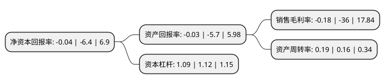

> 本页面由自动化程序生成于 2022年5月20日 01:39
> 内容可能存在错误，如有bug请提交issue至：https://github.com/Eroleice/doc-pi/issues
{.is-warning}

# 上市公司基本情况

## 基本资料

三生国健药业(上海)股份有限公司（以下简称“三生国健”）成立于2002年01月25日，上海市。于2020年07月22日在上交所科创板上市。

三生国健注册资本61,621.141万元，主要收入来源为“重组人II型肿瘤坏死因子受体-抗体融合蛋白”(商品名“益赛普”)，包括12。5mg/瓶与25mg/瓶两种规格。以下是详细信息：

- 公司名称: 三生国健药业(上海)股份有限公司
- 股票代码: 688336.SH
- 所在地: 上海 - 上海市
- 成立日期: 2002年01月25日
- 注册资本: 61,621.141万元
- 法定代表人: LOU JING
- 主营业务: 主要收入来源为“重组人II型肿瘤坏死因子受体-抗体融合蛋白”(商品名“益赛普”)，包括125mg/瓶与25mg/瓶两种规格
- 公司官网: www.3s-guojian.com
- 公司介绍: 三生国健成立于2002年，是中国第一批专注于抗体药物的创新型生物医药企业，也是一家拥有三款已上市治疗性抗体类药物的国内药企，已发展为同时具备自主研发、产业化及商业化能力的中国抗体药物先行者。公司拥有抗体药物国家工程研究中心，运行着目前国内生物制药公司中规模领先的抗体药物生产基地，已建成生物反应器合计规模超40,000升。公司以创新型治疗性抗体药物为主要研发方向，为自身免疫性疾病、肿瘤等重大疾病治疗领域提供高品质、安全有效的临床解决方案。三生国健秉承“珍爱生命、关注生存、创造生活”的理念，致力于成为一家惠及中国、面向全球的创新型治疗性抗体药物公司，践行“让创新抗体药触手可及”的企业使命，从而不断提升人民群众的获得感、幸福感和安全感，助力健康中国建设。

## 股东及高管情况

上市公司第一大股东为富健药业有限公司，持股221,518,988股，占比35.95%，为上市公司实际控制人。

截至2022年03月31日，上市公司的前十大股东中，共有9名机构股东，1个海外主体，其中5%以上大股东共有3名。上市公司前十大股东明细如下：

> 截至2022年03月31日，上市公司前十大股东信息如下：

| 股东名称 | 持股数量（股） | 持股比例 |
| --- | --- | --- |
| 富健药业有限公司 | 221,518,988 | 35.95% |
| 上海兴生药业有限公司 | 212,658,228 | 34.51% |
| 沈阳三生制药有限责任公司 | 39,614,607 | 6.43% |
| 达佳国际(香港)有限公司 | 25,160,657 | 4.08% |
| 上海昊颔企业管理咨询中心(有限合伙) | 19,206,564 | 3.12% |
| 上海浦东领驭投资发展中心(有限合伙) | 11,339,405 | 1.84% |
| 上海浦东田羽投资发展中心(有限合伙) | 10,965,428 | 1.78% |
| Grand Path   Holdings Limited | 10,408,922 | 1.69% |
| 上海翃熵投资咨询有限公司 | 3,717,472 | 0.6% |
| 华泰创新投资有限公司 | 1,913,769 | 0.31% |

## 利润表分析

上市公司2021年总收入为9.28亿元，净利润为-0.02亿元，**未实现盈利**。

## 杜邦分析

> 数据列示周期：2021年 | 2020年 | 2019年
{.is-info}

上市公司的净资产收益率在近一年有所下降，下降幅度为-99.37%，其变化情况分解如下：
- 上市公司的销售毛利率在近一年下降了-99.5%，可能是生产效率的下降、商品原材料价格上涨或商品价格的下跌所致。
- 上市公司的资产周转率在近一年上升了18.75%，可能是源自于更快的销售回款或库存管理效果提升。
- 上市公司的财务杠杆比率在近一年下降了-2.68%，可能是减少负债降低财务费用。

