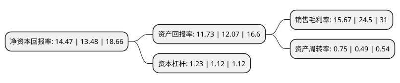

> 本页面由自动化程序生成于 2022年5月20日 01:39
> 内容可能存在错误，如有bug请提交issue至：https://github.com/Eroleice/doc-pi/issues
{.is-warning}

# 上市公司基本情况

## 基本资料

华熙生物科技股份有限公司（以下简称“华熙生物”）成立于2000年01月03日，济南市。于2019年11月06日在上交所科创板上市。

华熙生物注册资本48,000万元，以微生物发酵和交联两大技术平台，开发有助于人类生命健康的生物活性材料，从原料到医疗终端产品，功能性护肤品及功能性食品的全产业链业务体系，服务于全球的医药，化妆品，食品制造企业，医疗机构及终端用户。以下是详细信息：

- 公司名称: 华熙生物科技股份有限公司
- 股票代码: 688363.SH
- 所在地: 山东 - 济南市
- 成立日期: 2000年01月03日
- 注册资本: 48,000万元
- 法定代表人: 赵燕
- 主营业务: 以微生物发酵和交联两大技术平台，开发有助于人类生命健康的生物活性材料，从原料到医疗终端产品，功能性护肤品及功能性食品的全产业链业务体系，服务于全球的医药，化妆品，食品制造企业，医疗机构及终端用户
- 公司官网: www.bloomagebiotech.com
- 公司介绍: 公司是全球领先的、以透明质酸微生物发酵生产技术为核心的高新技术企业，透明质酸产业化规模位居国际前列，公司是国内最早实现微生物发酵法生产透明质酸的企业之一，透明质酸具有良好的保水性、润滑性、黏弹性、生物降解性及生物相容性等理化性能和生物活性，在医药(骨科、眼科、普外科、泌尿外科、胃肠科、耳鼻喉科、口腔科、整形外科、皮肤科等)、化妆品及功能性食品中应用十分广泛，公司持续开展微生物发酵法生产透明质酸技术研发，国内率先实现了透明质酸微生物发酵技术产业化的突破，改变了我国以动物组织提取法生产透明质酸且主要依靠进口的落后局面。通过菌种诱变和高通量筛选、发酵代谢流调控、多尺度过程优化、动态补料控制等技术，极大提升了透明质酸的生产规模和质量，显著降低了生产成本，推动了透明质酸在各个领域的应用。凭借透明质酸发酵技术的创新成就，多次获得国家和省科技进步奖励。

## 股东及高管情况

上市公司第一大股东为华熙昕宇投资有限公司，持股283,500,000股，占比58.93%，为上市公司实际控制人。

截至2022年03月31日，上市公司的前十大股东中，共有5名机构股东，1个产品账户，4个海外主体，其中5%以上大股东共有2名。上市公司前十大股东明细如下：

> 截至2022年03月31日，上市公司前十大股东信息如下：

| 股东名称 | 持股数量（股） | 持股比例 |
| --- | --- | --- |
| 华熙昕宇投资有限公司 | 283,500,000 | 58.93% |
| 国寿成达(上海)健康产业股权投资中心(有限合伙) | 34,433,286 | 7.16% |
| JPMORGAN CHASE BANK,NATIONAL ASSOCIATION | 8,116,913 | 1.69% |
| Fortune Ace Investment Limited | 7,754,376 | 1.61% |
| 中金佳泰贰期(天津)股权投资基金合伙企业(有限合伙) | 7,173,601 | 1.49% |
| 天津华杰海河医疗投资合伙企业(有限合伙) | 6,599,713 | 1.37% |
| 艾睿思(天津)医疗投资合伙企业(有限合伙) | 6,312,769 | 1.31% |
| 中国民生信托有限公司 | 5,827,215 | 1.21% |
| WEST SUPREME LIMITED | 5,774,548 | 1.2% |
| Sunny Faithful Investment Limited | 4,617,150 | 0.96% |

## 利润表分析

上市公司2021年总收入为49.47亿元，净利润为7.75亿元，实现盈利。

## 杜邦分析

> 数据列示周期：2021年 | 2020年 | 2019年
{.is-info}

上市公司的净资产收益率在近一年有所上升，上升幅度为7.34%，其变化情况分解如下：
- 上市公司的销售毛利率在近一年下降了-36.04%，可能是生产效率的下降、商品原材料价格上涨或商品价格的下跌所致。
- 上市公司的资产周转率在近一年上升了53.06%，可能是源自于更快的销售回款或库存管理效果提升。
- 上市公司的财务杠杆比率在近一年上升了9.82%，可能是增加负债扩大生产规模。

