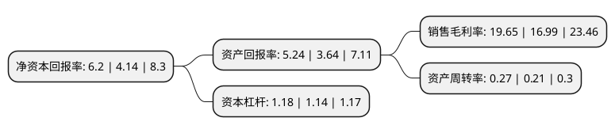

> 本页面由自动化程序生成于 2022年5月20日 01:39
> 内容可能存在错误，如有bug请提交issue至：https://github.com/Eroleice/doc-pi/issues
{.is-warning}

# 上市公司基本情况

## 基本资料

上海昊海生物科技股份有限公司（以下简称“昊海生科”）成立于2007年01月24日，上海市。于2019年10月30日在上交所科创板上市。

昊海生科注册资本17,582.21万元，致力于通过技术创新及转化，国内外资源整合及规模化生产，为市场提供创新医疗产品。公司的主要产品可分为眼科，整形美容与创面护理，骨科，防粘连及止血四大板块。以下是详细信息：

- 公司名称: 上海昊海生物科技股份有限公司
- 股票代码: 688366.SH
- 所在地: 上海 - 上海市
- 成立日期: 2007年01月24日
- 注册资本: 17,582.21万元
- 法定代表人: 侯永泰
- 主营业务: 致力于通过技术创新及转化，国内外资源整合及规模化生产，为市场提供创新医疗产品公司的主要产品可分为眼科，整形美容与创面护理，骨科，防粘连及止血四大板块
- 公司官网: www.3healthcare.com
- 公司介绍: 公司是一家应用生物医用材料技术和基因工程技术进行医疗器械和药品研发、生产和销售的科技创新型企业，致力于通过技术创新及转化、国内外资源整合及规模化生产，为市场提供创新医疗产品，逐步实现相关医药产品的进口替代，成为有关生物医用材料领域的领军企业。经过十余年不断自主创新和产业整合，公司完成了以医用透明质酸钠/玻璃酸钠和医用几丁糖为代表的可吸收生物医用材料的行业重组，实现了创新基因工程药物重组人表皮生长因子的产业化，进而在眼科、整形美容与创面护理、骨科和防粘连及止血四个主要业务领域取得了行业领先优势。此基础之上，公司通过一系列并购，构建了从原料制备、光学设计、创新工艺研发到规模化生产和专业市场营销的人工晶状体全产业链。

## 股东及高管情况

上市公司第一大股东为蒋伟，持股44,449,000股，占比25.28%，**疑似为**上市公司实际控制人。

截至2022年03月31日，上市公司的前十大股东中，共有8名自然人股东，1名机构股东，1个海外主体，其中5%以上大股东共有3名。上市公司前十大股东明细如下：

> 未能通过持股比例判定出上市公司实际控制人（持股30%以上）
> 可能存在通过间接持股、联合持股、协议控制等方式拥有实际控制权的主体，具体请参考上市公司定期公告！
{.is-warning}

> 截至2022年03月31日，上市公司前十大股东信息如下：

| 股东名称 | 持股数量（股） | 持股比例 |
| --- | --- | --- |
| 蒋伟 | 44,449,000 | 25.28% |
| 香港中央结算(代理人)有限公司 | 37,948,789 | 21.58% |
| 游捷 | 28,800,000 | 16.38% |
| 楼国梁 | 7,125,075 | 4.05% |
| 上海湛泽企业管理合伙企业(有限合伙) | 6,471,000 | 3.68% |
| 吴剑英 | 6,000,000 | 3.41% |
| 侯永泰 | 5,982,000 | 3.4% |
| 黄明 | 2,000,000 | 1.14% |
| 刘远中 | 2,000,000 | 1.14% |
| 王文斌 | 1,700,000 | 0.97% |

## 利润表分析

上市公司2021年总收入为17.66亿元，净利润为3.47亿元，实现盈利。

## 杜邦分析

> 数据列示周期：2021年 | 2020年 | 2019年
{.is-info}

上市公司的净资产收益率在近一年有所上升，上升幅度为49.76%，其变化情况分解如下：
- 上市公司的销售毛利率在近一年上升了15.66%，可能是生产效率的提升、商品原材料价格下跌或商品价格的上涨所致。
- 上市公司的资产周转率在近一年上升了28.57%，可能是源自于更快的销售回款或库存管理效果提升。
- 上市公司的财务杠杆比率在近一年上升了3.51%，可能是增加负债扩大生产规模。

