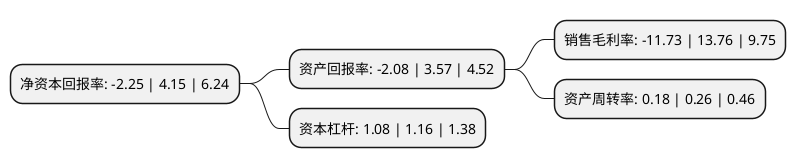

> 本页面由自动化程序生成于 2022年5月20日 01:39
> 内容可能存在错误，如有bug请提交issue至：https://github.com/Eroleice/doc-pi/issues
{.is-warning}

# 上市公司基本情况

## 基本资料

江苏艾迪药业股份有限公司（以下简称“艾迪药业”）成立于2009年12月15日，扬州市。于2020年07月20日在上交所科创板上市。

艾迪药业注册资本42,000万元，主营业务为乌司他丁，尤瑞克林，尿激酶等人源蛋白产品以及蜡样芽孢杆菌片，番泻叶颗粒，头孢拉定胶囊等制剂品种的生产销售，此外还经销HIV诊断设备及试剂。以下是详细信息：

- 公司名称: 江苏艾迪药业股份有限公司
- 股票代码: 688488.SH
- 所在地: 江苏 - 扬州市
- 成立日期: 2009年12月15日
- 注册资本: 42,000万元
- 法定代表人: 傅和亮
- 主营业务: 主营业务为乌司他丁，尤瑞克林，尿激酶等人源蛋白产品以及蜡样芽孢杆菌片，番泻叶颗粒，头孢拉定胶囊等制剂品种的生产销售，此外还经销HIV诊断设备及试剂
- 公司官网: www.aidea.com.cn
- 公司介绍: 公司是一家专注于医药领域，集药品研发、生产、销售于一体的高新技术企业,瞄准艾滋病、炎症以及恶性肿瘤等严重威胁人类健康的重大疾病领域，以未被满足的临床需求为导向，致力于探索、研发和销售创新性化学药物以及人源蛋白产品,公司致力于创新药物的研发，曾获国家科技进步二等奖，先后研究开发出国家一类新药和国家二类新药,并着力打造抗肿瘤、抗病毒和心脑血管三大领域，实现“仿制药+创新药”双轮驱动的产品组合布局。

## 股东及高管情况

上市公司第一大股东为广州维美投资有限公司，持股94,500,000股，占比22.5%，**疑似为**上市公司实际控制人。

截至2022年03月31日，上市公司的前十大股东中，共有1名自然人股东，3名机构股东，2个产品账户，4个海外主体，其中5%以上大股东共有2名。上市公司前十大股东明细如下：

> 未能通过持股比例判定出上市公司实际控制人（持股30%以上）
> 可能存在通过间接持股、联合持股、协议控制等方式拥有实际控制权的主体，具体请参考上市公司定期公告！
{.is-warning}

> 截至2022年03月31日，上市公司前十大股东信息如下：

| 股东名称 | 持股数量（股） | 持股比例 |
| --- | --- | --- |
| 广州维美投资有限公司 | 94,500,000 | 22.5% |
| 維美投資(香港)有限公司 | 77,693,400 | 18.5% |
| 上海乐扬凯睿企业管理合伙企业(有限合伙) | 17,599,958 | 4.19% |
| AEGLE TECH LIMITED | 16,200,000 | 3.86% |
| AVIDIAN TECH LIMITED | 16,200,000 | 3.86% |
| 华泰紫金(江苏)股权投资基金(有限合伙) | 15,018,480 | 3.58% |
| Starr International Investments HK V, Limited | 13,726,145 | 3.27% |
| 傅和祥 | 13,166,280 | 3.13% |
| 江苏毅达并购成长股权投资基金(有限合伙) | 12,375,905 | 2.95% |
| YYH Investment   Holdings Limited | 8,134,995 | 1.94% |

## 利润表分析

上市公司2021年总收入为2.55亿元，净利润为-0.3亿元，**未实现盈利**。

## 杜邦分析

> 数据列示周期：2021年 | 2020年 | 2019年
{.is-info}

上市公司的净资产收益率在近一年有所下降，下降幅度为-154.22%，其变化情况分解如下：
- 上市公司的销售毛利率在近一年下降了-185.25%，可能是生产效率的下降、商品原材料价格上涨或商品价格的下跌所致。
- 上市公司的资产周转率在近一年下降了-30.77%，可能是源自于更慢的销售回款或库存管理效果下降。
- 上市公司的财务杠杆比率在近一年下降了-6.9%，可能是减少负债降低财务费用。

