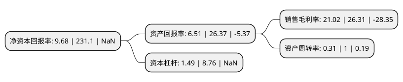

> 本页面由自动化程序生成于 2022年5月20日 01:40
> 内容可能存在错误，如有bug请提交issue至：https://github.com/Eroleice/doc-pi/issues
{.is-warning}

# 上市公司基本情况

## 基本资料

江苏金迪克生物技术股份有限公司（以下简称“金迪克”）成立于2008年12月29日，泰州市。于2021年08月02日在上交所科创板上市。

金迪克注册资本8,800万元，公司主要从事疫苗研发，生产，销售。公司主要产品(含在研)包括针对预防流行性感冒，狂犬病，水痘，带状疱疹和肺炎疾病等适应症的多种人用疫苗产品。以下是详细信息：

- 公司名称: 江苏金迪克生物技术股份有限公司
- 股票代码: 688670.SH
- 所在地: 江苏 - 泰州市
- 成立日期: 2008年12月29日
- 注册资本: 8,800万元
- 法定代表人: 余军
- 主营业务: 公司主要从事疫苗研发，生产，销售公司主要产品(含在研)包括针对预防流行性感冒，狂犬病，水痘，带状疱疹和肺炎疾病等适应症的多种人用疫苗产品
- 公司官网: www.gdkbio.com
- 公司介绍: 公司是一家专注于人用疫苗研发、生产、销售的生物制药企业。公司开发的四价流感病毒裂解疫苗已于2019年11月实现上市销售，为国内唯一以预防用生物制品1类向CDE进行申报的四价流感疫苗。公司主要产品研发取得了实质性的进展，包括四价流感病毒裂解疫苗完成新药注册、冻干人用狂犬病疫苗(Vero细胞)开展III期临床试验、四价流感病毒裂解疫苗(儿童)开展I期临床试验等。凭借多年的技术积累，公司已经建立了四个核心平台技术，分别为鸡胚基质疫苗制备生产技术、细胞基质病毒培养与疫苗制备技术、多糖纯化与蛋白偶联技术和规模化制剂生产技术，覆盖人用疫苗研发和产业化的全流程。2019年，公司是国内仅有的两家实现四价流感疫苗批签发及上市销售的企业之一。

## 股东及高管情况

上市公司第一大股东为张良斌，持股27,049,291股，占比30.74%，为上市公司实际控制人。

截至2022年03月31日，上市公司的前十大股东中，共有6名自然人股东，3名机构股东，1个产品账户，其中5%以上大股东共有2名。上市公司前十大股东明细如下：

> 截至2022年03月31日，上市公司前十大股东信息如下：

| 股东名称 | 持股数量（股） | 持股比例 |
| --- | --- | --- |
| 张良斌 | 27,049,291 | 30.74% |
| 余军 | 27,049,291 | 30.74% |
| 张建辉 | 4,057,394 | 4.61% |
| 聂申钱 | 3,381,159 | 3.84% |
| 中信证券-中信银行-中信证券金迪克员工参与科创板战略配售集合资产管理计划 | 2,200,000 | 2.5% |
| 夏建国 | 2,086,865 | 2.37% |
| 泰州同泽企业管理咨询合伙企业(有限合伙) | 1,188,000 | 1.35% |
| 泰州同人企业管理咨询合伙企业(有限合伙) | 1,188,000 | 1.35% |
| 吴铁 | 822,000 | 0.93% |
| 中信证券投资有限公司 | 712,400 | 0.81% |

## 利润表分析

上市公司2021年总收入为3.92亿元，净利润为0.82亿元，实现盈利。

## 杜邦分析

> 数据列示周期：2021年 | 2020年 | 2019年
{.is-info}

上市公司的净资产收益率在近一年有所下降，下降幅度为-95.81%，其变化情况分解如下：
- 上市公司的销售毛利率在近一年下降了-20.11%，可能是生产效率的下降、商品原材料价格上涨或商品价格的下跌所致。
- 上市公司的资产周转率在近一年下降了-69%，可能是源自于更慢的销售回款或库存管理效果下降。
- 上市公司的财务杠杆比率在近一年下降了-82.99%，可能是减少负债降低财务费用。

