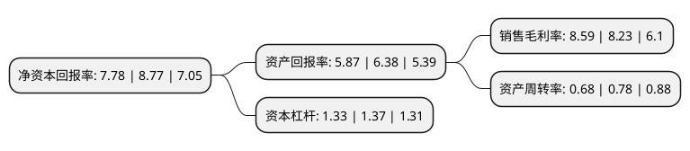

> 本页面由自动化程序生成于 2022年5月20日 01:40
> 内容可能存在错误，如有bug请提交issue至：https://github.com/Eroleice/doc-pi/issues
{.is-warning}

# 上市公司基本情况

## 基本资料

北京凯因科技股份有限公司（以下简称“凯因科技”）成立于2008年08月20日，北京市。于2021年02月08日在上交所科创板上市。

凯因科技注册资本16,982.842万元，专注于现有病毒病领域治疗药物的生产及销售为基础，同时积极开展创新药的研发。以下是详细信息：

- 公司名称: 北京凯因科技股份有限公司
- 股票代码: 688687.SH
- 所在地: 北京 - 北京市
- 成立日期: 2008年08月20日
- 注册资本: 16,982.842万元
- 法定代表人: 周德胜
- 主营业务: 专注于现有病毒病领域治疗药物的生产及销售为基础，同时积极开展创新药的研发
- 公司官网: www.kawin.com.cn
- 公司介绍: 公司是一家以生物技术为平台，专注于病毒性疾病领域，致力于提供治疗解决方案的生物医药公司。公司以现有病毒病领域治疗药物的生产及销售为基础，同时积极开展创新药的研发。公司是国内首家成功开发出丙肝高治愈率泛基因型全口服药物组合的医药企业，打破了国外医药企业对国内丙肝治疗药物的垄断局面，从而实现进口替代，将惠及千万患者，助力实现世界卫生组织提出的“2030年消除病毒性肝炎作为公共卫生威胁”目标,公司拥有蛋白质药物精准单点修饰长效技术、中和抗体发现技术、重组蛋白和抗体产业化技术、抗病毒小分子创新药物设计技术等核心技术平台，并承担了“1类抗丙肝新药KW-136的临床开发研究”、“治疗病毒性乙肝的PEG长效药物的临床研究”等7项“十二五”、“十三五”国家科技重大专项-重大新药创制专项、艾滋病和病毒性肝炎等重大传染病防治专项,公司秉承“坚持做临床有价值的创新药，为患者提供整体治疗解决方案”的经营理念，公司已逐渐成长为国内病毒性疾病治疗领域的领先力量。

## 股东及高管情况

上市公司第一大股东为北京松安投资管理有限公司，持股38,400,000股，占比22.61%，**疑似为**上市公司实际控制人。

截至2022年03月31日，上市公司的前十大股东中，共有10名机构股东，其中5%以上大股东共有1名。上市公司前十大股东明细如下：

> 未能通过持股比例判定出上市公司实际控制人（持股30%以上）
> 可能存在通过间接持股、联合持股、协议控制等方式拥有实际控制权的主体，具体请参考上市公司定期公告！
{.is-warning}

> 截至2022年03月31日，上市公司前十大股东信息如下：

| 股东名称 | 持股数量（股） | 持股比例 |
| --- | --- | --- |
| 北京松安投资管理有限公司 | 38,400,000 | 22.61% |
| 天津君睿祺股权投资合伙企业(有限合伙) | 8,491,300 | 4.99% |
| 海通开元投资有限公司 | 6,244,000 | 3.68% |
| 北京卓尚湾企业管理中心(有限合伙) | 5,043,922 | 2.97% |
| 宁波赛伯乐甬科股权投资合伙企业(有限合伙) | 4,827,500 | 2.84% |
| 尚融宝盈(宁波)投资中心(有限合伙) | 4,502,399 | 2.65% |
| 高林厚健(上海)创业投资合伙企业(有限合伙) | 4,000,000 | 2.36% |
| 北京富山湾投资管理中心(有限合伙) | 3,156,600 | 1.86% |
| 北京富宁湾投资管理中心(有限合伙) | 3,113,100 | 1.83% |
| 深圳前海方维股权投资合伙企业(有限合伙) | 2,689,500 | 1.58% |

## 利润表分析

上市公司2021年总收入为11.44亿元，净利润为0.98亿元，实现盈利。

## 杜邦分析

> 数据列示周期：2021年 | 2020年 | 2019年
{.is-info}

上市公司的净资产收益率在近一年有所下降，下降幅度为-11.29%，其变化情况分解如下：
- 上市公司的销售毛利率在近一年上升了4.37%，可能是生产效率的提升、商品原材料价格下跌或商品价格的上涨所致。
- 上市公司的资产周转率在近一年下降了-12.82%，可能是源自于更慢的销售回款或库存管理效果下降。
- 上市公司的财务杠杆比率在近一年下降了-2.92%，可能是减少负债降低财务费用。

