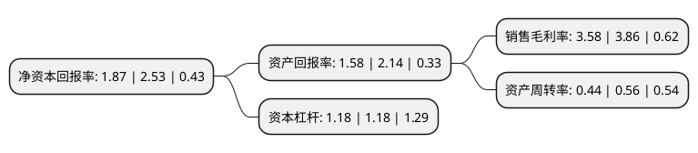

> 本页面由自动化程序生成于 2022年5月20日 01:14
> 内容可能存在错误，如有bug请提交issue至：https://github.com/Eroleice/doc-pi/issues
{.is-warning}

# 上市公司基本情况

## 基本资料

网宿科技股份有限公司（以下简称“网宿科技”）成立于2000年01月26日，上海市。于2009年10月30日在深交所创业板上市。

网宿科技注册资本244,702.98万元，主要产品:CDN，IDC，云计算，云安全。主营业务:向客户提供“内容分发与加速(CDN)”，定制化“互联网数据中心(IDC)”，“云计算”，“云安全”等服务。以下是详细信息：

- 公司名称: 网宿科技股份有限公司
- 股票代码: 300017.SZ
- 所在地: 上海 - 上海市
- 成立日期: 2000年01月26日
- 注册资本: 244,702.98万元
- 法定代表人: 刘成彦
- 主营业务: 主要产品:CDN，IDC，云计算，云安全主营业务:向客户提供“内容分发与加速(CDN)”，定制化“互联网数据中心(IDC)”，“云计算”，“云安全”等服务
- 公司官网: www.wangsu.com
- 公司介绍: 公司是一家互联网业务平台提供商，知识和技术密集型的高新技术企业，公司服务的中大型客户包括互联网企业、政府、传统企业及电信运营商。针对客户在IT部署及数据计算、传输、安全等方面的需求，公司总结多年来服务各行业的经验和行业特点，推出针对手机直播、媒体、家电、汽车、电商、快消、金融、消费电子、游戏、政务、教育等行业的整体解决方案，并为客户提供定制化服务。公司通过多年积累的运营经验为客户提供专业服务，帮助客户提升自身互联网服务质量、简化维护管理流程、降低运维成本。公司主要产品包括：CDN,IDC,云计算,云安全。

## 股东及高管情况

上市公司第一大股东为陈宝珍，持股261,062,924股，占比10.67%，**疑似为**上市公司实际控制人。

截至2022年04月28日，上市公司的前十大股东中，共有4名自然人股东，1名机构股东，4个产品账户，1个海外主体，其中5%以上大股东共有2名。上市公司前十大股东明细如下：

> 未能通过持股比例判定出上市公司实际控制人（持股30%以上）
> 可能存在通过间接持股、联合持股、协议控制等方式拥有实际控制权的主体，具体请参考上市公司定期公告！
{.is-warning}

> 截至2022年04月28日，上市公司前十大股东信息如下：

| 股东名称 | 持股数量（股） | 持股比例 |
| --- | --- | --- |
| 陈宝珍 | 261,062,924 | 10.67% |
| 刘成彦 | 202,507,029 | 8.28% |
| 香港中央结算有限公司(陆股通) | 29,781,530 | 1.22% |
| 深圳市泰润海吉资产管理有限公司-泰润惠鑫1号私募证券投资基金 | 18,989,667 | 0.78% |
| 储敏健 | 18,629,728 | 0.76% |
| 不列颠哥伦比亚省投资管理公司-自有资金 | 18,269,400 | 0.75% |
| 中国银行股份有限公司-华夏中证5G通信主题交易型开放式指数证券投资基金 | 17,088,837 | 0.7% |
| 张茹 | 16,009,793 | 0.65% |
| 博时基金-招商银行-长城国融投资管理有限公司 | 13,631,288 | 0.56% |
| 博时基金-招商银行-西藏信托-晋泽1号单一资金信托 | 13,631,288 | 0.56% |

## 利润表分析

上市公司2021年总收入为45.75亿元，净利润为1.63亿元，实现盈利。

## 杜邦分析

> 数据列示周期：2021年 | 2020年 | 2019年
{.is-info}

上市公司的净资产收益率在近一年有所下降，下降幅度为-26.09%，其变化情况分解如下：
- 上市公司的销售毛利率在近一年下降了-7.25%，可能是生产效率的下降、商品原材料价格上涨或商品价格的下跌所致。
- 上市公司的资产周转率在近一年下降了-21.43%，可能是源自于更慢的销售回款或库存管理效果下降。
- 上市公司的财务杠杆比率在近一年下降了0%，可能是减少负债降低财务费用。

