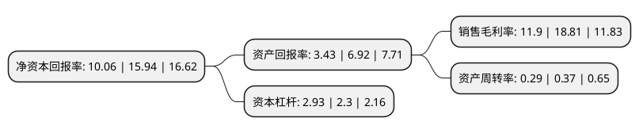

> 本页面由自动化程序生成于 2022年5月20日 01:20
> 内容可能存在错误，如有bug请提交issue至：https://github.com/Eroleice/doc-pi/issues
{.is-warning}

# 上市公司基本情况

## 基本资料

广东奥飞数据科技股份有限公司（以下简称“奥飞数据”）成立于2004年09月28日，广州市。于2018年01月19日在深交所创业板上市。

奥飞数据注册资本38,164.465万元，主要为客户提供IDC服务及其他互联网综合服务。以下是详细信息：

- 公司名称: 广东奥飞数据科技股份有限公司
- 股票代码: 300738.SZ
- 所在地: 广东 - 广州市
- 成立日期: 2004年09月28日
- 注册资本: 38,164.465万元
- 法定代表人: 冯康
- 主营业务: 主要为客户提供IDC服务及其他互联网综合服务
- 公司官网: www.ofidc.com
- 公司介绍: 公司是专业的数据中心业务运营商和通信综合运营企业。奥飞数据依靠自身雄厚的技术与丰富的资源，秉承“为客户提供优质服务”的宗旨，获得了多项专业认证与服务资质。服务范围包括数据中心服务(IDC)、容灾备份、异地双活等互联网增值服务和产品。作为专业的云计算与大数据应用基础服务提供商，奥飞数据严守“高稳定性、高可用性、高安全性”的原则在华南地区设计建设了多个自建数据中心，并在全国各地运营着众多高标准数据中心，具备覆盖全国的服务能力。目前公司作为中国电信、中国联通、中国移动的核心合作伙伴，已经成为华南地区核心多线(电信+联通+移动+教育网)托管运营商，主要服务客户包括搜狐、网易、UC、风行、三七互娱等著名互联网企业；同时拥有IDC(互联网数据中心)、固定网国内数据传送业务、ICP(互联网内容服务)等通信业务的经营资质，能为客户提供全方位的通信解决方案。

## 股东及高管情况

上市公司第一大股东为广州市昊盟计算机科技有限公司，持股167,002,560股，占比43.76%，为上市公司实际控制人。

截至2022年03月31日，上市公司的前十大股东中，共有6名自然人股东，1名机构股东，2个产品账户，1个海外主体，其中5%以上大股东共有1名。上市公司前十大股东明细如下：

> 截至2022年03月31日，上市公司前十大股东信息如下：

| 股东名称 | 持股数量（股） | 持股比例 |
| --- | --- | --- |
| 广州市昊盟计算机科技有限公司 | 167,002,560 | 43.76% |
| 冷勇燕 | 8,670,932 | 2.27% |
| 秦美芳 | 6,888,925 | 1.81% |
| 唐巨良 | 4,776,552 | 1.25% |
| 横琴广金美好基金管理有限公司-广金美好科新十号私募证券投资基金 | 3,521,269 | 0.92% |
| 何宇亮 | 2,203,200 | 0.58% |
| 唐仲良 | 2,203,200 | 0.58% |
| 国泰君安证券股份有限公司-湘财长顺混合型发起式证券投资基金 | 2,161,464 | 0.57% |
| 香港中央结算有限公司(陆股通) | 2,097,193 | 0.55% |
| 杨茵 | 1,987,341 | 0.52% |

## 利润表分析

上市公司2021年总收入为12.04亿元，净利润为1.43亿元，实现盈利。

## 杜邦分析

> 数据列示周期：2021年 | 2020年 | 2019年
{.is-info}

上市公司的净资产收益率在近一年有所下降，下降幅度为-36.89%，其变化情况分解如下：
- 上市公司的销售毛利率在近一年下降了-36.74%，可能是生产效率的下降、商品原材料价格上涨或商品价格的下跌所致。
- 上市公司的资产周转率在近一年下降了-21.62%，可能是源自于更慢的销售回款或库存管理效果下降。
- 上市公司的财务杠杆比率在近一年上升了27.39%，可能是增加负债扩大生产规模。

