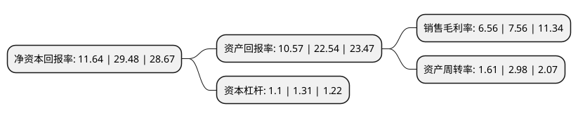

> 本页面由自动化程序生成于 2022年5月20日 01:21
> 内容可能存在错误，如有bug请提交issue至：https://github.com/Eroleice/doc-pi/issues
{.is-warning}

# 上市公司基本情况

## 基本资料

无锡线上线下通讯信息技术股份有限公司（以下简称“线上线下”）成立于2012年09月14日，无锡市。于2021年03月22日在深交所创业板上市。

线上线下注册资本8,000万元，公司主营业务为移动信息服务，包括企业短信业务以及少量的流量业务。以下是详细信息：

- 公司名称: 无锡线上线下通讯信息技术股份有限公司
- 股票代码: 300959.SZ
- 所在地: 江苏 - 无锡市
- 成立日期: 2012年09月14日
- 注册资本: 8,000万元
- 法定代表人: 汪坤
- 主营业务: 公司主营业务为移动信息服务，包括企业短信业务以及少量的流量业务
- 公司官网: www.wxxsxx.cn
- 公司介绍: 公司深耕移动信息服务行业多年，是一家具有丰富行业经验的移动信息服务提供商。公司依托于体系化的服务流程、自主研发的业务平台，通过对电信运营商的通信资源的整合，秉承“技术驱动服务、深耕行业客户、连接创造价值”的企业文化理念，致力于为客户提供安全、有效、及时的移动信息服务。公司是中国移动、中国电信、中国联通卓越的战略伙伴，同近千家中大型知名企业保持着良好的合作关系，为中国用户和广大企业提供便捷适用的互联网软件应用服务和电信增值服务。

## 股东及高管情况

上市公司第一大股东为汪坤，持股27,744,994股，占比34.68%，为上市公司实际控制人。

截至2022年03月31日，上市公司的前十大股东中，共有6名自然人股东，4名机构股东，其中5%以上大股东共有5名。上市公司前十大股东明细如下：

> 截至2022年03月31日，上市公司前十大股东信息如下：

| 股东名称 | 持股数量（股） | 持股比例 |
| --- | --- | --- |
| 汪坤 | 27,744,994 | 34.68% |
| 门庆娟 | 9,403,115 | 11.75% |
| 广东易简投资有限公司-珠海横琴易简光煦柒号投资合伙企业(有限合伙) | 8,219,019 | 10.27% |
| 宁波梅山保税港区牧银股权投资有限公司 | 7,621,167 | 9.53% |
| 无锡峻茂投资有限公司 | 5,676,695 | 7.1% |
| 深圳市联成资产管理有限公司-珠海联成恒健资产管理合伙企业(有限合伙) | 1,335,010 | 1.67% |
| 朱长根 | 151,700 | 0.19% |
| 高法有 | 106,200 | 0.13% |
| 李萍 | 90,100 | 0.11% |
| 潘慧广 | 88,500 | 0.11% |

## 利润表分析

上市公司2021年总收入为12.94亿元，净利润为0.84亿元，实现盈利。

## 杜邦分析

> 数据列示周期：2021年 | 2020年 | 2019年
{.is-info}

上市公司的净资产收益率在近一年有所下降，下降幅度为-60.52%，其变化情况分解如下：
- 上市公司的销售毛利率在近一年下降了-13.23%，可能是生产效率的下降、商品原材料价格上涨或商品价格的下跌所致。
- 上市公司的资产周转率在近一年下降了-45.97%，可能是源自于更慢的销售回款或库存管理效果下降。
- 上市公司的财务杠杆比率在近一年下降了-16.03%，可能是减少负债降低财务费用。

