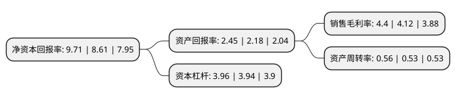

> 本页面由自动化程序生成于 2022年5月20日 01:23
> 内容可能存在错误，如有bug请提交issue至：https://github.com/Eroleice/doc-pi/issues
{.is-warning}

# 上市公司基本情况

## 基本资料

中国联合网络通信股份有限公司（以下简称“中国联通”）成立于2001年12月31日，北京市。于2002年10月09日在上交所主板上市。

中国联通注册资本3,098,813.161万元，主要业务:电信业的投资。以下是详细信息：

- 公司名称: 中国联合网络通信股份有限公司
- 股票代码: 600050.SH
- 所在地: 北京 - 北京市
- 成立日期: 2001年12月31日
- 注册资本: 3,098,813.161万元
- 法定代表人: 刘烈宏
- 主营业务: 电信业的投资
- 公司官网: www.chinaunicom-a.com
- 公司介绍: 公司是经国务院批准的控股公司，经营范围为电信业的投资。公司拥有覆盖全国、通达世界的现代通信网络，积极推进固定网络和移动网络的宽带化，为用户提供全方位、高品质信息通信服务。公司通过联通红筹公司及其所属子公司面向全国提供全方位的电信服务，包括移动宽带(WCDMA、LTE FDD、TD-LTE)、固网宽带、GSM、固网本地电话、信息通信技术服务、数据通信服务以及其他相关增值服务。公司致力成为客户信赖的智慧生活创造者，联通世界，创享美好智慧生活，不断提高产品与服务的品质来满足客户需求。公司深入实施聚焦创新合作战略，发展转型取得积极成效，混合所有制改革持续深化，互联网化运营全面展开，内外部生态持续向好，“五新”联通建设取得了重要进展。

## 股东及高管情况

上市公司第一大股东为中国联合网络通信集团有限公司，持股11,399,724,220股，占比36.8%，为上市公司实际控制人。

截至2022年03月31日，上市公司的前十大股东中，共有7名机构股东，2个产品账户，1个海外主体，其中5%以上大股东共有4名。上市公司前十大股东明细如下：

> 截至2022年03月31日，上市公司前十大股东信息如下：

| 股东名称 | 持股数量（股） | 持股比例 |
| --- | --- | --- |
| 中国联合网络通信集团有限公司 | 11,399,724,220 | 36.8% |
| 中国人寿保险股份有限公司-传统-普通保险产品-005L-CT001沪 | 3,190,419,687 | 10.3% |
| 中国国有企业结构调整基金股份有限公司 | 1,899,764,201 | 6.1% |
| 深圳市腾讯信达有限合伙企业(有限合伙) | 1,610,541,728 | 5.2% |
| 宿迁京东三弘企业管理中心(有限合伙) | 732,064,421 | 2.4% |
| 香港中央结算有限公司(陆股通) | 689,340,764 | 2.2% |
| 杭州阿里创业投资有限公司 | 633,254,734 | 2% |
| 苏宁易购集团股份有限公司 | 585,651,537 | 1.9% |
| 嘉兴小度投资管理有限公司-宁波梅山保税港区百度鹏寰投资合伙企业(有限合伙) | 439,238,653 | 1.4% |
| 深圳光启互联技术投资合伙企业(有限合伙) | 375,172,851 | 1.2% |

## 利润表分析

上市公司2021年总收入为3,278.54亿元，净利润为144.16亿元，实现盈利。

## 杜邦分析

> 数据列示周期：2021年 | 2020年 | 2019年
{.is-info}

上市公司的净资产收益率在近一年有所上升，上升幅度为12.78%，其变化情况分解如下：
- 上市公司的销售毛利率在近一年上升了6.8%，可能是生产效率的提升、商品原材料价格下跌或商品价格的上涨所致。
- 上市公司的资产周转率在近一年上升了5.66%，可能是源自于更快的销售回款或库存管理效果提升。
- 上市公司的财务杠杆比率在近一年上升了0.51%，可能是增加负债扩大生产规模。

