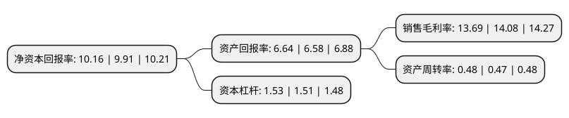

> 本页面由自动化程序生成于 2022年5月20日 01:30
> 内容可能存在错误，如有bug请提交issue至：https://github.com/Eroleice/doc-pi/issues
{.is-warning}

# 上市公司基本情况

## 基本资料

中国移动有限公司（以下简称“中国移动”）成立于1997年09月03日，null。于2022年01月05日在上交所主板上市。

中国移动注册资本2,136,282.676万元，公司持续构建基础网络能力，形成了包括移动通信，有线宽带的通信服务，以及IDC，云计算，物联网，数字应用与内容等一系列的信息服务。公司的通信及信息服务面向个人，家庭，政企和新兴市场，实现全方位，一站式的广泛覆盖。以下是详细信息：

- 公司名称: 中国移动有限公司
- 股票代码: 600941.SH
- 所在地: 香港特别行政区 - null
- 成立日期: 1997年09月03日
- 注册资本: 2,136,282.676万元
- 法定代表人: 杨杰
- 主营业务: 公司持续构建基础网络能力，形成了包括移动通信，有线宽带的通信服务，以及IDC，云计算，物联网，数字应用与内容等一系列的信息服务公司的通信及信息服务面向个人，家庭，政企和新兴市场，实现全方位，一站式的广泛覆盖
- 公司官网: www.chinamobileltd.com
- 公司介绍: 中国移动是全球领先的通信及信息服务企业，致力于为个人、家庭、政企、新兴市场提供全方位的通信及信息服务，是我国信息通信产业发展壮大的科技引领者和创新推动者。二十余年来，公司持续推进信息技术突破与应用，推动我国信息通信产业实现了“2G跟随、3G突破、4G同步、5G引领”的跨越式发展，建成了惠及全球五分之一人口的高速、移动、安全、泛在信息基础设施，一直以来，公司持续推进转型升级和创新发展，在语音、数据、宽带、专线、IDC、云计算、物联网等业务基础上，积极开拓数字经济新蓝海，不断推出超高清视频、视频彩铃、和彩云、移动认证、权益超市等个人数字内容与应用，拓展娱乐、教育、养老、安防等多样化智慧家庭运营服务，引领智慧城市、工业、交通、医疗等产业互联网DICT解决方案示范项目落地。进入5G时代，公司积极筑牢“新基建”根基，夯实千行百业数智化转型的关键基础；加速“新要素”运用，推动信息技术和数据的汇聚应用，为经济增长注入强劲动力；促进“新业态”繁荣，丰富拓展数字生活、生产、治理的信息服务，打造经济社会民生数智化转型升级的创新引擎。

## 股东及高管情况

上市公司第一大股东为中国移动香港(BVI)有限公司，持股14,890,116,842股，占比69.7%，为上市公司实际控制人。

截至2022年03月31日，上市公司的前十大股东中，共有6名机构股东，3个产品账户，1个海外主体，其中5%以上大股东共有2名。上市公司前十大股东明细如下：

> 截至2022年03月31日，上市公司前十大股东信息如下：

| 股东名称 | 持股数量（股） | 持股比例 |
| --- | --- | --- |
| 中国移动香港(BVI)有限公司 | 14,890,116,842 | 69.7% |
| 香港中央结算(代理人)有限公司 | 5,511,955,609 | 25.8% |
| 中国国有企业结构调整基金二期股份有限公司 | 34,734,000 | 0.16% |
| 国新投资有限公司 | 34,734,000 | 0.16% |
| 国网英大国际控股集团有限公司 | 34,734,000 | 0.16% |
| 国家能源集团资本控股有限公司 | 34,734,000 | 0.16% |
| 中国人民财产保险股份有限公司-自有资金 | 34,734,000 | 0.16% |
| 中国人寿保险股份有限公司-传统-普通保险产品-005L-CT001沪 | 34,734,000 | 0.16% |
| 中国能源建设集团有限公司 | 26,050,000 | 0.12% |
| 中非发展基金有限公司 | 26,050,000 | 0.12% |

## 利润表分析

上市公司2021年总收入为8,482.58亿元，净利润为1,160.95亿元，实现盈利。

## 杜邦分析

> 数据列示周期：2021年 | 2020年 | 2019年
{.is-info}

上市公司的净资产收益率在近一年有所上升，上升幅度为2.52%，其变化情况分解如下：
- 上市公司的销售毛利率在近一年下降了-2.77%，可能是生产效率的下降、商品原材料价格上涨或商品价格的下跌所致。
- 上市公司的资产周转率在近一年上升了2.13%，可能是源自于更快的销售回款或库存管理效果提升。
- 上市公司的财务杠杆比率在近一年上升了1.32%，可能是增加负债扩大生产规模。

