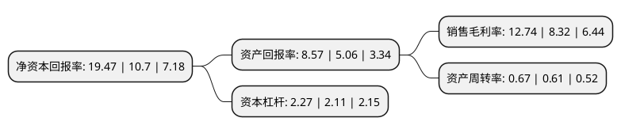

> 本页面由自动化程序生成于 2022年5月20日 01:05
> 内容可能存在错误，如有bug请提交issue至：https://github.com/Eroleice/doc-pi/issues
{.is-warning}

# 上市公司基本情况

## 基本资料

大族激光科技产业集团股份有限公司（以下简称“大族激光”）成立于1999年03月04日，深圳市。于2004年06月25日在深交所中小板上市。

大族激光注册资本105,173.77万元，主要产品:激光信息标记设备，激光焊接机，数控设备以下是详细信息：

- 公司名称: 大族激光科技产业集团股份有限公司
- 股票代码: 002008.SZ
- 所在地: 广东 - 深圳市
- 成立日期: 1999年03月04日
- 注册资本: 105,173.77万元
- 法定代表人: 高云峰
- 主营业务: 主要产品:激光信息标记设备，激光焊接机，数控设备
- 公司官网: www.hanslaser.com
- 公司介绍: 公司是中国激光装备行业的领军企业，也是世界知名的激光加工设备生产厂商，主要从事激光加工设备的研发、生产和销售。公司承担建设的主要科研项目被国家科技部火炬高新技术产业中心认定为“国家级火炬计划项目”。公司通过不断自主研发把“实验室装置”变成可以连续24小时稳定工作的激光技术装备，是世界上仅有的几家拥有“紫外激光专利”的公司之一。在强大的资本和技术平台支持下，公司实现了从小功率到大型高功率激光技术装备研发、生产的跨越发展，为国内外客户提供一整套激光加工解决方案及相关配套设施。公司还被评为深圳市高新技术企业，深圳市重点软件企业，广东省装备制造业重点企业，国家级创新型试点企业，国家科技成果推广示范基地重点推广示范企业，国家规划布局内重点软件企业，主要科研项目被认定为国家级火炬计划项目。

## 股东及高管情况

上市公司第一大股东为香港中央结算有限公司(陆股通)，持股185,129,220股，占比17.6%，**疑似为**上市公司实际控制人。

截至2022年03月31日，上市公司的前十大股东中，共有1名自然人股东，2名机构股东，6个产品账户，1个海外主体，其中5%以上大股东共有3名。上市公司前十大股东明细如下：

> 未能通过持股比例判定出上市公司实际控制人（持股30%以上）
> 可能存在通过间接持股、联合持股、协议控制等方式拥有实际控制权的主体，具体请参考上市公司定期公告！
{.is-warning}

> 截至2022年03月31日，上市公司前十大股东信息如下：

| 股东名称 | 持股数量（股） | 持股比例 |
| --- | --- | --- |
| 香港中央结算有限公司(陆股通) | 185,129,220 | 17.6% |
| 大族控股集团有限公司 | 161,773,306 | 15.38% |
| 高云峰 | 96,319,535 | 9.16% |
| 招商银行股份有限公司-睿远成长价值混合型证券投资基金 | 28,182,842 | 2.68% |
| 中国证券金融股份有限公司 | 23,355,607 | 2.22% |
| 加拿大年金计划投资委员会-自有资金 | 16,108,201 | 1.53% |
| 全国社保基金四零一组合 | 8,210,261 | 0.78% |
| 上海景林资产管理有限公司-景林全球基金 | 7,669,998 | 0.73% |
| 上海景林资产管理有限公司-景林景泰全球私募证券投资基金 | 5,150,009 | 0.49% |
| 全国社保基金四一八组合 | 4,190,427 | 0.4% |

## 利润表分析

上市公司2021年总收入为163.32亿元，净利润为20.8亿元，实现盈利。

## 杜邦分析

> 数据列示周期：2021年 | 2020年 | 2019年
{.is-info}

上市公司的净资产收益率在近一年有所上升，上升幅度为81.96%，其变化情况分解如下：
- 上市公司的销售毛利率在近一年上升了53.13%，可能是生产效率的提升、商品原材料价格下跌或商品价格的上涨所致。
- 上市公司的资产周转率在近一年上升了9.84%，可能是源自于更快的销售回款或库存管理效果提升。
- 上市公司的财务杠杆比率在近一年上升了7.58%，可能是增加负债扩大生产规模。

