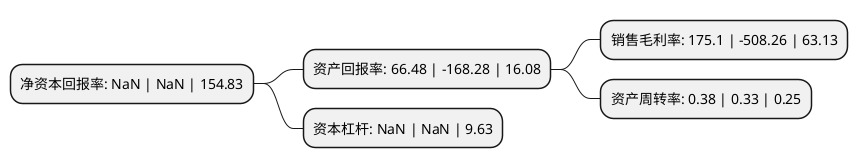

> 本页面由自动化程序生成于 2022年5月20日 01:06
> 内容可能存在错误，如有bug请提交issue至：https://github.com/Eroleice/doc-pi/issues
{.is-warning}

# 上市公司基本情况

## 基本资料

东方时代网络传媒股份有限公司（以下简称“东方网络”）成立于1989年06月26日，桂林市。于2007年10月12日在深交所中小板上市。

东方网络注册资本127,678.073万元，主要业务为数显量具的生产，销售。主要产品包括卡尺系列，千分尺系列，指示表系列以及其它产品四大类。以下是详细信息：

- 公司名称: 东方时代网络传媒股份有限公司
- 股票代码: 002175.SZ
- 所在地: 广西 - 桂林市
- 成立日期: 1989年06月26日
- 注册资本: 127,678.073万元
- 法定代表人: 张群
- 主营业务: 主要业务为数显量具的生产，销售主要产品包括卡尺系列，千分尺系列，指示表系列以及其它产品四大类
- 公司官网: www.eastwindows.com
- 公司介绍: 公司主业分布在影视娱乐、传媒渠道、文化旅游、产业投资等四大领域，通过并购重组、投资及建立产业基金方式，搭建以IP制造为轴心、以传媒渠道和互联网平台为基础的跨领域、多平台泛娱乐产业生态链。公司先后与中航资本、华融新兴、ACTIONPARK签署战略合作协议，共同推进文化创意休闲业务的开展，发挥公司的IP资源、运营能力的最大化效用。公司已经具备从IP内容生产、制作、发行、主题乐园以及衍生品开发的全生态运营能力。公司基于自身的优势资源和行业发展前景,最大化拓展业务覆盖面，完善公司产业链，提高综合竞争力。公司已制定文化传媒业务长期发展战略,力争从内容集成、发行渠道、用户终端到实景娱乐实现全面布局。

## 股东及高管情况

上市公司第一大股东为科翔高新技术发展有限公司，持股245,210,042股，占比19.21%，**疑似为**上市公司实际控制人。

截至2022年03月31日，上市公司的前十大股东中，共有4名自然人股东，5名机构股东，1个产品账户，其中5%以上大股东共有1名。上市公司前十大股东明细如下：

> 未能通过持股比例判定出上市公司实际控制人（持股30%以上）
> 可能存在通过间接持股、联合持股、协议控制等方式拥有实际控制权的主体，具体请参考上市公司定期公告！
{.is-warning}

> 截至2022年03月31日，上市公司前十大股东信息如下：

| 股东名称 | 持股数量（股） | 持股比例 |
| --- | --- | --- |
| 科翔高新技术发展有限公司 | 245,210,042 | 19.21% |
| 彭朋 | 57,853,383 | 4.53% |
| 李斌 | 55,835,773 | 4.37% |
| 广西南雅宝鑫投资有限公司 | 46,127,010 | 3.61% |
| 徽商银行股份有限公司 | 44,266,562 | 3.47% |
| 南通东柏文化发展合伙企业(有限合伙) | 40,592,469 | 3.18% |
| 管鑫龙 | 35,531,892 | 2.78% |
| 东方时代网络传媒股份有限公司破产企业财产处置专用账户 | 32,573,049 | 2.55% |
| 深圳邦佳投资管理有限公司 | 15,384,614 | 1.2% |
| 陈建新 | 14,546,387 | 1.14% |

## 利润表分析

上市公司2021年总收入为2.33亿元，净利润为4.09亿元，实现盈利。

## 杜邦分析

> 数据列示周期：2021年 | 2020年 | 2019年
{.is-info}

上市公司的净资产收益率在近一年有所下降，下降幅度为NaN%，其变化情况分解如下：
- 上市公司的销售毛利率在近一年下降了-134.45%，可能是生产效率的下降、商品原材料价格上涨或商品价格的下跌所致。
- 上市公司的资产周转率在近一年上升了15.15%，可能是源自于更快的销售回款或库存管理效果提升。
- 上市公司的财务杠杆比率在近一年下降了NaN%，可能是减少负债降低财务费用。

