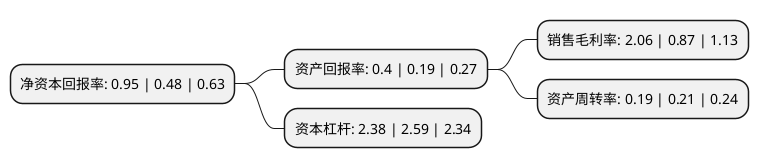

> 本页面由自动化程序生成于 2022年5月20日 01:07
> 内容可能存在错误，如有bug请提交issue至：https://github.com/Eroleice/doc-pi/issues
{.is-warning}

# 上市公司基本情况

## 基本资料

深圳市证通电子股份有限公司（以下简称“证通电子”）成立于1993年09月04日，深圳市。于2007年12月18日在深交所中小板上市。

证通电子注册资本61,436.293万元，主要产品:加密键盘(EPP)，自助服务终端，电话E-POS和信用卡付费电话四大类。主营业务:加密键盘，自助服务终端，电话E-POS，自动识别技术产品和公共通讯终端产品等的研发，生产和销售。以下是详细信息：

- 公司名称: 深圳市证通电子股份有限公司
- 股票代码: 002197.SZ
- 所在地: 广东 - 深圳市
- 成立日期: 1993年09月04日
- 注册资本: 61,436.293万元
- 法定代表人: 曾胜强
- 主营业务: 主要产品:加密键盘(EPP)，自助服务终端，电话E-POS和信用卡付费电话四大类主营业务:加密键盘，自助服务终端，电话E-POS，自动识别技术产品和公共通讯终端产品等的研发，生产和销售
- 公司官网: www.szzt.com.cn
- 公司介绍: 公司致力于为客户提供全面的金融支付基础设施服务。作为第一批国家认定的高新技术企业，证通电子拥有金融科技、LED照明技术、IDC及云计算相关专利近200项，自主研发了具有自主知识产权的密码安全芯片，建设了高水平的金融终端自动化生产线和先进的物联网云计算平台，为国有各大型银行、股份制商业银行和各中小商业银行提供包括终端、业务软件、平台运营和机房托管等类型多样的差异化金融支付解决方案，为腾讯、阿里和百度等大型互联网企业提供基础设施服务，产品足迹遍布全球160余个国家和地区。经过多年的发展，证通电子已经发展成为兼备金融科技、光电、IDC及云计算三大业务板块的高科技服务企业。

## 股东及高管情况

上市公司第一大股东为曾胜强，持股104,677,171股，占比17.04%，**疑似为**上市公司实际控制人。

截至2022年03月31日，上市公司的前十大股东中，共有6名自然人股东，2名机构股东，2个产品账户，其中5%以上大股东共有1名。上市公司前十大股东明细如下：

> 未能通过持股比例判定出上市公司实际控制人（持股30%以上）
> 可能存在通过间接持股、联合持股、协议控制等方式拥有实际控制权的主体，具体请参考上市公司定期公告！
{.is-warning}

> 截至2022年03月31日，上市公司前十大股东信息如下：

| 股东名称 | 持股数量（股） | 持股比例 |
| --- | --- | --- |
| 曾胜强 | 104,677,171 | 17.04% |
| 深圳市高新投大数据投资合伙企业(有限合伙) | 26,494,718 | 4.31% |
| 曾胜辉 | 19,729,463 | 3.21% |
| 许忠桂 | 10,020,698 | 1.63% |
| 广州市玄元投资管理有限公司-玄元科新43号私募证券投资基金 | 10,000,000 | 1.63% |
| 珠海阿巴马资产管理有限公司-阿巴马元享红利83号私募证券投资基金 | 10,000,000 | 1.63% |
| 中国国际金融股份有限公司 | 9,330,985 | 1.52% |
| 崔刚先 | 8,826,916 | 1.44% |
| 汪爱娟 | 8,802,816 | 1.43% |
| 张媞 | 8,802,816 | 1.43% |

## 杜邦分析

> 数据列示周期：2021年 | 2020年 | 2019年
{.is-info}

上市公司的净资产收益率在近一年有所上升，上升幅度为97.92%，其变化情况分解如下：
- 上市公司的销售毛利率在近一年上升了136.78%，可能是生产效率的提升、商品原材料价格下跌或商品价格的上涨所致。
- 上市公司的资产周转率在近一年下降了-9.52%，可能是源自于更慢的销售回款或库存管理效果下降。
- 上市公司的财务杠杆比率在近一年下降了-8.11%，可能是减少负债降低财务费用。

