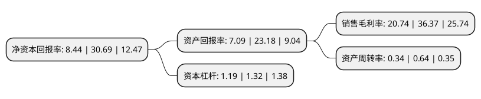

> 本页面由自动化程序生成于 2022年5月20日 01:07
> 内容可能存在错误，如有bug请提交issue至：https://github.com/Eroleice/doc-pi/issues
{.is-warning}

# 上市公司基本情况

## 基本资料

浙江大立科技股份有限公司（以下简称“大立科技”）成立于2001年07月19日，杭州市。于2008年02月18日在深交所中小板上市。

大立科技注册资本59,923.794万元，红外热像仪系列产品和数字硬盘录像机系列产品的生产和销售。以下是详细信息：

- 公司名称: 浙江大立科技股份有限公司
- 股票代码: 002214.SZ
- 所在地: 浙江 - 杭州市
- 成立日期: 2001年07月19日
- 注册资本: 59,923.794万元
- 法定代表人: 庞惠民
- 主营业务: 红外热像仪系列产品和数字硬盘录像机系列产品的生产和销售
- 公司官网: www.dali-tech.com
- 公司介绍: 公司是国内少数拥有完全自主知识产权，能够独立研发、生产热成像技术相关核心器件、机芯组件到整机系统全产业链完整的高新技术企业。公司专业从事非制冷焦平面探测器、红外热像仪、红外热成像系统的研发、生产和销售。公司的技术人员占比高，从根本上保证了技术的国内领先、国际先进水平以及持续创新的能力。同时，公司采用国际化的现代管理模式，取得了ISO9001质量管理体系、ISO14000环境管理体系及ISO18000职业健康安全管理体系认证，从根本上保证了公司的健康发展。公司取得了ISO9001质量管理体系、ISO14000环境管理体系及ISO18000职业健康安全管理体系认证，从根本上保证了公司的健康发展。

## 股东及高管情况

上市公司第一大股东为庞惠民，持股160,159,085股，占比26.73%，**疑似为**上市公司实际控制人。

截至2022年03月31日，上市公司的前十大股东中，共有5名自然人股东，1名机构股东，4个产品账户，其中5%以上大股东共有1名。上市公司前十大股东明细如下：

> 未能通过持股比例判定出上市公司实际控制人（持股30%以上）
> 可能存在通过间接持股、联合持股、协议控制等方式拥有实际控制权的主体，具体请参考上市公司定期公告！
{.is-warning}

> 截至2022年03月31日，上市公司前十大股东信息如下：

| 股东名称 | 持股数量（股） | 持股比例 |
| --- | --- | --- |
| 庞惠民 | 160,159,085 | 26.73% |
| 章佳欢 | 7,491,480 | 1.25% |
| 深圳市优众纳资本管理有限公司-优众纳阿甘-红牛1号私募证券投资基金 | 7,013,440 | 1.17% |
| 廖鸿宾 | 6,772,881 | 1.13% |
| 彭国华 | 4,680,000 | 0.78% |
| 第一创业证券-兴业银行-第一创业聚增2号集合资产管理计划 | 4,417,987 | 0.74% |
| 中信证券股份有限公司 | 4,238,736 | 0.71% |
| 国寿养老策略4号股票型养老金产品-中国工商银行股份有限公司 | 4,142,461 | 0.69% |
| 邵月嫦 | 3,568,945 | 0.6% |
| 深圳市优众纳资本管理有限公司-优众纳阿甘-红牛2号私募证券投资基金 | 3,534,734 | 0.59% |

## 利润表分析

上市公司2021年总收入为8.05亿元，净利润为1.67亿元，实现盈利。

## 杜邦分析

> 数据列示周期：2021年 | 2020年 | 2019年
{.is-info}

上市公司的净资产收益率在近一年有所下降，下降幅度为-72.5%，其变化情况分解如下：
- 上市公司的销售毛利率在近一年下降了-42.97%，可能是生产效率的下降、商品原材料价格上涨或商品价格的下跌所致。
- 上市公司的资产周转率在近一年下降了-46.87%，可能是源自于更慢的销售回款或库存管理效果下降。
- 上市公司的财务杠杆比率在近一年下降了-9.85%，可能是减少负债降低财务费用。

