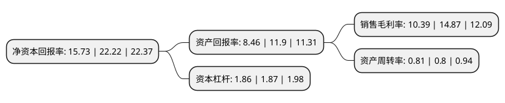

> 本页面由自动化程序生成于 2022年5月20日 01:07
> 内容可能存在错误，如有bug请提交issue至：https://github.com/Eroleice/doc-pi/issues
{.is-warning}

# 上市公司基本情况

## 基本资料

浙江大华技术股份有限公司（以下简称“大华股份”）成立于2001年03月12日，杭州市。于2008年05月20日在深交所中小板上市。

大华股份注册资本299,455.073万元，公司是我国安防产品主流供应商之一，主要从事安防视频监控产品的研发，生产和销售。公司不断强化音视频编解码算法技术，信息存储调用技术，集成电路应用技术，网络控制与传输技术，嵌入式开发技术五大核心技术平台，已经形成以嵌入式DVR为核心产品的面向安防视频监控前沿领域的“大安防”产品架构，公司的主要产品包括嵌入式DVR，球机，NVS，板卡，数字远程图像监控系统，数字程控调度机等，公司产品主要应用于金融，公安，邮政，电信，交通，电力，煤矿等行业。以下是详细信息：

- 公司名称: 浙江大华技术股份有限公司
- 股票代码: 002236.SZ
- 所在地: 浙江 - 杭州市
- 成立日期: 2001年03月12日
- 注册资本: 299,455.073万元
- 法定代表人: 傅利泉
- 主营业务: 公司是我国安防产品主流供应商之一，主要从事安防视频监控产品的研发，生产和销售公司不断强化音视频编解码算法技术，信息存储调用技术，集成电路应用技术，网络控制与传输技术，嵌入式开发技术五大核心技术平台，已经形成以嵌入式DVR为核心产品的面向安防视频监控前沿领域的“大安防”产品架构，公司的主要产品包括嵌入式DVR，球机，NVS，板卡，数字远程图像监控系统，数字程控调度机等，公司产品主要应用于金融，公安，邮政，电信，交通，电力，煤矿等行业
- 公司官网: www.dahuatech.com
- 公司介绍: 公司是全球领先的以视频为核心的智慧物联解决方案提供商和运营服务商，以技术创新为基础，提供端到端的视频监控解决方案、系统及服务，为城市运营、企业管理、个人消费者生活创造价值。公司持续探索新兴业务，延展了机器视觉、视频会议系统、专业无人机、智慧消防、电子车牌、RFID及机器人等新兴视频物联业务。公司的营销和服务网络覆盖全球，在国内多个省市设立多个办事处，在亚太、北美、欧洲、非洲等地建立境外分支机构，为客户提供快速、优质服务。产品覆盖全球多国家和地区，广泛应用于公安、交管、消防、金融、零售、能源等关键领域，并参与了中国国际进口博览会、G20杭州峰会、里约奥运会、厦门金砖国家峰会、老挝东盟峰会、上海世博会、广州亚运会、港珠澳大桥等重大工程项目。公司拥有国家级博士后科研工作站、是国家认定企业技术中心、国家创新型试点企业，相继与UL、SGS等建立了联合实验室。

## 股东及高管情况

上市公司第一大股东为傅利泉，持股1,023,868,980股，占比34.19%，为上市公司实际控制人。

截至2022年03月31日，上市公司的前十大股东中，共有4名自然人股东，2名机构股东，3个产品账户，1个海外主体，其中5%以上大股东共有2名。上市公司前十大股东明细如下：

> 截至2022年03月31日，上市公司前十大股东信息如下：

| 股东名称 | 持股数量（股） | 持股比例 |
| --- | --- | --- |
| 傅利泉 | 1,023,868,980 | 34.19% |
| 朱江明 | 160,577,490 | 5.36% |
| 香港中央结算有限公司(陆股通) | 149,794,659 | 5% |
| 陈爱玲 | 71,262,813 | 2.38% |
| 吴军 | 69,250,886 | 2.31% |
| 全国社保基金一零三组合 | 41,000,969 | 1.37% |
| 中国证券金融股份有限公司 | 39,611,241 | 1.32% |
| 中国银河证券股份有限公司 | 32,962,479 | 1.1% |
| 全国社保基金一一一组合 | 23,657,131 | 0.79% |
| 上海景林资产管理有限公司-景林全球基金 | 20,803,816 | 0.69% |

## 利润表分析

上市公司2021年总收入为328.35亿元，净利润为34.11亿元，实现盈利。

## 杜邦分析

> 数据列示周期：2021年 | 2020年 | 2019年
{.is-info}

上市公司的净资产收益率在近一年有所下降，下降幅度为-29.21%，其变化情况分解如下：
- 上市公司的销售毛利率在近一年下降了-30.13%，可能是生产效率的下降、商品原材料价格上涨或商品价格的下跌所致。
- 上市公司的资产周转率在近一年上升了1.25%，可能是源自于更快的销售回款或库存管理效果提升。
- 上市公司的财务杠杆比率在近一年下降了-0.53%，可能是减少负债降低财务费用。

