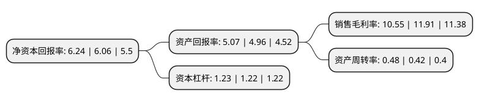

> 本页面由自动化程序生成于 2022年5月20日 01:08
> 内容可能存在错误，如有bug请提交issue至：https://github.com/Eroleice/doc-pi/issues
{.is-warning}

# 上市公司基本情况

## 基本资料

长春奥普光电技术股份有限公司（以下简称“奥普光电”）成立于2001年06月26日，长春市。于2010年01月15日在深交所中小板上市。

奥普光电注册资本24,000万元，主要产品:光电测控仪器设备。主营业务:光电测控仪器设备，新型医疗检测仪器及光学材料等产品的研发，生产与销售。以下是详细信息：

- 公司名称: 长春奥普光电技术股份有限公司
- 股票代码: 002338.SZ
- 所在地: 吉林 - 长春市
- 成立日期: 2001年06月26日
- 注册资本: 24,000万元
- 法定代表人: 孙守红
- 主营业务: 主要产品:光电测控仪器设备主营业务:光电测控仪器设备，新型医疗检测仪器及光学材料等产品的研发，生产与销售
- 公司官网: www.up-china.com
- 公司介绍: 公司是国内国防用光电测控仪器设备的主要生产厂家，生产的光电测控仪器设备主要用于新型装备配套、现有装备升级换代或国防科学试验。主要客户为从事相关产品生产的军工企业和国防科研机构。公司具有国内一流的光学精密机械与光学材料研发和生产能力,在军用电视测角仪、光电经纬仪光机分系统等国防用光电测控仪器设备产品研发和生产上处于国内优势地位，拥有绝对领先的市场占有率，多种产品成功应用于载人航天工程等多项重大国家工程项目中。公司在光电测控领域不断积累的技术及经验势必将保持公司现有产品的优势地位及其他光电测控仪器设备产品生产的行业领先地位。

## 股东及高管情况

上市公司第一大股东为中国科学院长春光学精密机械与物理研究所，持股101,754,784股，占比42.4%，为上市公司实际控制人。

截至2022年03月31日，上市公司的前十大股东中，共有5名自然人股东，2名机构股东，2个产品账户，1名其他股东，其中5%以上大股东共有1名。上市公司前十大股东明细如下：

> 截至2022年03月31日，上市公司前十大股东信息如下：

| 股东名称 | 持股数量（股） | 持股比例 |
| --- | --- | --- |
| 中国科学院长春光学精密机械与物理研究所 | 101,754,784 | 42.4% |
| 广东风华高新科技股份有限公司 | 11,990,000 | 4.99% |
| 沈希洪 | 4,048,863 | 1.69% |
| 沈海彬 | 3,483,796 | 1.45% |
| 易方达基金-中央汇金资产管理有限责任公司-易方达基金-汇金资管单一资产管理计划 | 2,991,000 | 1.25% |
| 郑文宝 | 2,304,049 | 0.96% |
| 中国建设银行股份有限公司-国泰中证军工交易型开放式指数证券投资基金 | 2,007,400 | 0.84% |
| 宣明 | 1,228,124 | 0.51% |
| 周士兴 | 1,200,000 | 0.5% |
| 泰康人寿保险有限责任公司-投连-行业配置 | 984,100 | 0.41% |

## 利润表分析

上市公司2021年总收入为5.46亿元，净利润为0.57亿元，实现盈利。

## 杜邦分析

> 数据列示周期：2021年 | 2020年 | 2019年
{.is-info}

上市公司的净资产收益率在近一年有所上升，上升幅度为2.97%，其变化情况分解如下：
- 上市公司的销售毛利率在近一年下降了-11.42%，可能是生产效率的下降、商品原材料价格上涨或商品价格的下跌所致。
- 上市公司的资产周转率在近一年上升了14.29%，可能是源自于更快的销售回款或库存管理效果提升。
- 上市公司的财务杠杆比率在近一年上升了0.82%，可能是增加负债扩大生产规模。

