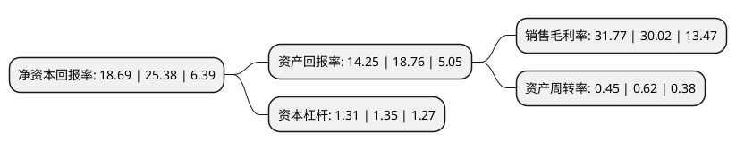

> 本页面由自动化程序生成于 2022年5月20日 01:09
> 内容可能存在错误，如有bug请提交issue至：https://github.com/Eroleice/doc-pi/issues
{.is-warning}

# 上市公司基本情况

## 基本资料

武汉高德红外股份有限公司（以下简称“高德红外”）成立于2004年07月13日，武汉市。于2010年07月16日在深交所中小板上市。

高德红外注册资本234,655.83万元，主营业务为红外热像仪产品研发，生产和销售。本公司生产的红外热成像产品按产品形态分为红外热像仪整机产品和机芯产品，根据产品功能分为测温类产品和非测温类产品。以下是详细信息：

- 公司名称: 武汉高德红外股份有限公司
- 股票代码: 002414.SZ
- 所在地: 湖北 - 武汉市
- 成立日期: 2004年07月13日
- 注册资本: 234,655.83万元
- 法定代表人: 黄立
- 主营业务: 主营业务为红外热像仪产品研发，生产和销售本公司生产的红外热成像产品按产品形态分为红外热像仪整机产品和机芯产品，根据产品功能分为测温类产品和非测温类产品
- 公司官网: www.wuhan-guide.com
- 公司介绍: 公司是全球领先的红外热像仪专业研制厂商，在测温型红外热像仪里排名全球第四，是进入全球排名前五的唯一中国企业。公司积极开展红外光学、成像电路、图像处理、人工智能、机械结构及系统工程等方面的设计与研究，开发出数十款拥有完全知识产权的红外热像系统及高科技光电系统，各项技术居国内领先、国际先进水平。公司已顺利通过了ISO9001质量管理体系、GJB9001A质量管理体系等资质。并拥有“GuideIR”,“MobIR”，“ThermoPro”等驰名海外的注册商标。目前公司有数十多项国内、国际专利。产品广泛应用于电力、医疗、消防、公安、科研、建筑，交通夜视等领域，现已在全球多个国家和地区拥有经销商，并已在比利时开办了欧洲分公司。

## 股东及高管情况

上市公司第一大股东为武汉市高德电气有限公司，持股853,955,145股，占比36.39%，为上市公司实际控制人。

截至2022年03月31日，上市公司的前十大股东中，共有1名自然人股东，5名机构股东，3个产品账户，1个海外主体，其中5%以上大股东共有2名。上市公司前十大股东明细如下：

> 截至2022年03月31日，上市公司前十大股东信息如下：

| 股东名称 | 持股数量（股） | 持股比例 |
| --- | --- | --- |
| 武汉市高德电气有限公司 | 853,955,145 | 36.39% |
| 黄立 | 635,906,250 | 27.1% |
| 香港中央结算有限公司(陆股通) | 34,272,227 | 1.46% |
| 招商证券股份有限公司 | 24,874,422 | 1.06% |
| 中国建设银行股份有限公司-广发科技先锋混合型证券投资基金 | 24,806,152 | 1.06% |
| 宁波市星通投资管理有限公司 | 23,898,000 | 1.02% |
| 上海浦东发展银行股份有限公司-广发小盘成长混合型证券投资基金(LOF) | 18,063,380 | 0.77% |
| 广东恒阔投资管理有限公司 | 15,708,800 | 0.67% |
| 广东恒健国际投资有限公司 | 15,697,452 | 0.67% |
| 中国建设银行股份有限公司-国泰中证军工交易型开放式指数证券投资基金 | 10,552,443 | 0.45% |

## 利润表分析

上市公司2021年总收入为34.99亿元，净利润为11.11亿元，实现盈利。

## 杜邦分析

> 数据列示周期：2021年 | 2020年 | 2019年
{.is-info}

上市公司的净资产收益率在近一年有所下降，下降幅度为-26.36%，其变化情况分解如下：
- 上市公司的销售毛利率在近一年上升了5.83%，可能是生产效率的提升、商品原材料价格下跌或商品价格的上涨所致。
- 上市公司的资产周转率在近一年下降了-27.42%，可能是源自于更慢的销售回款或库存管理效果下降。
- 上市公司的财务杠杆比率在近一年下降了-2.96%，可能是减少负债降低财务费用。

