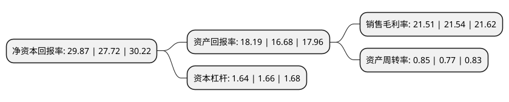

> 本页面由自动化程序生成于 2022年5月20日 01:09
> 内容可能存在错误，如有bug请提交issue至：https://github.com/Eroleice/doc-pi/issues
{.is-warning}

# 上市公司基本情况

## 基本资料

杭州海康威视数字技术股份有限公司（以下简称“海康威视”）成立于2001年11月30日，杭州市。于2010年05月28日在深交所中小板上市。

海康威视注册资本943,320.872万元，主营业务:安防视频监控产品研发，生产和销售，产品包括硬盘录像机(DVR)，视音频编解码卡等数据存储及处理设备，以及监控摄像机，监控球机，视频服务器(DVS)等视音频信息采集处理设备。本公司产品主要包括后端数据存储及处理设备中的核心设备DVR，视音频编解码卡;前端视音频信息采集处理设备中的监控摄像机，监控球机，视频服务器(DVS)等，其中硬盘录像机，视音频编解码卡是目前公司的核心产品。以下是详细信息：

- 公司名称: 杭州海康威视数字技术股份有限公司
- 股票代码: 002415.SZ
- 所在地: 浙江 - 杭州市
- 成立日期: 2001年11月30日
- 注册资本: 943,320.872万元
- 法定代表人: 陈宗年
- 主营业务: 主营业务:安防视频监控产品研发，生产和销售，产品包括硬盘录像机(DVR)，视音频编解码卡等数据存储及处理设备，以及监控摄像机，监控球机，视频服务器(DVS)等视音频信息采集处理设备本公司产品主要包括后端数据存储及处理设备中的核心设备DVR，视音频编解码卡;前端视音频信息采集处理设备中的监控摄像机，监控球机，视频服务器(DVS)等，其中硬盘录像机，视音频编解码卡是目前公司的核心产品
- 公司官网: www.hikvision.com
- 公司介绍: 公司是领先的视频产品和内容服务提供商，面向全球提供领先的视频产品、专业的行业解决方案与内容服务。公司积极布局新兴市场和新兴业务，基于互联网推出了面向家庭和小微企业的相关产品及云服务平台；进入智能制造领域，推出了一系列机器视觉产品及解决方案。公司产品已涵盖视频监控系统的所有主要设备，包括前端采集设备、后端存储及集中控制、显示、管理及储存设备。典型视频监控系统的前端设备主要包括摄像机(采集视音频信号)及DVS(压缩及编码视音频信号)；典型视频监控系统的后端设备主要包括录像机(记录及存储视音频信号)；典型视频监控系统的中心控制设备主要包括集中控制设备(控制、检索及显示视音频信号)、VMS软件及中心储存设备。此外，公司拥有门禁、报警、可视对讲等系列大安防领域的产品。

## 股东及高管情况

上市公司第一大股东为中电海康集团有限公司，持股3,403,879,509股，占比36.08%，为上市公司实际控制人。

截至2022年03月31日，上市公司的前十大股东中，共有2名自然人股东，6名机构股东，2个产品账户，其中5%以上大股东共有2名。上市公司前十大股东明细如下：

> 截至2022年03月31日，上市公司前十大股东信息如下：

| 股东名称 | 持股数量（股） | 持股比例 |
| --- | --- | --- |
| 中电海康集团有限公司 | 3,403,879,509 | 36.08% |
| 龚虹嘉 | 962,504,814 | 10.2% |
| 新疆威讯投资管理有限合伙企业 | 450,795,176 | 4.78% |
| 中电科投资控股有限公司 | 232,307,903 | 2.46% |
| 上海高毅资产管理合伙企业(有限合伙)-高毅邻山1号远望基金 | 210,000,000 | 2.23% |
| 新疆普康投资有限合伙企业 | 182,510,174 | 1.93% |
| 中国电子科技集团公司第五十二研究所 | 180,775,044 | 1.92% |
| 胡扬忠 | 155,246,477 | 1.65% |
| 中国银行股份有限公司-易方达蓝筹精选混合型证券投资基金 | 126,000,000 | 1.34% |
| 中信证券股份有限公司 | 88,559,824 | 0.94% |

## 利润表分析

上市公司2021年总收入为814.2亿元，净利润为175.1亿元，实现盈利。

## 杜邦分析

> 数据列示周期：2021年 | 2020年 | 2019年
{.is-info}

上市公司的净资产收益率在近一年有所上升，上升幅度为7.76%，其变化情况分解如下：
- 上市公司的销售毛利率在近一年下降了-0.14%，可能是生产效率的下降、商品原材料价格上涨或商品价格的下跌所致。
- 上市公司的资产周转率在近一年上升了10.39%，可能是源自于更快的销售回款或库存管理效果提升。
- 上市公司的财务杠杆比率在近一年下降了-1.2%，可能是减少负债降低财务费用。

