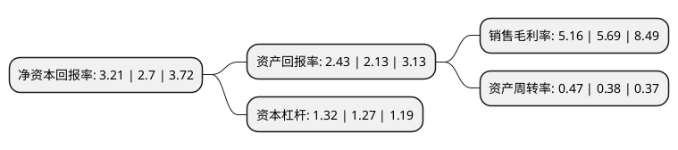

> 本页面由自动化程序生成于 2022年5月20日 01:12
> 内容可能存在错误，如有bug请提交issue至：https://github.com/Eroleice/doc-pi/issues
{.is-warning}

# 上市公司基本情况

## 基本资料

杭州先锋电子技术股份有限公司（以下简称“先锋电子”）成立于1991年10月20日，杭州市。于2015年06月12日在深交所中小板上市。

先锋电子注册资本15,000万元，主要产品:“城市燃气智能计量网络收费系统”的整体解决方案及与之配套的智能燃气表等终端产品。主营业务:为燃气行业提供“城市燃气智能计量网络收费系统”的整体解决方案及与之配套的智能燃气表等终端产品的研发，生产和销售。以下是详细信息：

- 公司名称: 杭州先锋电子技术股份有限公司
- 股票代码: 002767.SZ
- 所在地: 浙江 - 杭州市
- 成立日期: 1991年10月20日
- 注册资本: 15,000万元
- 法定代表人: 石扬
- 主营业务: 主要产品:“城市燃气智能计量网络收费系统”的整体解决方案及与之配套的智能燃气表等终端产品主营业务:为燃气行业提供“城市燃气智能计量网络收费系统”的整体解决方案及与之配套的智能燃气表等终端产品的研发，生产和销售
- 公司官网: www.innover.com
- 公司介绍: 公司一直专注于为城市燃气行业提供集硬件设备、软件平台和应用方案为一体的“城市燃气智能计量网络收费系统”产品。公司的主营业务是为燃气行业提供“城市燃气智能计量网络收费系统”的整体解决方案及与之配套的智能燃气表等终端产品的研发、生产和销售。“城市燃气智能计量网络收费系统”解决方案是指紧密结合燃气公司的业务特点和管理需求，设计或选择适合燃气公司要求的收费管理软件系统、数据采集传输系统及智能燃气表终端产品，通过此系统实现对产品信息的采集、传递、收缴费、监控、数据统计分析和服务等。

## 股东及高管情况

上市公司第一大股东为石政民，持股66,417,332股，占比44.28%，为上市公司实际控制人。

截至2022年03月31日，上市公司的前十大股东中，共有10名自然人股东，其中5%以上大股东共有2名。上市公司前十大股东明细如下：

> 截至2022年03月31日，上市公司前十大股东信息如下：

| 股东名称 | 持股数量（股） | 持股比例 |
| --- | --- | --- |
| 石政民 | 66,417,332 | 44.28% |
| 石义民 | 25,952,535 | 17.3% |
| 周宇农 | 1,230,000 | 0.82% |
| 王凤 | 1,120,000 | 0.75% |
| 郭向生 | 1,120,000 | 0.75% |
| 韦海宏 | 780,000 | 0.52% |
| 仇六罗 | 720,200 | 0.48% |
| 王梦飞 | 704,680 | 0.47% |
| 杨永林 | 693,600 | 0.46% |
| 高建荣 | 671,833 | 0.45% |

## 利润表分析

上市公司2021年总收入为4.75亿元，净利润为0.24亿元，实现盈利。

## 杜邦分析

> 数据列示周期：2021年 | 2020年 | 2019年
{.is-info}

上市公司的净资产收益率在近一年有所上升，上升幅度为18.89%，其变化情况分解如下：
- 上市公司的销售毛利率在近一年下降了-9.31%，可能是生产效率的下降、商品原材料价格上涨或商品价格的下跌所致。
- 上市公司的资产周转率在近一年上升了23.68%，可能是源自于更快的销售回款或库存管理效果提升。
- 上市公司的财务杠杆比率在近一年上升了3.94%，可能是增加负债扩大生产规模。

