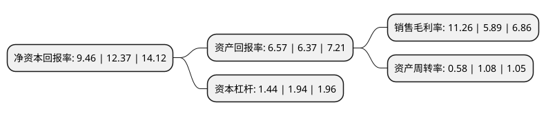

> 本页面由自动化程序生成于 2022年5月20日 01:12
> 内容可能存在错误，如有bug请提交issue至：https://github.com/Eroleice/doc-pi/issues
{.is-warning}

# 上市公司基本情况

## 基本资料

北京东方中科集成科技股份有限公司（以下简称“东方中科”）成立于2000年08月10日，北京市。于2016年11月11日在深交所中小板上市。

东方中科注册资本31,817.977万元，主营业务:从事电子测量仪器的销售，租赁和系统集成业务。主要产品:示波器，温度测量仪，信号发生器，电源，频谱分析仪，数据采集/开关，万用表，计量校准仪表等以下是详细信息：

- 公司名称: 北京东方中科集成科技股份有限公司
- 股票代码: 002819.SZ
- 所在地: 北京 - 北京市
- 成立日期: 2000年08月10日
- 注册资本: 31,817.977万元
- 法定代表人: 王戈
- 主营业务: 主营业务:从事电子测量仪器的销售，租赁和系统集成业务主要产品:示波器，温度测量仪，信号发生器，电源，频谱分析仪，数据采集/开关，万用表，计量校准仪表等
- 公司官网: www.dfzk.com
- 公司介绍: 公司是国内引入测试仪器科技租赁业务的先行者之一，是国内少数能够全面提供仪器销售、租赁、系统集成及相关技术服务的综合服务商。公司创立的“业务+产品+服务”综合服务模式已经成为行业内领先的商业模式。在业务的不断扩大发展中，公司一直十分重视品牌价值的培养，在企业信誉、业务能力、客户服务、公司发展和行业责任方面都有着较高的声誉。此外，公司拥有较为完善的营销服务网络、雄厚的产业链资源和坚实的技术基础。目前除北京总部外，在上海、南京、苏州、深圳、西安、武汉、成都等地设立了分公司，服务范围覆盖了全国三十多个大中城市。昔日根植于北京中关村科技沃土的电子测量仪器服务领域的东方中科，经历多年风雨的洗礼，如今已成长为中国电子测试测量综合服务领域中的一颗参天大树。

## 股东及高管情况

上市公司第一大股东为东方科仪控股集团有限公司，持股76,064,719股，占比23.91%，**疑似为**上市公司实际控制人。

截至2022年03月31日，上市公司的前十大股东中，共有3名自然人股东，7名机构股东，其中5%以上大股东共有3名。上市公司前十大股东明细如下：

> 未能通过持股比例判定出上市公司实际控制人（持股30%以上）
> 可能存在通过间接持股、联合持股、协议控制等方式拥有实际控制权的主体，具体请参考上市公司定期公告！
{.is-warning}

> 截至2022年03月31日，上市公司前十大股东信息如下：

| 股东名称 | 持股数量（股） | 持股比例 |
| --- | --- | --- |
| 东方科仪控股集团有限公司 | 76,064,719 | 23.91% |
| 万里锦程创业投资有限公司 | 46,862,409 | 14.73% |
| 大连金融产业投资集团有限公司 | 37,570,000 | 11.81% |
| 刘达 | 12,072,378 | 3.79% |
| 金泰富资本管理有限责任公司 | 9,736,038 | 3.06% |
| 杭州明颉企业管理有限公司 | 8,368,287 | 2.63% |
| 王戈 | 7,903,743 | 2.48% |
| 珠海格力创业投资有限公司 | 6,490,691 | 2.04% |
| 青岛精确力升资产管理有限公司-青岛精确智芯股权投资合伙企业(有限合伙) | 6,490,691 | 2.04% |
| 赵国 | 4,956,600 | 1.56% |

## 利润表分析

上市公司2021年总收入为18.48亿元，净利润为2.08亿元，实现盈利。

## 杜邦分析

> 数据列示周期：2021年 | 2020年 | 2019年
{.is-info}

上市公司的净资产收益率在近一年有所下降，下降幅度为-23.52%，其变化情况分解如下：
- 上市公司的销售毛利率在近一年上升了91.17%，可能是生产效率的提升、商品原材料价格下跌或商品价格的上涨所致。
- 上市公司的资产周转率在近一年下降了-46.3%，可能是源自于更慢的销售回款或库存管理效果下降。
- 上市公司的财务杠杆比率在近一年下降了-25.77%，可能是减少负债降低财务费用。

