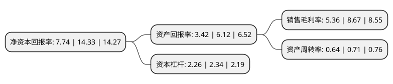

> 本页面由自动化程序生成于 2022年5月20日 01:12
> 内容可能存在错误，如有bug请提交issue至：https://github.com/Eroleice/doc-pi/issues
{.is-warning}

# 上市公司基本情况

## 基本资料

浙江威星智能仪表股份有限公司（以下简称“威星智能”）成立于2005年08月29日，杭州市。于2017年02月17日在深交所中小板上市。

威星智能注册资本13,235.605万元，主要产品:目前拥有3大产品开发体系，智能产品平台，计量产品平台以及软件产品平台，向城市燃气运营商提供用气计量智能终端，运营管理(抄表，结算，收费，设备管理，用气分析等)和数据及其他服务。主营业务:本公司自成立以来，专业致力于为城市燃气行业提供智能计量终端及燃气管理系统平台的研发，生产和销售。以下是详细信息：

- 公司名称: 浙江威星智能仪表股份有限公司
- 股票代码: 002849.SZ
- 所在地: 浙江 - 杭州市
- 成立日期: 2005年08月29日
- 注册资本: 13,235.605万元
- 法定代表人: 黄文谦
- 主营业务: 主要产品:目前拥有3大产品开发体系，智能产品平台，计量产品平台以及软件产品平台，向城市燃气运营商提供用气计量智能终端，运营管理(抄表，结算，收费，设备管理，用气分析等)和数据及其他服务主营业务:本公司自成立以来，专业致力于为城市燃气行业提供智能计量终端及燃气管理系统平台的研发，生产和销售
- 公司官网: www.viewshine.cn
- 公司介绍: 公司专业致力于为城市燃气行业提供智能计量终端及燃气管理系统平台的研发、生产和销售，经过多年的发展，已经成为国内领先的城市燃气行业智能燃气表和系统平台供应商之一。公司积极适应能源转型发展的新形势，牢牢把握“煤改气”等政策脉搏，明确产品市场定位，在技术研发上不断创新，新技术产品化进程持续推进，通过开展燃气行业大数据分析研究，推动物联网技术及其解决方案在燃气行业的应用。公司目前拥有三大产品平台，智能产品平台、计量产品平台以及软件产品平台，向城市燃气运营商提供智能燃气表终端、新一代超声波计量仪表、运营管理和数据管理(数据采集、抄表管理、结算收费、设备管理、用气分析、自助服务、移动外勤等)及其他服务。

## 股东及高管情况

上市公司第一大股东为黄文谦，持股28,790,650股，占比21.75%，**疑似为**上市公司实际控制人。

截至2022年03月31日，上市公司的前十大股东中，共有7名自然人股东，3名机构股东，其中5%以上大股东共有2名。上市公司前十大股东明细如下：

> 未能通过持股比例判定出上市公司实际控制人（持股30%以上）
> 可能存在通过间接持股、联合持股、协议控制等方式拥有实际控制权的主体，具体请参考上市公司定期公告！
{.is-warning}

> 截至2022年03月31日，上市公司前十大股东信息如下：

| 股东名称 | 持股数量（股） | 持股比例 |
| --- | --- | --- |
| 黄文谦 | 28,790,650 | 21.75% |
| 深圳市中燃科技有限公司 | 16,200,000 | 12.24% |
| 范慧群 | 6,330,600 | 4.78% |
| 马善炳 | 4,558,800 | 3.44% |
| 山东颐锐丰企业管理合伙企业(有限合伙) | 2,298,050 | 1.74% |
| 詹镇辉 | 2,190,000 | 1.65% |
| 胡国忠 | 1,500,000 | 1.13% |
| 新天科技股份有限公司 | 1,330,000 | 1% |
| 金德波 | 1,277,600 | 0.97% |
| 许凯文 | 1,250,000 | 0.94% |

## 利润表分析

上市公司2021年总收入为11.45亿元，净利润为0.61亿元，实现盈利。

## 杜邦分析

> 数据列示周期：2021年 | 2020年 | 2019年
{.is-info}

上市公司的净资产收益率在近一年有所下降，下降幅度为-45.99%，其变化情况分解如下：
- 上市公司的销售毛利率在近一年下降了-38.18%，可能是生产效率的下降、商品原材料价格上涨或商品价格的下跌所致。
- 上市公司的资产周转率在近一年下降了-9.86%，可能是源自于更慢的销售回款或库存管理效果下降。
- 上市公司的财务杠杆比率在近一年下降了-3.42%，可能是减少负债降低财务费用。

