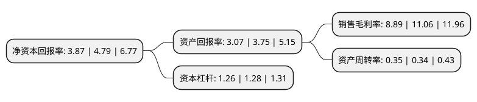

> 本页面由自动化程序生成于 2022年5月20日 01:12
> 内容可能存在错误，如有bug请提交issue至：https://github.com/Eroleice/doc-pi/issues
{.is-warning}

# 上市公司基本情况

## 基本资料

郑州三晖电气股份有限公司（以下简称“三晖电气”）成立于1996年07月16日，郑州市。于2017年03月23日在深交所中小板上市。

三晖电气注册资本12,800万元，主要产品:电能计量装置，电力互感器和电力负荷管理采集终端。主营业务:从事与电能表的生产，检定，使用，信息采集，仓储全过程相关产品的研发，设计，生产和销售。以下是详细信息：

- 公司名称: 郑州三晖电气股份有限公司
- 股票代码: 002857.SZ
- 所在地: 河南 - 郑州市
- 成立日期: 1996年07月16日
- 注册资本: 12,800万元
- 法定代表人: 胡坤
- 主营业务: 主要产品:电能计量装置，电力互感器和电力负荷管理采集终端主营业务:从事与电能表的生产，检定，使用，信息采集，仓储全过程相关产品的研发，设计，生产和销售
- 公司官网: www.cnsms.com
- 公司介绍: 公司所属行业为仪器仪表制造业，公司主营业务为从事与电能表的生产、检定、使用、信息采集、仓储全过程相关产品的研发、设计、生产和销售。公司以电能表检定技术、自动化控制技术、通讯技术、信息技术等为依托，能够为电网公司、电能表生产企业、质量技术监督管理部门等提供电能表标准与校验装置、电能表自动化生产线、电能表智能化仓储系统、用电信息采集系统、互感器等产品。公司以深厚的技术和行业经验积累、快速、灵活的技术响应体制和较强的市场应变能力、稳定可靠的产品性能、过硬的产品品质、丰富完善的产品线和主动高效的产品开发机制在行业内赢得了良好的口碑，树立了良好的品牌形象，产品在行业竞争中具有较强的竞争优势。

## 股东及高管情况

上市公司第一大股东为于文彪，持股11,974,674股，占比9.36%，**疑似为**上市公司实际控制人。

截至2022年03月31日，上市公司的前十大股东中，共有8名自然人股东，2名机构股东，其中5%以上大股东共有3名。上市公司前十大股东明细如下：

> 未能通过持股比例判定出上市公司实际控制人（持股30%以上）
> 可能存在通过间接持股、联合持股、协议控制等方式拥有实际控制权的主体，具体请参考上市公司定期公告！
{.is-warning}

> 上市公司第一大股东持股不超过10%，请检查是否存在公司控制权风险！
{.is-danger}

> 截至2022年03月31日，上市公司前十大股东信息如下：

| 股东名称 | 持股数量（股） | 持股比例 |
| --- | --- | --- |
| 于文彪 | 11,974,674 | 9.36% |
| 上海长耘企业管理合伙企业(有限合伙) | 11,974,670 | 9.36% |
| 宁波恒晖企业管理咨询有限公司 | 6,673,703 | 5.21% |
| 杨建国 | 5,987,337 | 4.68% |
| 金双寿 | 5,987,337 | 4.68% |
| 关付安 | 5,987,337 | 4.68% |
| 刘俊忠 | 5,987,337 | 4.68% |
| 刘清洋 | 5,423,115 | 4.24% |
| 李小拴 | 5,423,115 | 4.24% |
| 武保福 | 5,288,116 | 4.13% |

## 利润表分析

上市公司2021年总收入为2.19亿元，净利润为0.19亿元，实现盈利。

## 杜邦分析

> 数据列示周期：2021年 | 2020年 | 2019年
{.is-info}

上市公司的净资产收益率在近一年有所下降，下降幅度为-19.21%，其变化情况分解如下：
- 上市公司的销售毛利率在近一年下降了-19.62%，可能是生产效率的下降、商品原材料价格上涨或商品价格的下跌所致。
- 上市公司的资产周转率在近一年上升了2.94%，可能是源自于更快的销售回款或库存管理效果提升。
- 上市公司的财务杠杆比率在近一年下降了-1.56%，可能是减少负债降低财务费用。

