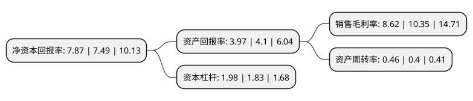

> 本页面由自动化程序生成于 2022年5月20日 01:12
> 内容可能存在错误，如有bug请提交issue至：https://github.com/Eroleice/doc-pi/issues
{.is-warning}

# 上市公司基本情况

## 基本资料

无锡智能自控工程股份有限公司（以下简称“智能自控”）成立于2001年11月12日，无锡市。于2017年06月05日在深交所中小板上市。

智能自控注册资本33,252.707万元，主要产品:P系列单座套筒阀，M系列套筒调节阀，W系列蝶阀，R系列球阀，Z系列物料阀，F系列防腐阀，Y系列自力式调节阀，J系列角型控制阀，T系列三通调节阀等。主营业务:智能控制阀及其配件的研发，生产和销售以及检维修服务。以下是详细信息：

- 公司名称: 无锡智能自控工程股份有限公司
- 股票代码: 002877.SZ
- 所在地: 江苏 - 无锡市
- 成立日期: 2001年11月12日
- 注册资本: 33,252.707万元
- 法定代表人: 沈剑标
- 主营业务: 主要产品:P系列单座套筒阀，M系列套筒调节阀，W系列蝶阀，R系列球阀，Z系列物料阀，F系列防腐阀，Y系列自力式调节阀，J系列角型控制阀，T系列三通调节阀等主营业务:智能控制阀及其配件的研发，生产和销售以及检维修服务
- 公司官网: www.wuxismart.com
- 公司介绍: 公司是一家融生产、销售、研发、服务于一体的专业从事全系列智能控制阀的高新技术企业，一直专注于智能控制阀及其配件的研发、生产和销售以及检维修服务。公司的主要产品包括P系列单座套筒阀、M系列套筒调节阀、W系列蝶阀、R系列球阀、Z系列物料阀、F系列防腐阀、Y系列自力式调节阀、J系列角型控制阀、T系列三通调节阀等。公司的产品和技术广泛应用于石油、化工、钢铁、冶金、纺织、能源、电力、食品、环保等行业。被工信部评为“信息化和工业化两化深度融合专项试点企业”。

## 股东及高管情况

上市公司第一大股东为沈剑标，持股124,616,800股，占比37.48%，为上市公司实际控制人。

截至2022年03月31日，上市公司的前十大股东中，共有9名自然人股东，1名机构股东，其中5%以上大股东共有5名。上市公司前十大股东明细如下：

> 截至2022年03月31日，上市公司前十大股东信息如下：

| 股东名称 | 持股数量（股） | 持股比例 |
| --- | --- | --- |
| 沈剑标 | 124,616,800 | 37.48% |
| 李耀武 | 20,720,072 | 6.23% |
| 吴畏 | 19,871,152 | 5.98% |
| 李春喜 | 18,491,540 | 5.56% |
| 孟少新 | 16,900,360 | 5.08% |
| 孙明东 | 5,967,744 | 1.79% |
| 无锡天亿信投资有限公司 | 5,072,800 | 1.53% |
| 陈彦 | 4,736,080 | 1.42% |
| 仲佩亚 | 2,176,000 | 0.65% |
| 沈剑飞 | 2,176,000 | 0.65% |

## 利润表分析

上市公司2021年总收入为7.34亿元，净利润为0.63亿元，实现盈利。

## 杜邦分析

> 数据列示周期：2021年 | 2020年 | 2019年
{.is-info}

上市公司的净资产收益率在近一年有所上升，上升幅度为5.07%，其变化情况分解如下：
- 上市公司的销售毛利率在近一年下降了-16.71%，可能是生产效率的下降、商品原材料价格上涨或商品价格的下跌所致。
- 上市公司的资产周转率在近一年上升了15%，可能是源自于更快的销售回款或库存管理效果提升。
- 上市公司的财务杠杆比率在近一年上升了8.2%，可能是增加负债扩大生产规模。

