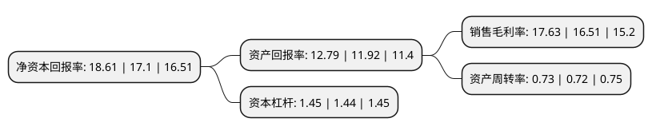

> 本页面由自动化程序生成于 2022年5月20日 01:14
> 内容可能存在错误，如有bug请提交issue至：https://github.com/Eroleice/doc-pi/issues
{.is-warning}

# 上市公司基本情况

## 基本资料

华测检测认证集团股份有限公司（以下简称“华测检测”）成立于2003年12月23日，深圳市。于2009年10月30日在深交所创业板上市。

华测检测注册资本168,030.264万元，公司主要从事贸易保障，消费品，工业品以及生命科学领域的技术检测服务。以下是详细信息：

- 公司名称: 华测检测认证集团股份有限公司
- 股票代码: 300012.SZ
- 所在地: 广东 - 深圳市
- 成立日期: 2003年12月23日
- 注册资本: 168,030.264万元
- 法定代表人: 万峰
- 主营业务: 公司主要从事贸易保障，消费品，工业品以及生命科学领域的技术检测服务
- 公司官网: www.cti-cert.com
- 公司介绍: 公司是一家全国性、综合性的独立第三方检测服务机构，主要从事工业品、消费品、生命科学以及贸易保障领域的技术检测服务。在国内拥有数十家分支机构组成的业务网络，拥有化学、生物、物理、机械、电磁等领域的多个实验室，取得了CMA计量认证与CNAS国家合格评定委员会实验室认可资格和检查机构认可资格，并依据ISO17025、ISO17020进行管理。公司具备向社会独立出具公正数据的资质，检测数据具有较高的市场公信力，检测报告得到包括美国、英国、德国、法国、意大利、日本、韩国、中国台湾和中国香港地区在内的共42个国家和地区的认可。公司为中国制造业产品创新、产业升级提供公共技术服务平台，为中国乃至世界各地的产品质量、安全、环保、健康、节能等提供监督和支持。

## 股东及高管情况

上市公司第一大股东为香港中央结算有限公司(陆股通)，持股264,898,495股，占比15.76%，**疑似为**上市公司实际控制人。

截至2022年03月31日，上市公司的前十大股东中，共有3名自然人股东，6个产品账户，1个海外主体，其中5%以上大股东共有3名。上市公司前十大股东明细如下：

> 未能通过持股比例判定出上市公司实际控制人（持股30%以上）
> 可能存在通过间接持股、联合持股、协议控制等方式拥有实际控制权的主体，具体请参考上市公司定期公告！
{.is-warning}

> 截至2022年03月31日，上市公司前十大股东信息如下：

| 股东名称 | 持股数量（股） | 持股比例 |
| --- | --- | --- |
| 香港中央结算有限公司(陆股通) | 264,898,495 | 15.76% |
| 万云翔 | 130,501,554 | 7.77% |
| 万峰 | 120,834,320 | 7.19% |
| 于翠萍 | 71,775,500 | 4.27% |
| 安本标准投资管理(亚洲)有限公司-安本标准-中国A股股票基金 | 34,902,358 | 2.08% |
| 中国农业银行股份有限公司-嘉实新兴产业股票型证券投资基金 | 31,398,664 | 1.87% |
| 全国社保基金四零六组合 | 31,167,196 | 1.85% |
| 中国邮政储蓄银行股份有限公司-中欧中小盘股票型证券投资基金(LOF) | 28,090,898 | 1.67% |
| 全国社保基金一一五组合 | 28,000,000 | 1.67% |
| 中国农业银行股份有限公司-嘉实核心成长混合型证券投资基金 | 26,151,047 | 1.56% |

## 杜邦分析

> 数据列示周期：2021年 | 2020年 | 2019年
{.is-info}

上市公司的净资产收益率在近一年有所上升，上升幅度为8.83%，其变化情况分解如下：
- 上市公司的销售毛利率在近一年上升了6.78%，可能是生产效率的提升、商品原材料价格下跌或商品价格的上涨所致。
- 上市公司的资产周转率在近一年上升了1.39%，可能是源自于更快的销售回款或库存管理效果提升。
- 上市公司的财务杠杆比率在近一年上升了0.69%，可能是增加负债扩大生产规模。

