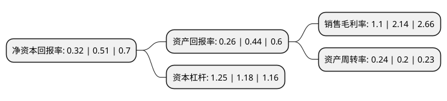

> 本页面由自动化程序生成于 2022年5月20日 01:15
> 内容可能存在错误，如有bug请提交issue至：https://github.com/Eroleice/doc-pi/issues
{.is-warning}

# 上市公司基本情况

## 基本资料

烟台龙源电力技术股份有限公司（以下简称“龙源技术”）成立于1998年12月26日，烟台市。于2010年08月20日在深交所创业板上市。

龙源技术注册资本52,240万元，主要业务:电力领域燃烧控制设备及系统的研究开发，设计制造，现场调试，人员培训，技术咨询等业务。以下是详细信息：

- 公司名称: 烟台龙源电力技术股份有限公司
- 股票代码: 300105.SZ
- 所在地: 山东 - 烟台市
- 成立日期: 1998年12月26日
- 注册资本: 52,240万元
- 法定代表人: 杨怀亮
- 主营业务: 电力领域燃烧控制设备及系统的研究开发，设计制造，现场调试，人员培训，技术咨询等业务
- 公司官网: lyjs.chnenergy.com.cn
- 公司介绍: 公司是国家能源投资集团有限责任公司控股的国家火炬计划高新技术企业公司。公司主要从事电力领域燃烧控制设备及系统的研究开发，设计制造、现场调试、人员培训、技术咨询等业务，是世界上首家成功研发并大规模推广应用电站锅炉等离子体节能环保技术及稳燃的高科技企业，自主研发的煤粉锅炉等离子体无燃油点火技术、等离子体双尺度低氮燃烧技术均达到了国际领先水平，拥有完全自主知识产权，企业规模、技术水平等各方面均占据行业领先地位。公司通过多年的发展壮大，培养了一支经验丰富、技术过硬、专业齐备、结构合理且富有朝气的研发、设计、制造、销售与工程技术服务团队。公司技术中心已被认定为“国家认定企业技术中心”，已组建的“山东省煤粉燃烧工程技术研究中心”荣获“山东省省级示范工程技术研究中心”称号。同时，公司拥有完备的产品认证、生产施工资质、标准体系与质量保证体系，先后通过了ISO9001-2016质量管理体系认证、ISO14001-2015环境管理体系认证、OHSAS18001-2007职业健康安全体系认证;等离子体系列产品通过了TUV(南德集团)的CE认证。

## 股东及高管情况

上市公司第一大股东为国电科技环保集团股份有限公司，持股119,322,720股，占比22.84%，**疑似为**上市公司实际控制人。

截至2022年03月31日，上市公司的前十大股东中，共有7名自然人股东，3名机构股东，其中5%以上大股东共有2名。上市公司前十大股东明细如下：

> 未能通过持股比例判定出上市公司实际控制人（持股30%以上）
> 可能存在通过间接持股、联合持股、协议控制等方式拥有实际控制权的主体，具体请参考上市公司定期公告！
{.is-warning}

> 截至2022年03月31日，上市公司前十大股东信息如下：

| 股东名称 | 持股数量（股） | 持股比例 |
| --- | --- | --- |
| 国电科技环保集团股份有限公司 | 119,322,720 | 22.84% |
| 雄亚(维尔京)有限公司 | 96,228,000 | 18.42% |
| 烟台开发区龙源电力燃烧控制工程有限公司 | 14,571,500 | 2.79% |
| 曹波 | 3,451,197 | 0.66% |
| 程永红 | 2,086,308 | 0.4% |
| 叶奇恩 | 1,720,500 | 0.33% |
| 侯铁英 | 1,483,300 | 0.28% |
| 盛智仕 | 1,432,000 | 0.27% |
| 刘贞 | 1,304,000 | 0.25% |
| 王烁烽 | 1,247,600 | 0.24% |

## 利润表分析

上市公司2021年总收入为5.41亿元，净利润为0.05亿元，实现盈利。

## 杜邦分析

> 数据列示周期：2021年 | 2020年 | 2019年
{.is-info}

上市公司的净资产收益率在近一年有所下降，下降幅度为-37.25%，其变化情况分解如下：
- 上市公司的销售毛利率在近一年下降了-48.6%，可能是生产效率的下降、商品原材料价格上涨或商品价格的下跌所致。
- 上市公司的资产周转率在近一年上升了20%，可能是源自于更快的销售回款或库存管理效果提升。
- 上市公司的财务杠杆比率在近一年上升了5.93%，可能是增加负债扩大生产规模。

