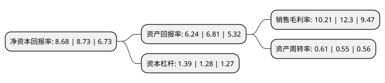

> 本页面由自动化程序生成于 2022年5月20日 01:15
> 内容可能存在错误，如有bug请提交issue至：https://github.com/Eroleice/doc-pi/issues
{.is-warning}

# 上市公司基本情况

## 基本资料

深圳万讯自控股份有限公司（以下简称“万讯自控”）成立于1994年06月06日，深圳市。于2010年08月27日在深交所创业板上市。

万讯自控注册资本28,577.909万元，主要产品:现场仪表，二次仪表及压力仪表等。主营业务:工业自动化仪表的研发，生产与销售业务。以下是详细信息：

- 公司名称: 深圳万讯自控股份有限公司
- 股票代码: 300112.SZ
- 所在地: 广东 - 深圳市
- 成立日期: 1994年06月06日
- 注册资本: 28,577.909万元
- 法定代表人: 傅宇晨
- 主营业务: 主要产品:现场仪表，二次仪表及压力仪表等主营业务:工业自动化仪表的研发，生产与销售业务
- 公司官网: www.maxonic.com.cn
- 公司介绍: 公司主要从事工业自动化仪表的研发、生产与销售业务，主要产品包括现场仪表、二次仪表及压力仪表等，其中现场仪表包括电动执行器、楼宇执行器、气体探测器、电磁阀、流量计、物位计、工业阀门等，二次仪表包括信号调理器、安全栅、电量变送器等，压力仪表包括压力变送器、压力开关、温度变送器及压力检测仪等。工业自动化仪器仪表被广泛应用于工业生产的信息采集、传送、显示、记录和控制执行。公司在上述主营产品的基础上，也积极在工业智能化仪表、传感器、高端数控系统以及工业机器人等新兴相关领域有所拓展，这些产品目前仍处在培育期。

## 股东及高管情况

上市公司第一大股东为傅宇晨，持股54,336,277股，占比19.01%，**疑似为**上市公司实际控制人。

截至2022年03月31日，上市公司的前十大股东中，共有9名自然人股东，1名机构股东，其中5%以上大股东共有3名。上市公司前十大股东明细如下：

> 未能通过持股比例判定出上市公司实际控制人（持股30%以上）
> 可能存在通过间接持股、联合持股、协议控制等方式拥有实际控制权的主体，具体请参考上市公司定期公告！
{.is-warning}

> 截至2022年03月31日，上市公司前十大股东信息如下：

| 股东名称 | 持股数量（股） | 持股比例 |
| --- | --- | --- |
| 傅宇晨 | 54,336,277 | 19.01% |
| 尊威贸易(深圳)有限公司 | 22,746,500 | 7.96% |
| 傅晓阳 | 17,780,251 | 6.22% |
| 孟祥历 | 8,210,013 | 2.87% |
| 王洪 | 6,477,603 | 2.27% |
| 高雅萍 | 6,022,323 | 2.11% |
| 郑维强 | 4,381,625 | 1.53% |
| 李胜军 | 2,526,100 | 0.88% |
| 熊礼文 | 2,138,000 | 0.75% |
| 李光宇 | 1,711,500 | 0.6% |

## 利润表分析

上市公司2021年总收入为9.47亿元，净利润为0.96亿元，实现盈利。

## 杜邦分析

> 数据列示周期：2021年 | 2020年 | 2019年
{.is-info}

上市公司的净资产收益率在近一年有所下降，下降幅度为-0.57%，其变化情况分解如下：
- 上市公司的销售毛利率在近一年下降了-16.99%，可能是生产效率的下降、商品原材料价格上涨或商品价格的下跌所致。
- 上市公司的资产周转率在近一年上升了10.91%，可能是源自于更快的销售回款或库存管理效果提升。
- 上市公司的财务杠杆比率在近一年上升了8.59%，可能是增加负债扩大生产规模。

