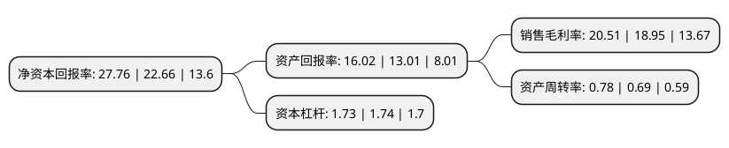

> 本页面由自动化程序生成于 2022年5月20日 01:15
> 内容可能存在错误，如有bug请提交issue至：https://github.com/Eroleice/doc-pi/issues
{.is-warning}

# 上市公司基本情况

## 基本资料

深圳市汇川技术股份有限公司（以下简称“汇川技术”）成立于2003年04月10日，深圳市。于2010年09月28日在深交所创业板上市。

汇川技术注册资本263,517.278万元，主要产品为低压变频器，伺服系统，可编程逻辑控制器，一体化及专机等工业自动化控制产品。主营业务:工业自动化控制产品的研发，生产和销售。以下是详细信息：

- 公司名称: 深圳市汇川技术股份有限公司
- 股票代码: 300124.SZ
- 所在地: 广东 - 深圳市
- 成立日期: 2003年04月10日
- 注册资本: 263,517.278万元
- 法定代表人: 朱兴明
- 主营业务: 主要产品为低压变频器，伺服系统，可编程逻辑控制器，一体化及专机等工业自动化控制产品主营业务:工业自动化控制产品的研发，生产和销售
- 公司官网: www.inovance.com
- 公司介绍: 公司是专门从事工业自动化和新能源相关产品研发、生产和销售的高新技术企业。经过十多年的发展，公司已经从单一的变频器供应商发展成机电液综合产品及解决方案供应商。目前公司主要产品包括：①服务于智能装备领域的工业自动化产品，②服务于工业机器人领域的核心部件、整机及解决方案，③服务于新能源汽车领域的动力总成产品，④服务于轨道交通领域的牵引与控制系统，⑤服务于设备后服务市场的工业互联网解决方案。公司专注于工业自动化控制产品的研发、生产和销售，定位服务于中高端设备制造商，以拥有自主知识产权的工业自动化技术为基础，在经营过程中坚持进口替代、行业营销、为细分市场客户提供整体解决方案的经营模式，实现企业价值与客户价值共同成长。在工业自动化产品方面，公司已经成为国内最大的中低压变频器与伺服系统供应商；在电梯行业，公司已经成为行业领先的电梯一体化控制器供应商；在新能源汽车领域，公司已经成为我国新能源汽车电机控制器的领军企业。公司是国家高新技术企业，掌握了高性能矢量变频技术、PLC技术、伺服技术和永磁同步电机等核心平台技术。

## 股东及高管情况

上市公司第一大股东为香港中央结算有限公司(陆股通)，持股482,372,751股，占比18.31%，**疑似为**上市公司实际控制人。

截至2022年03月31日，上市公司的前十大股东中，共有8名自然人股东，1名机构股东，1个海外主体，其中5%以上大股东共有2名。上市公司前十大股东明细如下：

> 未能通过持股比例判定出上市公司实际控制人（持股30%以上）
> 可能存在通过间接持股、联合持股、协议控制等方式拥有实际控制权的主体，具体请参考上市公司定期公告！
{.is-warning}

> 截至2022年03月31日，上市公司前十大股东信息如下：

| 股东名称 | 持股数量（股） | 持股比例 |
| --- | --- | --- |
| 香港中央结算有限公司(陆股通) | 482,372,751 | 18.31% |
| 深圳市汇川投资有限公司 | 465,220,404 | 17.65% |
| 刘国伟 | 79,916,441 | 3.03% |
| 李俊田 | 75,375,620 | 2.86% |
| 钟进 | 66,021,273 | 2.51% |
| 刘迎新 | 65,747,186 | 2.49% |
| 唐柱学 | 62,285,140 | 2.36% |
| 朱兴明 | 59,576,728 | 2.26% |
| 赵锦荣 | 58,792,528 | 2.23% |
| 李芬 | 41,385,074 | 1.57% |

## 利润表分析

上市公司2021年总收入为179.43亿元，净利润为36.8亿元，实现盈利。

## 杜邦分析

> 数据列示周期：2021年 | 2020年 | 2019年
{.is-info}

上市公司的净资产收益率在近一年有所上升，上升幅度为22.51%，其变化情况分解如下：
- 上市公司的销售毛利率在近一年上升了8.23%，可能是生产效率的提升、商品原材料价格下跌或商品价格的上涨所致。
- 上市公司的资产周转率在近一年上升了13.04%，可能是源自于更快的销售回款或库存管理效果提升。
- 上市公司的财务杠杆比率在近一年下降了-0.57%，可能是减少负债降低财务费用。

