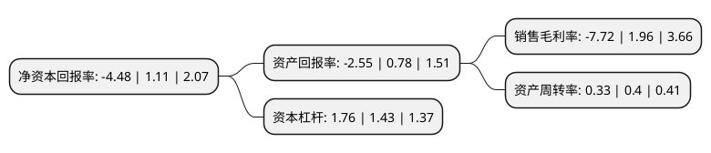

> 本页面由自动化程序生成于 2022年5月20日 01:15
> 内容可能存在错误，如有bug请提交issue至：https://github.com/Eroleice/doc-pi/issues
{.is-warning}

# 上市公司基本情况

## 基本资料

江苏天瑞仪器股份有限公司（以下简称“天瑞仪器”）成立于2006年07月04日，苏州市。于2011年01月25日在深交所创业板上市。

天瑞仪器注册资本49,699.087万元，主要产品:光谱仪，色谱仪，质谱仪为主的高端分析仪器及应用软件。主营业务:以光谱仪，色谱仪，质谱仪为主的高端分析仪器及应用软件的研发，生产，销售和相关技术服务。以下是详细信息：

- 公司名称: 江苏天瑞仪器股份有限公司
- 股票代码: 300165.SZ
- 所在地: 江苏 - 苏州市
- 成立日期: 2006年07月04日
- 注册资本: 49,699.087万元
- 法定代表人: 刘召贵
- 主营业务: 主要产品:光谱仪，色谱仪，质谱仪为主的高端分析仪器及应用软件主营业务:以光谱仪，色谱仪，质谱仪为主的高端分析仪器及应用软件的研发，生产，销售和相关技术服务
- 公司官网: www.skyray-instrument.com
- 公司介绍: 公司作为国内化学分析行业的领航者，专业从事以光谱仪、色谱仪、质谱仪为主的高端分析仪器及应用软件的研发、生产、销售和相关技术服务。产品主要应用于环境保护与安全(电子、电气、玩具等各类消费品行业、食品安全、空气、土壤、水质污染检测等)、工业生产质量控制(冶金、建材、石油、化工、贵金属、医疗器械等)、矿产与资源(地质、采矿)、商品检验、质量检验甚至人体微量元素的检验等众多领域。公司被授予“国家火炬计划重点高新技术企业”，“江苏省高新技术企业”，“江苏省软件企业”，“江苏省科技创新示范企业”，“江苏省规划布局内重点软件企业”，“江苏省光谱分析仪器工程技术研究中心”等荣誉称号。产品品种齐全，为环境保护与安全、工业测试与分析及其它领域提供专业解决方案。

## 股东及高管情况

上市公司第一大股东为刘召贵，持股116,326,306股，占比23.41%，**疑似为**上市公司实际控制人。

截至2022年03月31日，上市公司的前十大股东中，共有9名自然人股东，1个产品账户，其中5%以上大股东共有2名。上市公司前十大股东明细如下：

> 未能通过持股比例判定出上市公司实际控制人（持股30%以上）
> 可能存在通过间接持股、联合持股、协议控制等方式拥有实际控制权的主体，具体请参考上市公司定期公告！
{.is-warning}

> 截至2022年03月31日，上市公司前十大股东信息如下：

| 股东名称 | 持股数量（股） | 持股比例 |
| --- | --- | --- |
| 刘召贵 | 116,326,306 | 23.41% |
| 上海牧鑫资产管理有限公司-牧鑫天泽汇4号私募证券投资基金 | 28,000,000 | 5.63% |
| 应刚 | 23,523,890 | 4.73% |
| 赵学伟 | 3,075,674 | 0.62% |
| 王宏 | 2,845,395 | 0.57% |
| 朱英 | 2,281,500 | 0.46% |
| 杜颖莉 | 1,872,000 | 0.38% |
| 花田生 | 1,763,978 | 0.35% |
| 陈信燕 | 1,494,360 | 0.3% |
| 蔡兴 | 1,080,100 | 0.22% |

## 利润表分析

上市公司2021年总收入为9.58亿元，净利润为-0.74亿元，**未实现盈利**。

## 杜邦分析

> 数据列示周期：2021年 | 2020年 | 2019年
{.is-info}

上市公司的净资产收益率在近一年有所下降，下降幅度为-503.6%，其变化情况分解如下：
- 上市公司的销售毛利率在近一年下降了-493.88%，可能是生产效率的下降、商品原材料价格上涨或商品价格的下跌所致。
- 上市公司的资产周转率在近一年下降了-17.5%，可能是源自于更慢的销售回款或库存管理效果下降。
- 上市公司的财务杠杆比率在近一年上升了23.08%，可能是增加负债扩大生产规模。

