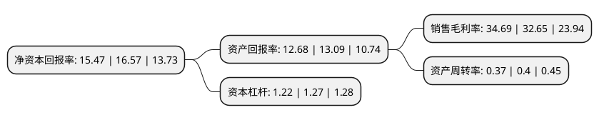

> 本页面由自动化程序生成于 2022年5月20日 01:16
> 内容可能存在错误，如有bug请提交issue至：https://github.com/Eroleice/doc-pi/issues
{.is-warning}

# 上市公司基本情况

## 基本资料

新天科技股份有限公司（以下简称“新天科技”）成立于2000年11月02日，郑州市。于2011年08月31日在深交所创业板上市。

新天科技注册资本117,565.796万元，主要产品:智慧水务，智慧农业节水，智能民用抄表系统，智能工商业流量计等。主营业务:智慧水务，智慧燃气，智慧农业节水，智慧热力节能和基于物联网的智能计量仪表及系统平台的研发，生产，销售和服务。以下是详细信息：

- 公司名称: 新天科技股份有限公司
- 股票代码: 300259.SZ
- 所在地: 河南 - 郑州市
- 成立日期: 2000年11月02日
- 注册资本: 117,565.796万元
- 法定代表人: 费战波
- 主营业务: 主要产品:智慧水务，智慧农业节水，智能民用抄表系统，智能工商业流量计等主营业务:智慧水务，智慧燃气，智慧农业节水，智慧热力节能和基于物联网的智能计量仪表及系统平台的研发，生产，销售和服务
- 公司官网: www.suntront.com
- 公司介绍: 公司专注于智慧水务、智慧燃气、智慧农业节水、智慧热力节能和基于物联网的智能计量仪表及系统平台的研发、生产、销售和服务，主要为供水公司、燃气公司、热力公司、水利部门等行业主管机构提供能源管理信息化和智能化解决方案。公司的产品涵盖智慧能源及智能表两大类。其中，智慧能源包含智慧水务、智慧节水、智慧农业与水利、智慧热力、智慧燃气；智能表包含智能水表、热量表、智能气表、智能电表以及支持智能表运行的系统、配套设备及软件。公司通过了ISO9001质量管理体系认证、ISO14001环境体系认证，通过了国际CE认证、国家质量安全体系3C认证、研发体系CMMI3认证，公司获得了“高新技术企业”、“省高新技术特色产业基地首批骨干企业”、“省科技创新十佳单位”、“优秀创新型企业”、“河南省著名商标”、“全国电子信息行业标杆企业”、“物联网十强企业”等荣誉。

## 股东及高管情况

上市公司第一大股东为费战波，持股419,461,659股，占比35.68%，为上市公司实际控制人。

截至2022年03月31日，上市公司的前十大股东中，共有10名自然人股东，其中5%以上大股东共有2名。上市公司前十大股东明细如下：

> 截至2022年03月31日，上市公司前十大股东信息如下：

| 股东名称 | 持股数量（股） | 持股比例 |
| --- | --- | --- |
| 费战波 | 419,461,659 | 35.68% |
| 费占军 | 97,135,495 | 8.26% |
| 王钧 | 54,676,422 | 4.65% |
| 杨竞夫 | 10,372,840 | 0.88% |
| 陈敏 | 6,476,864 | 0.55% |
| 陈霞 | 5,773,572 | 0.49% |
| 赵聪 | 3,427,700 | 0.29% |
| 李健 | 3,281,850 | 0.28% |
| 赵宇虹 | 3,265,900 | 0.28% |
| 林安秀 | 3,209,517 | 0.27% |

## 利润表分析

上市公司2021年总收入为11.93亿元，净利润为4.13亿元，实现盈利。

## 杜邦分析

> 数据列示周期：2021年 | 2020年 | 2019年
{.is-info}

上市公司的净资产收益率在近一年有所下降，下降幅度为-6.64%，其变化情况分解如下：
- 上市公司的销售毛利率在近一年上升了6.25%，可能是生产效率的提升、商品原材料价格下跌或商品价格的上涨所致。
- 上市公司的资产周转率在近一年下降了-7.5%，可能是源自于更慢的销售回款或库存管理效果下降。
- 上市公司的财务杠杆比率在近一年下降了-3.94%，可能是减少负债降低财务费用。

