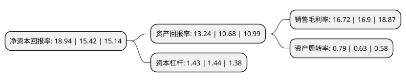

> 本页面由自动化程序生成于 2022年5月20日 01:16
> 内容可能存在错误，如有bug请提交issue至：https://github.com/Eroleice/doc-pi/issues
{.is-warning}

# 上市公司基本情况

## 基本资料

安科瑞电气股份有限公司（以下简称“安科瑞”）成立于2003年06月23日，上海市。于2012年01月13日在深交所创业板上市。

安科瑞注册资本21,480.013万元，主要产品:电力监控系统及产品，电能管理系统及产品，电气安全系统及产品，电量传感器等。主营业务:为用户提供用电数据服务。以下是详细信息：

- 公司名称: 安科瑞电气股份有限公司
- 股票代码: 300286.SZ
- 所在地: 上海 - 上海市
- 成立日期: 2003年06月23日
- 注册资本: 21,480.013万元
- 法定代表人: 周中
- 主营业务: 主要产品:电力监控系统及产品，电能管理系统及产品，电气安全系统及产品，电量传感器等主营业务:为用户提供用电数据服务
- 公司官网: www.acrel.cn
- 公司介绍: 公司作为一家为用户提供用电数据服务的集成商。结合企业供配电系统的特点，为每一个用户量身设计用电管理系统，搭建精细合理的用电监测体系。系统的建设与投运可在用电可靠供应、用能合理和用电安全等方面解决用户关注的痛点，帮用户实现能源使用数据的可视化管理，为用户今后节能措施的引进实施提供科学的数据支撑。主要产品包括：电力监控系统及产品、电能管理系统及产品、电气安全系统及产品、电量传感器等。公司是国家火炬计划重点高新技术企业和软件企业。

## 股东及高管情况

上市公司第一大股东为周中，持股39,197,988股，占比18.25%，**疑似为**上市公司实际控制人。

截至2022年04月27日，上市公司的前十大股东中，共有5名自然人股东，1名机构股东，4个产品账户，其中5%以上大股东共有5名。上市公司前十大股东明细如下：

> 未能通过持股比例判定出上市公司实际控制人（持股30%以上）
> 可能存在通过间接持股、联合持股、协议控制等方式拥有实际控制权的主体，具体请参考上市公司定期公告！
{.is-warning}

> 截至2022年04月27日，上市公司前十大股东信息如下：

| 股东名称 | 持股数量（股） | 持股比例 |
| --- | --- | --- |
| 周中 | 39,197,988 | 18.25% |
| 上海前航投资有限公司 | 36,900,000 | 17.18% |
| 吴建明 | 16,679,436 | 7.77% |
| 朱芳 | 12,991,452 | 6.05% |
| 姜龙 | 11,541,666 | 5.37% |
| 兴业银行股份有限公司-兴全趋势投资混合型证券投资基金 | 7,633,523 | 3.55% |
| 汤建军 | 7,147,346 | 3.33% |
| 招商银行股份有限公司-兴全轻资产投资混合型证券投资基金(LOF) | 4,546,078 | 2.12% |
| 安科瑞电气股份有限公司-第三期员工持股计划 | 4,300,060 | 2% |
| 中国工商银行股份有限公司-诺安先锋混合型证券投资基金 | 3,955,145 | 1.84% |

## 利润表分析

上市公司2021年总收入为10.16亿元，净利润为1.7亿元，实现盈利。

## 杜邦分析

> 数据列示周期：2021年 | 2020年 | 2019年
{.is-info}

上市公司的净资产收益率在近一年有所上升，上升幅度为22.83%，其变化情况分解如下：
- 上市公司的销售毛利率在近一年下降了-1.07%，可能是生产效率的下降、商品原材料价格上涨或商品价格的下跌所致。
- 上市公司的资产周转率在近一年上升了25.4%，可能是源自于更快的销售回款或库存管理效果提升。
- 上市公司的财务杠杆比率在近一年下降了-0.69%，可能是减少负债降低财务费用。

