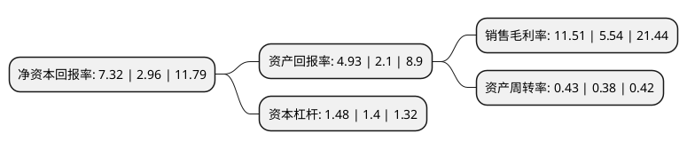

> 本页面由自动化程序生成于 2022年5月20日 01:17
> 内容可能存在错误，如有bug请提交issue至：https://github.com/Eroleice/doc-pi/issues
{.is-warning}

# 上市公司基本情况

## 基本资料

金卡智能集团股份有限公司（以下简称“金卡智能”）成立于2004年07月28日，温州市。于2012年08月17日在深交所创业板上市。

金卡智能注册资本42,905.433万元，主营业务:计算应用服务业，仪器仪表行业，车用燃气销售业务。主要产品为智能燃气表。以下是详细信息：

- 公司名称: 金卡智能集团股份有限公司
- 股票代码: 300349.SZ
- 所在地: 浙江 - 温州市
- 成立日期: 2004年07月28日
- 注册资本: 42,905.433万元
- 法定代表人: 杨斌
- 主营业务: 主营业务:计算应用服务业，仪器仪表行业，车用燃气销售业务主要产品为智能燃气表
- 公司官网: www.jinka.cn
- 公司介绍: 公司是一家专注于智慧公用事业解决方案服务商，围绕客户需求持续创新，历经多年的卓越发展，已成为智慧燃气行业领导企业之一。公司是国内智能燃气表行业第一家上市企业。公司积极追随物联网和互联网的时代潮流，努力构建全新的公用事业行业生态体系，并积极开拓新的技术、产品与业务，在智能终端、智能通讯、大数据、云计算及移动应用等方面，产生强大的协同效应，为公用事业领域客户提供从智能设备、通讯网络、应用管理软件到互联网云服务的高价值、高性能的产品及端到端解决方案，并与各大燃气公司、华为、阿里巴巴等建立了长期战略合作伙伴关系。

## 股东及高管情况

上市公司第一大股东为浙江金卡高科技工程有限公司，持股92,399,448股，占比21.54%，**疑似为**上市公司实际控制人。

截至2022年03月31日，上市公司的前十大股东中，共有4名自然人股东，4名机构股东，2个产品账户，其中5%以上大股东共有2名。上市公司前十大股东明细如下：

> 未能通过持股比例判定出上市公司实际控制人（持股30%以上）
> 可能存在通过间接持股、联合持股、协议控制等方式拥有实际控制权的主体，具体请参考上市公司定期公告！
{.is-warning}

> 截至2022年03月31日，上市公司前十大股东信息如下：

| 股东名称 | 持股数量（股） | 持股比例 |
| --- | --- | --- |
| 浙江金卡高科技工程有限公司 | 92,399,448 | 21.54% |
| 杨斌 | 62,724,777 | 14.62% |
| 北京和源投资管理有限公司-嘉兴和源庚酉投资管理合伙企业(有限合伙) | 14,430,680 | 3.36% |
| 施正余 | 13,383,646 | 3.12% |
| 山东高速投资控股有限公司 | 10,557,183 | 2.46% |
| 山东高速城镇化基金管理中心(有限合伙) | 9,685,395 | 2.26% |
| 泰康人寿保险有限责任公司-传统-普通保险产品-019L-CT001深 | 6,732,282 | 1.57% |
| 泰康人寿保险有限责任公司-分红-个人分红-019L-FH002深 | 5,735,391 | 1.34% |
| 杨小洪 | 5,265,400 | 1.23% |
| 戴意深 | 3,802,942 | 0.89% |

## 利润表分析

上市公司2021年总收入为23.01亿元，净利润为2.64亿元，实现盈利。

## 杜邦分析

> 数据列示周期：2021年 | 2020年 | 2019年
{.is-info}

上市公司的净资产收益率在近一年有所上升，上升幅度为147.3%，其变化情况分解如下：
- 上市公司的销售毛利率在近一年上升了107.76%，可能是生产效率的提升、商品原材料价格下跌或商品价格的上涨所致。
- 上市公司的资产周转率在近一年上升了13.16%，可能是源自于更快的销售回款或库存管理效果提升。
- 上市公司的财务杠杆比率在近一年上升了5.71%，可能是增加负债扩大生产规模。

