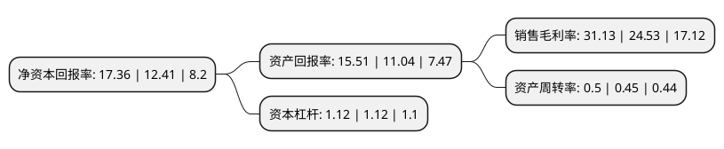

> 本页面由自动化程序生成于 2022年5月20日 01:17
> 内容可能存在错误，如有bug请提交issue至：https://github.com/Eroleice/doc-pi/issues
{.is-warning}

# 上市公司基本情况

## 基本资料

江苏东华测试技术股份有限公司（以下简称“东华测试”）成立于1993年03月08日，泰州市。于2012年09月20日在深交所创业板上市。

东华测试注册资本13,832.02万元，主要产品:有静态应变测试分析系统(DH38系列)和动态信号测试分析系统(DH59，DH83系列)两大系列。主营业务:结构力学性能测试仪器及配套软件的研发，生产和销售，并提供应用解决方案和技术服务。以下是详细信息：

- 公司名称: 江苏东华测试技术股份有限公司
- 股票代码: 300354.SZ
- 所在地: 江苏 - 泰州市
- 成立日期: 1993年03月08日
- 注册资本: 13,832.02万元
- 法定代表人: 刘士钢
- 主营业务: 主要产品:有静态应变测试分析系统(DH38系列)和动态信号测试分析系统(DH59，DH83系列)两大系列主营业务:结构力学性能测试仪器及配套软件的研发，生产和销售，并提供应用解决方案和技术服务
- 公司官网: www.dhtest.com
- 公司介绍: 公司是国内领先的结构力学性能测试仪器行业自主创新型企业，专注于结构力学性能测试仪器及配套软件的研发、生产和销售，并提供测试系统解决方案和技术服务。公司产品主要有静态应变测试分析系统(DH38系列)和动态信号测试分析系统(DH59、DH83系列)两大系列，每种产品主要由测试仪器、传感器和控制分析软件组成。公司产品主要用途有：结构力学性能试验、结构优化设计验证测试、大型建筑物的结构安全可靠性能检测、设备运行状态监测和故障诊断等。公司产品主要应用领域有：国防及航空航天、专业科研及检测机构、高校、装备制造业、设备状态监测行业等。经过多年坚持不懈的技术开发和经验积累，公司产品不断完善，在行业中形成了良好的口碑和信誉，在国防军工、航空航天、土木工程、机械装备、高铁、船舶、汽车、冶金石化等行业积累了一批稳定客户，形成了良好的品牌效应。

## 股东及高管情况

上市公司第一大股东为刘士钢，持股67,765,930股，占比48.99%，为上市公司实际控制人。

截至2022年03月31日，上市公司的前十大股东中，共有4名自然人股东，1名机构股东，5个产品账户，其中5%以上大股东共有2名。上市公司前十大股东明细如下：

> 截至2022年03月31日，上市公司前十大股东信息如下：

| 股东名称 | 持股数量（股） | 持股比例 |
| --- | --- | --- |
| 刘士钢 | 67,765,930 | 48.99% |
| 罗沔 | 8,553,100 | 6.18% |
| 孙慧明 | 5,338,600 | 3.86% |
| 中国农业银行股份有限公司-交银施罗德先进制造混合型证券投资基金 | 4,918,547 | 3.56% |
| 招商银行股份有限公司-交银施罗德均衡成长一年持有期混合型证券投资基金 | 4,126,660 | 2.98% |
| 招商银行股份有限公司-兴全合泰混合型证券投资基金 | 3,159,821 | 2.28% |
| 中国建设银行股份有限公司-交银施罗德启明混合型证券投资基金 | 2,007,670 | 1.45% |
| 杨燕灵 | 1,565,300 | 1.13% |
| 泰康人寿保险有限责任公司-分红-个人分红-019L-FH002深 | 1,392,200 | 1.01% |
| 泰康人寿保险有限责任公司-传统-普通保险产品-019L-CT001深 | 1,200,300 | 0.87% |

## 利润表分析

上市公司2021年总收入为2.57亿元，净利润为0.8亿元，实现盈利。

## 杜邦分析

> 数据列示周期：2021年 | 2020年 | 2019年
{.is-info}

上市公司的净资产收益率在近一年有所上升，上升幅度为39.89%，其变化情况分解如下：
- 上市公司的销售毛利率在近一年上升了26.91%，可能是生产效率的提升、商品原材料价格下跌或商品价格的上涨所致。
- 上市公司的资产周转率在近一年上升了11.11%，可能是源自于更快的销售回款或库存管理效果提升。
- 上市公司的财务杠杆比率在近一年下降了0%，可能是减少负债降低财务费用。

